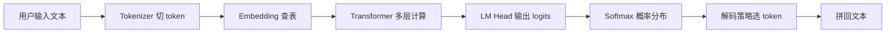

# LLM 从输入到输出：一条完整链路

## 面试高频考点

- 用户输入一句话后，LLM 内部发生了什么？
- Token、Embedding、Transformer、Logits、Sampling 分别在哪一步？
- 为什么 LLM 是“逐 token 生成”？
- Prefill 和 Decode 的区别是什么？
- 为什么上下文越长，推理越贵？

---

## 一句话总览

LLM 的工作流程可以压缩成一句话：

> 文本先被切成 token，token 被映射成向量，Transformer 反复混合上下文信息，最后输出下一个 token 的概率分布，再按解码策略选出一个 token。



### 外部图解：自回归解码


> 图源：[The Illustrated Transformer](https://jalammar.github.io/illustrated-transformer/)。这张图适合理解“输入上下文 -> 输出下一个 token -> 拼回上下文继续生成”的自回归链路。

---

## 1. Tokenization：文本变成离散 ID

**细化理解：** Tokenization 不只是“切词”，它决定了模型的输入粒度、词表覆盖范围和很多工程成本。英文里空格常常被编码进 token，中文可能一个字、一个词或字节片段变成 token；代码、URL、数字、罕见人名通常会被切得更碎。切得越碎，同样一段文本占用的 token 越多，长上下文压力、KV Cache 显存和 API 计费都会上升。面试时可以补一句：tokenizer 是训练前固定下来的接口，模型训练和推理必须使用同一套词表与切分规则，否则 embedding 查表会错位。

模型不能直接读字符串，必须先把文本切成 token。

例子：

```text
"大模型很好用"
→ ["大", "模型", "很", "好用"]
→ [1024, 8842, 309, 7711]
```

注意：

- token 不等于中文词，也不等于英文单词
- 同一句话在不同 tokenizer 下切分可能不同
- token 数直接影响上下文长度、推理成本和计费

面试里可以这样说：

> Tokenizer 是 LLM 的输入接口，它决定了文本如何被离散化。模型真正看到的是 token id，而不是原始字符。

---

## 2. Embedding：离散 ID 变成连续向量

每个 token id 会查一张 embedding 表，得到一个向量。

```text
token_id = 8842
embedding[token_id] = [0.12, -0.03, 0.87, ...]
```

Embedding 的作用是把离散符号放进连续空间，让模型可以用矩阵乘法处理语义关系。

但 embedding 本身还不知道顺序，所以还需要位置编码，比如 RoPE。

---

## 3. Transformer：上下文信息混合

**细化理解：** 每一层 Transformer 都在更新“当前位置对上下文的表示”。Attention 负责从历史 token 中取信息，FFN 负责对每个位置的表示做更强的非线性变换；多层堆叠后，浅层更偏局部模式和词法信息，深层更偏任务语义、指令遵循和答案组织。Decoder-only 架构用 causal mask 保证训练目标和推理一致：第 t 个位置只能利用前 t 个 token 来预测第 t+1 个 token，这也是为什么生成过程必须自回归展开。

Transformer block 通常由两部分组成：

- Attention：决定每个 token 该看哪些上下文
- FFN：对每个位置的表示做非线性变换

Decoder-only LLM 里每个位置只能看历史，不能看未来。

```text
当前位置 t 只能看：
token_1, token_2, ..., token_t

不能看：
token_{t+1}, token_{t+2}, ...
```

这就是 causal mask。

---

## 4. Logits：预测下一个 token

Transformer 最后一层输出 hidden state，经过 LM Head 映射到整个词表大小。

```text
hidden_t: [d_model]
LM Head: [d_model, vocab_size]
logits: [vocab_size]
```

如果词表是 150K，模型每一步都会给 150K 个 token 各打一个分。

这些分数还不是概率，需要 softmax。

---

## 5. Decoding：从概率分布里选 token

**面试追问：** logits 到最终文本之间有一层“解码策略”，这层会显著影响体验。贪心解码稳定但容易重复；temperature 和 top-p 能增加多样性，但也会提高偏题和事实错误概率；生产问答通常会降低随机性，创作类任务才会放大采样空间。要强调：解码策略改变的是从模型概率分布中取样的方式，不会让模型学到新知识。

常见策略：

| 策略 | 做法 | 适合 |
|------|------|------|
| Greedy | 每次选概率最高 | 确定性任务 |
| Temperature | 调整分布尖锐程度 | 控制随机性 |
| Top-p | 从累计概率 p 的候选集中采样 | 对话、创作 |
| Beam Search | 保留多条高分路径 | 翻译、摘要 |

LLM 不是一次生成整段话，而是每次生成一个 token，再把新 token 拼回上下文继续生成。

---

## 6. Prefill 和 Decode

LLM 推理分两段：

### Prefill

处理用户输入的整段 prompt。

特点：

- 可以并行处理多个 token
- 更像大矩阵计算
- 长 prompt 会显著增加首 token 延迟

### Decode

逐个生成输出 token。

特点：

- 每次只生成一个 token
- 串行依赖强
- 更受 KV Cache 和显存带宽影响

面试里要强调：

> Prefill 主要决定首 token 延迟，Decode 主要决定后续生成速度。

---

## 7. KV Cache 为什么重要

自回归生成时，历史 token 的 K/V 不会变。

所以推理时可以缓存历史 K/V，下一步只计算新 token 的 Q/K/V。

如果没有 KV Cache：

```text
生成第 1000 个 token 时，要重新算前 999 个 token
```

有 KV Cache：

```text
只算新 token，并复用历史 K/V
```

代价是显存随上下文长度增长。

---

## 8. 一个完整例子

用户输入：

```text
请解释什么是 RAG
```

内部流程：

1. tokenizer 切成 token id
2. embedding 查表得到向量
3. RoPE 注入位置信息
4. 多层 Transformer 做 attention 和 FFN
5. LM Head 输出下一个 token 分布
6. 解码策略选出“R”
7. 把“R”拼回上下文
8. 重复生成 “AG 是检索增强生成...”

---

## 常见误区

### 误区 1：LLM 一次生成一句话

不是。LLM 是逐 token 生成，只是速度快到看起来像一次输出。

### 误区 2：Embedding 就等于语义理解

Embedding 只是初始表示，真正复杂的上下文理解发生在 Transformer 层。

### 误区 3：上下文越长只是输入变多

不只是输入变多。长上下文会增加 prefill 计算量和 KV Cache 显存。

### 误区 4：Temperature 越高越聪明

Temperature 只控制随机性，不提升模型能力。

---

## 面试延伸

**Q：为什么 LLM 只能预测下一个 token，却能完成复杂任务？**

> 因为训练时 next-token prediction 逼迫模型学习语言、知识、推理模式和任务格式。推理时把任务描述放进上下文，模型通过预测下一个 token 延续出符合任务的答案。

**Q：为什么同一个问题每次回答可能不同？**

> 因为解码阶段可能使用采样策略，比如 temperature、top-p。模型输出的是概率分布，采样会引入随机性。

**Q：为什么长上下文会慢？**

> Prefill 阶段要处理更多 token，attention 计算和 KV Cache 都会增长；Decode 阶段也要在更长的 KV Cache 上做注意力读取。

---

## 学完可以做什么

1. 用自己的话画出 `文本 -> token -> embedding -> Transformer -> logits -> token` 链路。
2. 对比 Prefill 和 Decode 的瓶颈。
3. 解释为什么 KV Cache 能加速推理但会吃显存。

---

## 原始论文

| 论文 | 链接 |
|------|------|
| Attention Is All You Need (Vaswani et al., 2017) | [arxiv.org/abs/1706.03762](https://arxiv.org/abs/1706.03762) |
| Language Models are Few-Shot Learners / GPT-3 (Brown et al., 2020) | [arxiv.org/abs/2005.14165](https://arxiv.org/abs/2005.14165) |
| The Curious Case of Neural Text Degeneration / Nucleus Sampling (Holtzman et al., 2020) | [arxiv.org/abs/1904.09751](https://arxiv.org/abs/1904.09751) |
| Efficient Memory Management for LLM Serving with PagedAttention (Kwon et al., 2023) | [arxiv.org/abs/2309.06180](https://arxiv.org/abs/2309.06180) |

## 延伸阅读与视频

| 平台 | 标题 | 说明 |
|------|------|------|
| 📖 Blog | [The Illustrated Transformer](https://jalammar.github.io/illustrated-transformer/) | 用图解释 Transformer 从输入到输出的过程 |
| 📖 Hugging Face Docs | [Caching / KV Cache explanation](https://huggingface.co/docs/transformers/main/cache_explanation) | 官方文档解释 KV Cache 如何减少重复计算 |
| 📺 YouTube | [Let's build GPT: from scratch, in code, spelled out](https://www.youtube.com/watch?v=kCc8FmEb1nY) | Karpathy 从代码角度串起 GPT 训练与生成 |
| 📺 YouTube | [Let's build the GPT Tokenizer](https://www.youtube.com/watch?v=zduSFxRajkE) | Karpathy 专讲 tokenizer，适合理解 token 化细节 |
