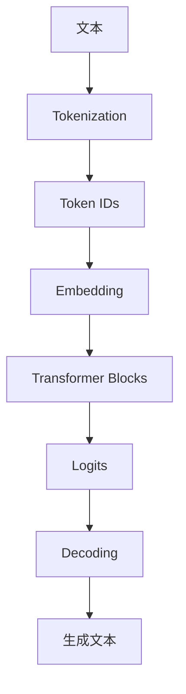
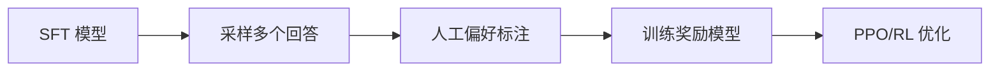

# LLM 核心名词解释

> 创建日期：2026-05-28

---

## 面试高频考点

- Token、Embedding、Vocabulary 三者分别是什么？
- Self-Attention 的公式怎么理解？Q/K/V 各自起什么作用？
- KV Cache 为什么能加速推理？代价是什么？
- Pre-training、SFT、RLHF、DPO 的边界是什么？
- Temperature、Top-k、Top-p、Beam Search 的使用差异是什么？
- Quantization、LoRA、MoE 分别解决什么问题？

---

## 一张总览图



这张图基本覆盖了大模型从输入到输出的主路径。下面的名词，大多都能放回这条链路里理解。

---

## 基础概念

### Token

**细化理解：** Token 是模型处理文本的最小离散单位，但它不是语言学上的“词”。同一个中文词可能被拆成多个 token，一个英文单词也可能因为大小写、前导空格、后缀变化被拆成不同 token。面试中遇到上下文长度、计费、KV Cache、吞吐这些问题时，都要先把“字符数”转换成“token 数”来讨论。

模型处理文本的最小离散单元。它不一定等于一个汉字、一个单词或一个标点，而是 tokenizer 切分后的片段。

例子：

- 英文单词 `"unhappiness"` 可能被切成 `["un", "happiness"]`
- 中文可能一个字一个 token，也可能多个字合成一个 token
- 代码中的空格、换行、缩进也可能占 token

**为什么重要：**

- 训练和推理成本通常按 token 计
- 上下文窗口大小本质上就是最多能处理多少 token
- 不同语言的 token 效率差异会影响真实成本

### Tokenization（分词）

把原始文本切成 token 序列的过程。常见算法有：

- **BPE**
- **WordPiece**
- **SentencePiece**

**理解重点：**

- tokenizer 不是语义理解器，而是一套编码压缩规则
- tokenizer 设计会影响中文、代码、数学公式的表示效率
- 好的 tokenizer 能减少序列长度，提升训练和推理效率

### Vocabulary（词表）

模型能识别的全部 token 的集合。

- GPT-2 词表规模约 50K
- LLaMA 约 32K
- 不同模型词表不同，token 切分方式也不同

**词表越大不一定越好：**

- 太小：文本会被切得很碎，序列变长
- 太大：embedding 和输出层参数增大，训练更重

### Embedding（词嵌入）

把离散 token id 映射成稠密向量的过程。

直观上可以把 embedding 理解成：模型把每个 token 投影到一个连续空间里，让后续网络在向量空间里做计算。

**要点：**

- embedding 层是离散世界进入神经网络的入口
- 语义相近 token 在向量空间里往往更接近
- 在大模型里，输入 embedding 和输出词表投影有时会共享参数

---

## 模型架构

### Transformer

2017 年提出的序列建模架构，核心是 **Self-Attention**。现代 LLM 大多是 Transformer 的 decoder-only 变体。

Transformer 的优势：

- 并行性强
- 长距离依赖建模能力强
- 易于扩展到超大参数规模

### Self-Attention（自注意力）

序列中每个位置都可以看见其他位置，并根据相关性聚合信息。

公式：

```text
Attention(Q, K, V) = softmax(QK^T / sqrt(d_k)) V
```

直观理解：

- `Q`：我想找什么
- `K`：我这里有什么特征
- `V`：真正要被拿来聚合的信息

流程是：

1. 用 `Q` 和所有 `K` 算相似度
2. 做 softmax 得到权重
3. 按权重对 `V` 加权求和

### Multi-Head Attention（多头注意力）

把 Q/K/V 投影到多个子空间，分别做 attention，再拼接回来。

**作用：**

- 不同头可以捕捉不同关系
- 有的头关注局部邻近
- 有的头关注长距离依赖
- 有的头可能更偏语法、位置或实体对齐

### Q / K / V

这三个向量通常都是由输入隐状态线性投影得到：

- **Q（Query）**：当前 token 想找什么信息
- **K（Key）**：每个 token 提供什么索引特征
- **V（Value）**：每个 token 携带什么内容信息

注意：Q/K/V 不是外部硬编码概念，而是训练中自动学出来的表示空间。

### KV Cache

**细化理解：** KV Cache 缓存的是每层 attention 中历史 token 的 Key 和 Value，不是缓存最终答案。它能避免每生成一个新 token 就重算全部历史，但显存会随 batch size、层数、head 数、head 维度和上下文长度线性增长。长上下文推理的核心瓶颈之一就是 KV Cache 管理，所以才会有 PagedAttention、MQA/GQA、KV 量化等优化。

推理时缓存已经算过的 `K` 和 `V`，避免每生成一个新 token 都把历史部分重新计算一遍。

**为什么能加速：**

- 自回归生成时，历史 token 不变
- 所以历史 K/V 可以直接复用
- 新 token 只需要和已有 K/V 做 attention

**代价：**

- 上下文越长，KV Cache 占用越大
- 长上下文推理常常是显存瓶颈，而不是参数本身

### Positional Encoding（位置编码）

Transformer 本身不感知顺序，所以要显式注入位置信息。

常见方式：

- 绝对位置编码
- 相对位置编码
- **RoPE**
- **ALiBi**

### RoPE（旋转位置编码）

通过旋转矩阵把位置信息编码进 Q/K。LLaMA、Qwen 等主流模型广泛采用。

它的优势是：

- 对相对位置信息建模自然
- 外推到更长上下文更方便
- 与现代 decoder-only 架构兼容性好

### FFN（前馈网络）

每个 Transformer Block 中，attention 后面通常接一个两层 MLP/FFN，用于做非线性变换和特征重组。

现代大模型中常见变体：

- ReLU -> 老方案
- GELU
- **SwiGLU** -> 目前主流

### Layer Norm / RMSNorm

归一化层用于稳定训练。

常见点：

- **Pre-Norm** 比 Post-Norm 更稳定
- 很多新模型从 LayerNorm 转向 **RMSNorm**
- RMSNorm 计算更简洁，工程上更常见

---

## 训练相关

### Pre-training（预训练）

在海量无监督语料上训练语言模型，目标通常是下一个 token 预测。

它解决的是：

- 语言规律学习
- 世界知识吸收
- 基础推理能力形成

### Fine-tuning（微调）

在预训练基座上继续训练，使模型适配特定任务或特定行为。

它可以是：

- 领域适配
- 指令跟随
- 风格控制
- 垂直任务优化

### SFT（Supervised Fine-Tuning）

使用人工标注的指令-回答数据继续训练模型，让模型学会按人类期望作答。

SFT 主要解决：

- 指令遵循
- 输出格式
- 对话行为

### RLHF（Reinforcement Learning from Human Feedback）

利用人类偏好数据训练奖励模型，再用强化学习优化模型，使输出更符合"有帮助、安全、无害"等主观偏好。

核心链路：



### PPO

RLHF 中常见的强化学习算法。它通过限制策略更新幅度，让训练更稳定。

你在面试里只要抓住一点：

- PPO 的价值不是更强表达力
- 而是让 RL 微调不至于一步把模型带偏

### DPO（Direct Preference Optimization）

RLHF 的简化替代方案。直接用偏好数据优化模型，不单独训练奖励模型，也不必跑复杂 PPO。

它为什么火：

- 实现简单
- 训练稳定
- 工程门槛低

---

## 推理相关

### Autoregressive（自回归）

模型逐个生成 token，每一步都依赖前面已经生成的内容。

特点：

- 输出自然
- 推理不可完全并行
- decode 阶段通常比 prefill 更慢

### Greedy Decoding（贪心解码）

每步选概率最高的 token。

优点：

- 快
- 稳

缺点：

- 容易保守
- 多样性差

### Beam Search（束搜索）

同时保留多个候选序列，再从整体概率角度选更优路径。

优点：

- 比贪心更全局

缺点：

- 计算量更大
- 在开放生成里未必比采样更自然

### Temperature（温度）

控制输出分布平滑程度的参数。

- 温度低：更确定、更保守
- 温度高：更发散、更多样

### Top-k / Top-p 采样

- **Top-k**：只从概率最高的前 `k` 个 token 里采样
- **Top-p**：从累计概率达到 `p` 的最小 token 集中采样

理解上：

- Top-k 更像固定候选池
- Top-p 更像自适应候选池

### Perplexity（困惑度）

衡量语言模型对测试集预测好坏的指标，值越低通常表示建模越好。

注意：

- 困惑度适合评估语言建模能力
- 不等于指令跟随能力
- 也不直接等于产品体验

---

## 效率与部署

### Quantization（量化）

把权重或激活从 FP16/BF16/FP32 压缩到 INT8、INT4 甚至更低精度，以减少显存和提升推理效率。

**解决的问题：**

- 模型太大，部署不起
- 显存贵
- 吞吐不够

### LoRA（低秩适配）

**细化理解：** LoRA 的关键假设是：下游任务需要的参数更新可以用低秩矩阵近似。它冻结原模型，只训练插入到线性层旁边的小矩阵，因此训练显存和可保存参数都大幅下降。面试时要说明 LoRA 适合低成本适配风格、格式和领域任务，但如果基础模型缺少目标能力或知识，LoRA 不能神奇补齐全部缺口。

微调时不更新全部参数，只训练少量低秩矩阵。

优点：

- 显存开销小
- 微调成本低
- 适合多任务多版本管理

### MoE（混合专家）

模型由多个专家子网络组成，每次只激活其中一部分。

好处：

- 总参数可以很大
- 单次激活参数较少
- 在不线性增加推理成本的前提下扩模型容量

挑战：

- 路由与负载均衡复杂
- 训练工程难度更高

### Prefill / Decode

推理通常分两阶段：

- **Prefill**：处理输入 prompt，建立 KV Cache
- **Decode**：逐 token 生成输出

它们的瓶颈不同：

- Prefill 更偏大矩阵计算
- Decode 更偏 memory-bound 和串行生成

---

## 常见混淆点

### Token 和词不是一回事

不要把 token 简单理解成"单词数"。中文、英文、代码、表情、空格的切法都可能不同。

### Embedding 不是检索向量

训练时的 token embedding 和 RAG 中的 sentence/document embedding 是两个不同层面的概念。

### KV Cache 只在推理阶段重要

训练时通常不会用这种逐步缓存方式，因为训练是并行喂整段序列。

### 困惑度低不代表对话体验一定好

它更多反映语言建模能力，不等于安全性、遵循性和任务完成率。

---

## 工程实践视角

### 面试里怎么把这些词讲顺

一个很实用的回答顺序是：

1. 输入先经 tokenizer 变成 token ids
2. token ids 进 embedding 变成向量
3. 经过多层 Transformer，用 self-attention 建模上下文
4. 输出 logits，再通过 decoding 生成 token
5. 训练阶段用 pretraining/SFT/RLHF 等不同目标塑造行为
6. 部署阶段再用 KV Cache、量化、LoRA、MoE 等手段平衡成本与效果

这个顺序能把零散术语串成一条完整链路。

---

## 学完可以做什么

1. 画一张自己的 Transformer 推理流程图，把每个名词放回所在位置。
2. 用 tokenizer 工具比较中英文和代码文本的 token 数差异。
3. 实测不同 temperature、top-p 对回答风格的影响。

---

## 原始论文

- [Attention Is All You Need](https://arxiv.org/abs/1706.03762)：Transformer 原论文，理解 self-attention、multi-head attention、position encoding 的起点。
- [Language Models are Few-Shot Learners](https://arxiv.org/abs/2005.14165)：GPT-3 论文，解释大模型、上下文学习和 scaling 后能力变化。
- [Training language models to follow instructions with human feedback](https://arxiv.org/abs/2203.02155)：InstructGPT / RLHF 经典论文，适合理解预训练模型为什么还需要对齐。
- [Direct Preference Optimization](https://arxiv.org/abs/2305.18290)：DPO 原论文，适合和 RLHF / PPO 放在一起对比。
- [LoRA: Low-Rank Adaptation of Large Language Models](https://arxiv.org/abs/2106.09685)：参数高效微调代表方法。
- [FlashAttention](https://arxiv.org/abs/2205.14135)：理解现代推理加速和 attention IO 瓶颈的重要论文。
- [Efficient Memory Management for Large Language Model Serving with PagedAttention](https://arxiv.org/abs/2309.06180)：vLLM / PagedAttention 论文，解释 KV Cache 管理为什么是 serving 核心问题。

---

## 延伸阅读与视频

- [The Illustrated Transformer](https://jalammar.github.io/illustrated-transformer/)：用图讲 Transformer，适合把 Q/K/V 和 attention 流程看明白。
- [3Blue1Brown: Attention in Transformers](https://www.youtube.com/watch?v=eMlx5fFNoYc)：注意力机制可视化讲解。
- [Andrej Karpathy: Let's build the GPT Tokenizer](https://www.youtube.com/watch?v=zduSFxRajkE)：从代码角度理解 tokenization 和 BPE。
- [Hugging Face Transformers - KV cache explanation](https://huggingface.co/docs/transformers/main/cache_explanation)：官方文档，解释 KV Cache 在生成阶段的作用。
- [OpenAI Cookbook: How to count tokens with tiktoken](https://cookbook.openai.com/examples/how_to_count_tokens_with_tiktoken)：适合做 token 成本估算和上下文窗口计算。
- [Lil'Log: The Transformer Family](https://lilianweng.github.io/posts/2023-01-27-the-transformer-family-v2/)：系统梳理 Transformer 变体、位置编码和 attention 变体。

---

*持续更新中...*
