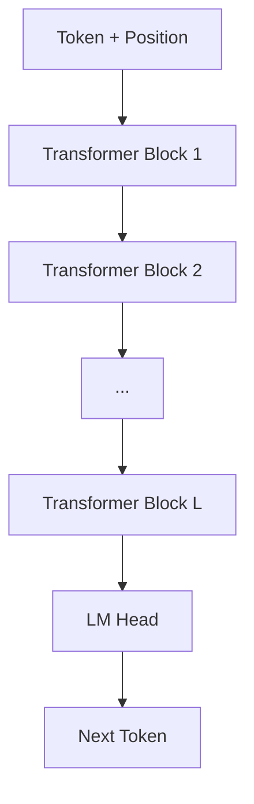
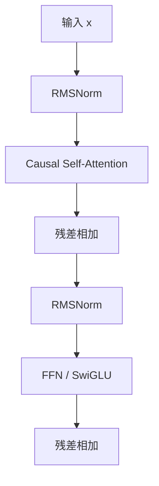

# Transformer 架构详解

## 面试高频考点

- Transformer 整体结构是什么？
- Self-Attention 的计算过程和复杂度是什么？
- 为什么 attention 要除以 `sqrt(d_k)`？
- Encoder-only、Decoder-only、Encoder-Decoder 三类架构怎么区分？
- 残差连接、Pre-Norm、RMSNorm、SwiGLU 各自起什么作用？

---

## Transformer 在做什么

一句话理解：

> Transformer 用 attention 让每个 token 动态读取其他 token 的信息，再用 FFN 做非线性变换。


> 图源：`Attention Is All You Need` 论文图，Wikimedia Commons 转载页已标注来自原论文并附带授权说明。

---

## 整体结构

### 原始 Transformer（Encoder-Decoder）

适合机器翻译等 seq2seq 任务：

- Encoder 编码输入
- Decoder 基于 encoder 表示生成输出

### 现代 LLM：Decoder-only

主流大模型基本都是 decoder-only：

- 输入 token
- 多层 causal self-attention
- 多层 FFN
- 预测下一个 token



---

## Transformer Block 长什么样

现代 decoder-only 里，每层大致是：

1. Norm
2. Self-Attention
3. Residual
4. Norm
5. FFN
6. Residual



---

## Self-Attention 计算过程

**细化理解：** Self-Attention 不是简单“看全文”，而是每个位置用 Query 去和所有可见位置的 Key 计算相关性，再按权重汇总 Value。Q/K/V 都来自当前 hidden states 的线性变换，因此同一个 token 在不同层、不同上下文里会产生不同的注意力行为。这个机制让模型能动态选择证据，但也带来二次复杂度和长上下文成本。

给定输入 `X`：

```text
Q = XW_Q
K = XW_K
V = XW_V

Attention(Q, K, V) = softmax(QK^T / sqrt(d_k)) V
```

### 直觉解释

- `Q`：我当前想找什么
- `K`：每个位置提供什么索引线索
- `V`：每个位置真正提供什么信息

### 为什么强

因为每个 token 都能按内容动态决定该看谁，而不是像 RNN 那样只按固定顺序传递。

---

## 为什么要除以 `sqrt(d_k)`

如果不缩放，`QK^T` 的值会随着维度增大而变大，softmax 更容易饱和。

结果是：

- 概率分布过尖
- 梯度变差
- 训练不稳定

除以 `sqrt(d_k)` 本质上是在控制分数尺度，让 softmax 工作在更合理的区域。

---

## Multi-Head Attention

不是只做一次 attention，而是拆成多个头并行做。

### 为什么要多头

- 不同头可以关注不同关系
- 有的头看邻近词
- 有的头看长距离依赖
- 有的头看语法，有的头看语义

### 关键点

多头 attention 的价值不是简单多算几遍，而是提供多个表示子空间。

---

## Causal Mask

Decoder-only 模型必须保证当前位置看不到未来 token。

否则训练时就会偷看答案，推理时行为和训练时不一致。

```mermaid
flowchart LR
    A["当前位置 token"] --> B["可看历史 token"]
    A -.x.-> C["不可看未来 token"]
```

---

## FFN / SwiGLU

**细化理解：** FFN 是 Transformer 中参数量很大的部分，常常比 attention 更“吃参数”。Attention 负责跨 token 交换信息，FFN 则在每个 token 位置上做特征变换和知识存储；SwiGLU 通过门控结构提高表达能力，在 LLaMA 等现代 LLM 中很常见。回答架构题时不要把 Transformer 简化成只有 attention。

Attention 负责“聚合信息”，FFN 负责“重组和变换特征”。

现代大模型常用 **SwiGLU**，相对 ReLU/GELU 更强。

### 为什么 SwiGLU 常见

- 门控能力更强
- 表达力更好
- 实证上通常优于简单激活函数

可以把它理解成：FFN 不只是做线性变换，而是在学哪些信息该放大、哪些该抑制。

---

## 残差连接与归一化

### 残差连接

作用：

- 让梯度更容易传播
- 支持更深网络堆叠
- 防止每层都把已有表示完全冲掉

### Pre-Norm vs Post-Norm

现代大模型多数用 Pre-Norm：

- 更稳定
- 深层训练更友好

### RMSNorm

相比 LayerNorm：

- 计算更简洁
- 工程上更高效
- 在现代 LLM 中很常见

---

## 三类架构对比

| 架构 | 代表 | 擅长 |
|------|------|------|
| Encoder-only | BERT | 理解类任务 |
| Decoder-only | GPT / LLaMA / Qwen | 生成、对话、统一建模 |
| Encoder-Decoder | T5 / BART | 传统 seq2seq |

### 为什么 Decoder-only 成为主流

1. next-token prediction 目标统一
2. 更适合生成任务
3. scaling 更自然
4. few-shot / in-context learning 表现强

---

## Transformer 的主要成本

**工程细节：** 训练时成本主要来自长序列 attention、FFN 矩阵乘和激活保存；推理时 prefill 更像训练中的并行前向，decode 则因为一次只生成一个 token，容易被显存带宽、KV Cache 读取和调度开销限制。FlashAttention、GQA/MQA、张量并行和 continuous batching 解决的是不同层面的瓶颈，不能混为一个“加速技巧”。

### 训练时

- attention 的 `O(n^2)` 序列交互
- 大矩阵乘法
- 激活内存

### 推理时

- 长上下文 KV Cache
- 逐 token decode 的串行性

所以后面很多优化技术，其实都在围绕 Transformer 的这些天然成本做文章。

---

## 一分钟回答模板

如果面试官让你快速解释 Transformer，可以按这个顺序讲：

1. 输入 token 先变成 embedding，并注入位置信息
2. attention 负责让每个 token 动态读取别的 token
3. FFN 负责在每个位置上做更强的非线性特征变换
4. 残差和归一化保证深层堆叠还能稳定训练

这样回答比只背 `QKV` 公式更完整。

---

## 常见误区

### 误区 1：Transformer 只有 attention 重要

不对。FFN、残差、归一化、位置编码都同样关键。

### 误区 2：多头 attention 只是参数变多

核心不是参数更多，而是提供多种关注模式和子空间表达。

### 误区 3：Decoder-only 比 Encoder-only 更高级

不是。它只是更适合统一生成式建模，不代表在所有理解任务上天然更优。

### 误区 4：attention 复杂度高就说明 Transformer 一定慢

要看场景。训练、prefill、decode 的瓶颈并不完全相同，而且工程优化空间很大。

---

## 面试延伸

**Q：为什么现代 LLM 几乎都用 Decoder-only？**
> 因为它能把很多任务统一为 next-token prediction，天然支持生成和 in-context learning，训练目标简单且 scaling 友好。

**Q：为什么 attention 需要 Q/K/V 三套投影？**
> 因为“怎么匹配”和“取什么内容”是两件事。Q/K 用于决定相关性，V 用于真正提供被聚合的信息。

**Q：KV Cache 为什么成立？**
> 因为自回归生成时，历史 token 的 K/V 不再变化，后续只需为新 token 计算增量部分并复用历史 K/V。

---

## 学完可以做什么

1. 自己画一张 decoder-only Transformer block 结构图。
2. 手推一次 `QK^T -> softmax -> V` 的 attention 流程。
3. 对比理解 `Encoder-only / Decoder-only / Encoder-Decoder` 三类架构的适用任务。

---

## 原始论文

| 论文 | 链接 |
|------|------|
| Attention Is All You Need (Vaswani et al., 2017) | [arxiv.org/abs/1706.03762](https://arxiv.org/abs/1706.03762) |
| RMSNorm (Zhang & Sennrich, 2019) | [arxiv.org/abs/1910.07467](https://arxiv.org/abs/1910.07467) |
| GLU Variants Improve Transformer (Shazeer, 2020) | [arxiv.org/abs/2002.05202](https://arxiv.org/abs/2002.05202) |
| FlashAttention (Dao et al., 2022) | [arxiv.org/abs/2205.14135](https://arxiv.org/abs/2205.14135) |

## 延伸阅读与视频

| 平台 | 标题 | 说明 |
|------|------|------|
| 📺 YouTube | [But what is a GPT? Visual intro to Transformers](https://www.youtube.com/watch?v=wjZofJX0v4M) | 3Blue1Brown，适合建立直觉 |
| 📺 YouTube | [Attention in transformers, visually explained](https://www.youtube.com/watch?v=eMlx5fFNoYc) | 专讲 attention |
| 📺 B站 | [跟李沐学 AI - Attention Is All You Need 论文精读](https://www.bilibili.com/video/BV1pu411o7BE) | 学术视角扎实 |
