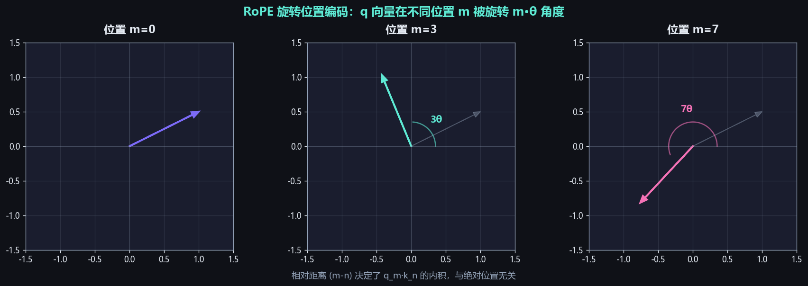

# 位置编码（Positional Encoding）

## 面试高频考点
- Transformer 为什么需要位置编码？
- RoPE 的原理是什么？为什么比绝对位置编码更好？
- ALiBi 如何实现长度外推？
- 位置插值（PI）、NTK、YaRN 的差异？
- 为什么 LLaMA 3 把 RoPE base 从 10000 改为 500000？

---

## 一、为什么需要位置编码？

Self-Attention 对输入是**排列不变的（permutation invariant）**：

```
打乱 token 顺序：
  原始："我 爱 北京 天安门"  → Attention 输出 O₁
  打乱："天安门 北京 爱 我"  → Attention 输出仍然是 O₁（顺序不同）

因为 Attention(Q,K,V) = softmax(QK^T/√d) · V
矩阵乘法对行的顺序不敏感

但语言显然有顺序：
  "狗咬人" ≠ "人咬狗"

→ 必须显式注入位置信息
```

注入位置信息有三种主流方式：① 加在 Embedding 上（绝对位置编码）；② 加在 Attention 分数上（相对位置编码）；③ 通过旋转 Q/K 注入（RoPE）。

---

## 二、绝对位置编码

### Sinusoidal（原始 Transformer）

```
PE(pos, 2i)   = sin(pos / 10000^(2i/d))
PE(pos, 2i+1) = cos(pos / 10000^(2i/d))

将位置 pos 编码成一个 d 维向量，加到 token embedding 上
```

**几何直觉**：每个维度对应一个不同频率的正弦波。低维度变化快（捕获短距离位置差异），高维度变化慢（编码长距离位置）。

**优点**：可外推到训练时未见的长度（公式定义无界）。
**缺点**：位置和内容信息以加法耦合，模型需要"自己学"如何分离这两类信号；长距离外推效果差。

### 可学习的位置 Embedding（BERT/GPT-2）

为每个位置直接学习一个 Embedding 向量，与 token Embedding 相加。

```
P_0, P_1, ..., P_{max_len-1}  ← max_len 个可学习向量
input = TokenEmbedding(x) + P_position
```

**优点**：训练数据范围内效果好。
**致命缺点**：完全无法外推。如果训练时 max_len=512，推理时第 1000 个位置的 Embedding 从未被训练过 → 表现崩溃。

---

## 三、RoPE（旋转位置编码）

> **来源**：苏剑林（苏神）2021 年提出，被 LLaMA、Qwen、ChatGLM、Mistral、DeepSeek 等几乎所有现代主流模型采用。

### 核心思想

不直接"加"位置向量，而是用**旋转矩阵**把位置信息"注入"到 Q 和 K 的方向上：



```
q_m = R(m·θ) · q    # 位置 m 处的 query 向量被旋转 m·θ 角度
k_n = R(n·θ) · k    # 位置 n 处的 key 向量被旋转 n·θ 角度

二者的内积：
  q_m · k_n = q^T · R(m·θ)^T · R(n·θ) · k
            = q^T · R((n-m)·θ) · k

→ 内积只依赖于【相对距离 (m-n)】，与绝对位置 m 和 n 无关
→ 这就是"相对位置编码"的核心特性
```

### 高维 RoPE：拆成 d/2 对 2D 旋转

```
将 d 维向量切成 d/2 对：
  q = [q₀, q₁, q₂, q₃, ..., q_{d-2}, q_{d-1}]
       └─对0─┘ └─对1─┘     └─对(d/2-1)─┘

每对 (q_{2i}, q_{2i+1}) 用不同的频率 θ_i 旋转：
  θ_i = base^(-2i/d),    base 通常 = 10000

低维度 (i 小)：θ_i 接近 1，旋转快，捕获短距离信息
高维度 (i 大)：θ_i 接近 0，旋转慢，捕获长距离信息
```

### RoPE 实现（PyTorch 风格）

```python
def apply_rope(q, k, position_ids):
    # q, k: shape [batch, n_heads, seq_len, d_head]
    # 计算每对维度的旋转角度
    inv_freq = 1.0 / (10000 ** (torch.arange(0, d_head, 2) / d_head))
    freqs = position_ids[:, None] * inv_freq[None, :]   # [seq_len, d_head/2]
    cos, sin = freqs.cos(), freqs.sin()

    # 将相邻两维 (q_{2i}, q_{2i+1}) 看作复数 (a+bi)
    # 旋转：(a+bi) * (cos+i·sin) = (a·cos - b·sin) + i(a·sin + b·cos)
    q_rotated = q * cos + rotate_half(q) * sin
    k_rotated = k * cos + rotate_half(k) * sin
    return q_rotated, k_rotated
```

### 为什么 RoPE 优于绝对位置编码？

1. **天然编码相对位置**：内积只依赖 (m-n)，符合"位置关系"而非"绝对位置"的语言学直觉
2. **平移等变性**：整段文本平移不影响内部 token 的相对关系
3. **数学优雅**：旋转保持向量长度不变，不引入额外信息损失
4. **外推友好**：配合 PI/NTK/YaRN 等技巧可扩展到训练长度的 32 倍以上

---

## 四、RoPE 的长度外推方案

直接外推（推理时位置超出训练长度）会导致角度分布偏移，注意力计算异常。主流外推方案：

### Position Interpolation (PI, Meta 2023)

```
原始：position_id = 0, 1, 2, ..., L_test-1
PI：  position_id = 0, L_train/L_test, 2·L_train/L_test, ..., L_train-1·(L_test-1)/L_test

把推理时的位置 ID 等比压缩到训练范围内
需要少量微调（~1000 步）才能稳定
```

### NTK-aware Scaling

```
不改 position_id，而是修改 RoPE base：
  base_new = base × (L_test / L_train)^(d/(d-2))

直觉：低频维度（编码长距离）需要"看得更远"
NTK 通过差异化缩放高低频，让高频几乎不变、低频大幅延展
无需微调即可使用（zero-shot extrapolation）
```

### YaRN（Yet Another RoPE extensioN, 2023）

```
NTK 的改进版：
1. 分频率段差异化处理（低频用 PI，高频不变，中频平滑过渡）
2. 增加 attention 温度（softmax 时缩放 logits 防止饱和）

效果：LLaMA 2 通过 YaRN 可扩展到 128K 上下文，性能损失极小
被 LLaMA 3、Qwen 等采用
```

### LongRoPE (Microsoft 2024)

```
非均匀插值：用进化算法搜索每个频率维度的最优缩放因子
+ 短期/长期渐进式微调

可将上下文扩展到 2048K（200万 tokens），是目前最强的外推方案
```

### 对比表

| 方法 | 是否需要微调 | 最大扩展 | 实现复杂度 | 代表使用 |
|------|------------|---------|-----------|---------|
| 直接外推 | 否 | 几乎无效 | 0 | - |
| PI | 是 | 4-8x | 低 | LLaMA 2 |
| NTK-aware | 否 | 4-8x | 低 | 通用方案 |
| **YaRN** | 是 | 16-32x | 中 | **LLaMA 3, Qwen** |
| LongRoPE | 是 | 256x+ | 高 | Phi-3 |

---

## 五、ALiBi（Attention with Linear Biases）

> **来源**：MPT、BLOOM 模型使用。

### 核心思想

完全不修改 Q 和 K，直接在注意力分数上加一个**与距离成正比的负偏置**：

```
score(i, j) = q_i · k_j / √d - m · |i - j|

其中 m 是每个头的斜率（slope），不同头有不同的 m
```

### 几何直觉

```
对于位置 i，它对其他位置的注意力分数：

位置:  i-3  i-2  i-1   i    i+1  i+2  i+3
原分数: s    s    s    s    s    s    s
ALiBi: s-3m s-2m s-m   s    s-m  s-2m s-3m  ← 距离越远惩罚越大

→ 自动衰减远距离 token 的影响，类似"衰减式注意力"
→ 因为衰减是线性的、确定性的，天然支持任意长度外推
```

### 优缺点

**优点**：
- 完全无参数，零训练开销
- 天然外推（衰减规则不依赖训练长度）
- 实现简单（只需在 attention score 上加一个矩阵）

**缺点**：
- 远距离信息被强制衰减，对需要精确长距离匹配的任务（代码补全、跨段引用）表现不佳
- 不如 RoPE 灵活（无法精细区分位置 5 和位置 7 的关系，只看距离）

---

## 六、LLaMA 3 的 base=500000 改动

LLaMA 2 的 RoPE base = 10000（沿用原始 Transformer），LLaMA 3 改为 **base=500000**。

### 为什么？

```
RoPE 频率公式：θ_i = base^(-2i/d)

base 越大 → 低频维度旋转越慢 → 编码"长距离位置"的容量越大

例子（d=128）：
  base=10000:   最低频维度 θ_63 ≈ 10^-4，每旋转 1 弧度需走 ~10000 个位置
  base=500000:  最低频维度 θ_63 ≈ 10^-5.4，每旋转 1 弧度需走 ~398000 个位置

→ base 越大，越能区分极远距离的位置
→ LLaMA 3 配合 YaRN 把上下文从 8K 扩展到 128K，需要更大的 base 才能不"绕圈"
```

直觉：把"位置编码的钟"做得更大，让秒针走得更慢，避免在长序列中重复指向同一角度。

---

## 七、对比总结

| 方法 | 类型 | 实现 | 外推 | 代表模型 |
|------|------|------|------|----------|
| Sinusoidal | 绝对 | 加在 Embedding | 一般 | 原始 Transformer |
| Learned | 绝对 | 加在 Embedding | **不可** | BERT, GPT-2 |
| **RoPE** | 相对 | 旋转 Q,K | **好**（配合 YaRN） | **LLaMA, Qwen, DeepSeek（主流）** |
| ALiBi | 相对偏置 | 加在 Attention 分数 | 好 | MPT, BLOOM |
| T5 Relative Bias | 相对 | 学习的相对位置偏置 | 一般 | T5 |

---

## 八、面试延伸

**Q：RoPE 为什么比加法位置编码更适合外推？**

> 加法编码的位置向量（无论是 Sinusoidal 还是 Learned）训练时见过的范围有限，外推时位置向量会进入分布外区域。RoPE 编码的是"旋转角度"——只要相对距离 (m-n) 接近训练时见过的距离，模型就能正确处理。配合 YaRN 等插值技巧，RoPE 可以把训练时见过的角度"压缩"到更长的距离上重用。

**Q：为什么不同注意力头的 RoPE 频率不同？**

> RoPE 把 d 维向量切成 d/2 对，每对用不同的频率旋转。低频维度旋转慢，捕获长距离依赖；高频维度旋转快，捕获短距离依赖。不同维度之间的差异化频率让模型能同时处理多种尺度的位置关系。这与 Sinusoidal 的设计动机一致——多尺度位置感知。

**Q：YaRN 比 NTK 强在哪里？**

> NTK 是均匀缩放（所有频率同比例修改 base），YaRN 在此基础上做了三点改进：① 分段策略（高频维度几乎不变、低频维度大幅插值，中频平滑过渡）；② 加入 attention 温度（防止 softmax 在长上下文下饱和）；③ 推荐配合短时微调以稳定。综合效果上 YaRN 在 32K-128K 区间显著优于 NTK 和 PI。

**Q：MRoPE（Multimodal RoPE）是什么？**

> Qwen-VL 等多模态模型使用的扩展。给图像 token 一个 2D 的位置编码（行 + 列），给文本 token 1D 编码（位置）。这样模型在处理图文混合输入时，能正确区分"图像内的空间关系"和"文本中的时间关系"。

---

## 原始论文

| 论文 | 链接 |
|------|------|
| RoFormer: Enhanced Transformer with Rotary Position Embedding (Su et al., 2021) | [arxiv.org/abs/2104.09864](https://arxiv.org/abs/2104.09864) |
| ALiBi: Train Short, Test Long (Press et al., ICLR 2022) | [arxiv.org/abs/2108.12409](https://arxiv.org/abs/2108.12409) |
| Position Interpolation for LLaMA (Meta, 2023) | [arxiv.org/abs/2306.15595](https://arxiv.org/abs/2306.15595) |
| YaRN: Efficient Context Window Extension of LLMs (Peng et al., 2023) | [arxiv.org/abs/2309.00071](https://arxiv.org/abs/2309.00071) |
| LongRoPE: Extending LLM Context Window Beyond 2 Million Tokens (Microsoft, 2024) | [arxiv.org/abs/2402.13753](https://arxiv.org/abs/2402.13753) |
| LaMPE: Length-aware Multi-grained Positional Encoding (2025) | [arxiv.org/abs/2508.02308](https://arxiv.org/abs/2508.02308) |
| Layer-Specific Scaling of Positional Encodings for Long-Context (2025) | [arxiv.org/abs/2503.04355](https://arxiv.org/abs/2503.04355) |

## 延伸阅读与视频

| 平台 | 标题 | 说明 |
|------|------|------|
| 📺 B站 | [【零基础10分钟学透RoPE】旋转位置编码及外推方法](https://www.bilibili.com/video/BV1vgpBzzEh5/) | 10分钟覆盖RoPE本体及NTK/YaRN/LongRoPE等外推方法 |
| 📺 B站 | [手撕RoPE旋转位置编码推导，通俗易懂](https://www.bilibili.com/video/BV1FjrCBdESo/) | 从数学原理出发完整推导RoPE，适合深入理解公式 |
| 📺 B站 | [旋转位置编码-详细解析RoPE和MRoPE](https://www.bilibili.com/video/BV1mHb8zDEUf/) | 同时讲解标准RoPE与多模态扩展版MRoPE |
| 📺 B站 | [终于知道Transformer为啥离不开RoPE了](https://www.bilibili.com/video/BV166egzvE9H/) | 从动机角度讲清RoPE替代绝对/相对位置编码的原因 |
