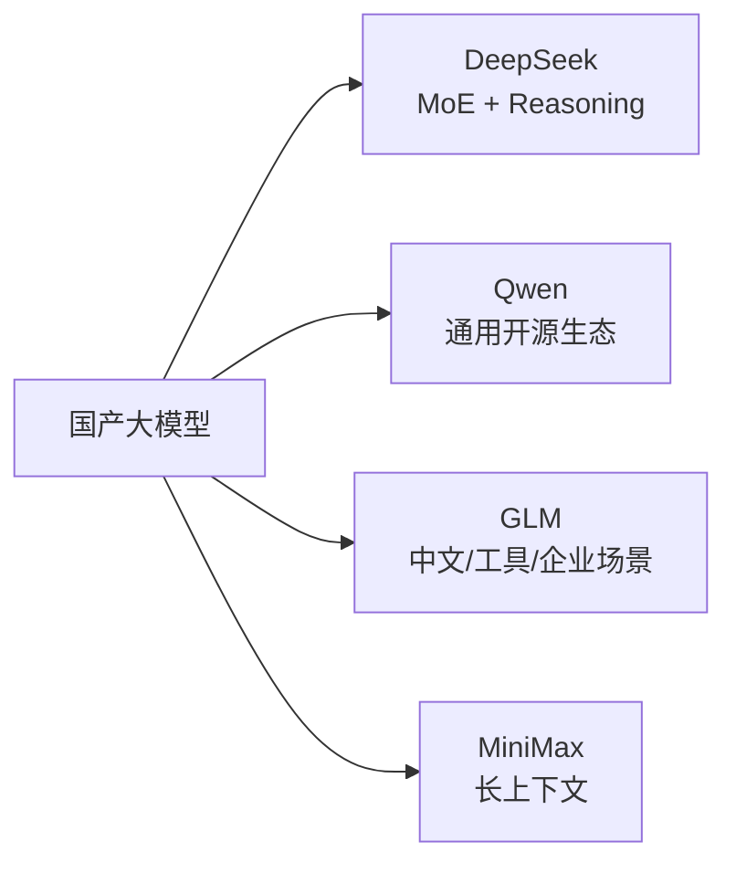
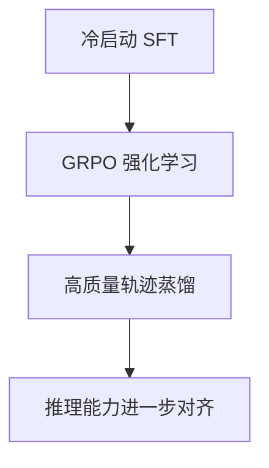
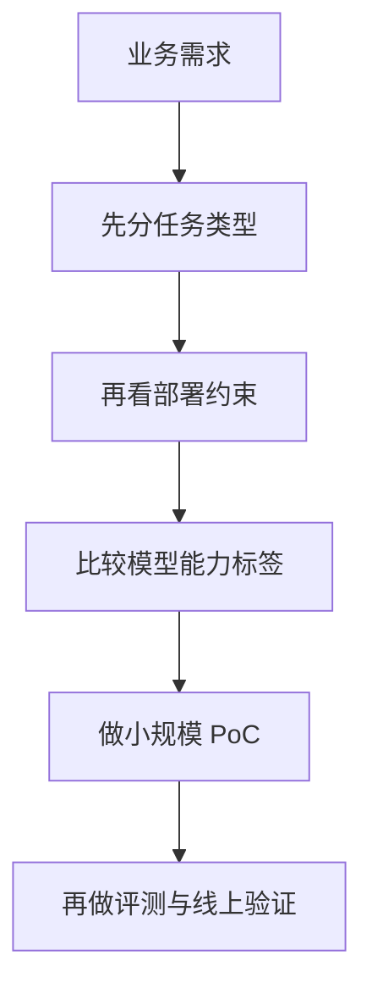

# 国产主流模型全景（DeepSeek / Qwen / GLM / MiniMax）

## 面试高频考点

- DeepSeek-V3 和 DeepSeek-R1 的区别是什么？各用了什么关键技术？
- Qwen3 的混合思考模式是什么？和 o1 类模型有什么边界差异？
- GLM 系列和 LLaMA 风格架构相比，有哪些演进特点？
- MiniMax-Text-01 的 Lightning Attention 解决了什么问题？
- 国产开源模型各自更擅长什么方向？
- 面试里如果问“怎么选国产模型”，该从哪些维度回答？

---

## 总览视角

这几条主线可以先记住：

- **DeepSeek**：以高性价比训练、MoE、推理强化见长
- **Qwen**：开源生态完整，dense 和 MoE 都强，通用能力均衡
- **GLM**：中文场景和工具能力积累深，国内企业认知度高
- **MiniMax**：超长上下文和高效注意力机制是亮点

---

## 一、DeepSeek 系列

DeepSeek 是 2025-2026 年全球关注度极高的中国 AI 公司之一，最大的标签是：**强模型能力 + 极强工程效率 + 高话题度的推理路线**。

### 模型谱系

| 模型 | 发布时间 | 参数 | 类型 | 核心亮点 |
|------|---------|------|------|---------|
| DeepSeek-V2 | 2024.05 | 236B（21B 激活） | MoE 基座模型 | MLA，显著压缩 KV Cache |
| DeepSeek-V3 | 2024.12 | 671B（37B 激活） | MoE 基座模型 | FP8 训练、负载均衡优化、MTP |
| DeepSeek-R1 | 2025.01 | 671B 级路线 | 推理模型 | GRPO、Long CoT、推理强化学习 |

### DeepSeek-V3 关键技术

#### 1. Auxiliary-Loss-Free Load Balancing

传统 MoE 常通过额外辅助 loss 强行做专家负载均衡，但这会干扰主任务优化。DeepSeek-V3 的一个亮点是尽量把负载均衡从"额外 loss 惩罚"转向更直接的路由层调节。

这类设计的价值在于：

- 减少 MoE 训练时的副目标干扰
- 让专家利用率更稳定
- 降低热点专家过载问题

#### 2. FP8 训练

FP8 的意义不是"噱头精度更低"，而是大规模训练时：

- 显著降低显存压力
- 降低通信带宽开销
- 提高单位硬件的吞吐效率

面试里如果被追问，重点回答：**真正难的是在超大规模下把 FP8 训稳，而不是能不能做一个 FP8 实验。**

#### 3. MTP（Multi-Token Prediction）

除了预测下一个 token，还让模型学习更远未来的 token 结构，目标是提升训练效率和长程建模能力。

可以把它理解成：模型不只学"下一步怎么走"，还学"后面几步大概会怎样展开"。

#### 4. MLA（Multi-head Latent Attention）

MLA 的核心价值在于显著压缩 KV Cache，使长上下文推理更可行。

在大模型部署里，很多时候真正炸掉的不是参数本体，而是长序列推理时的 KV Cache。MLA 的工程意义非常大。

### DeepSeek-R1 的意义

R1 最有代表性的不是单个架构新点，而是它把**推理能力训练**这件事打成了一个行业标志性案例。

核心标签：

- GRPO 路线
- 长链式思维
- 数学/代码等可验证任务上的推理强化

---

## 二、Qwen 系列（阿里）

Qwen 是当前开源生态中最完整、最稳健的国产模型系列之一。它的优势不是单点极端，而是**综合能力、版本覆盖、工具链和社区可用性都很强**。

### 模型谱系

| 模型 | 参数范围 | 上下文 | 特点 |
|------|----------|--------|------|
| Qwen2 | 7B / 72B 等 | 128K | 通用基座成熟 |
| Qwen2.5 | 多尺寸 | 128K | 代码、数学、指令遵循增强 |
| Qwen3 Dense | 0.6B ~ 32B | 128K | dense 系列，覆盖部署广 |
| Qwen3 MoE / 旗舰 | 235B 级 | 128K | 更强综合能力 |

### Qwen3 的混合思考模式

Qwen3 的代表性概念是：**同一模型支持不同思考模式**。

直观理解：

- 简单任务可以快速回答
- 难题可以进入更深推理模式

这种设计的工程价值很现实：

- 不必为“快聊”和“深想”维护两套完全独立模型
- 更适合做统一 API 和统一产品形态

### Qwen 系列为什么常被优先尝试

1. 开源权重和生态成熟  
2. 中文、英文、代码综合表现均衡  
3. 社区适配多，量化、部署、评测工具链完善  
4. 适合从研究 demo 一路走到业务 PoC

---

## 三、GLM 系列（智谱 / 清华系背景）

GLM 是国内很早就建立起影响力的一条模型线。它的历史地位在于：**早期中文对话模型认知普及里，GLM 是关键角色之一。**

### 模型谱系

| 模型 | 参数 | 上下文 | 特点 |
|------|------|--------|------|
| ChatGLM-6B | 6B | 2K | 早期中文开源对话模型代表 |
| ChatGLM2-6B | 6B | 32K | 更强长上下文能力 |
| ChatGLM3-6B | 6B | 128K | 工具调用、Agent 方向增强 |
| GLM-4 | 未完全公开统一规格 | 128K 级 | 面向通用旗舰能力 |
| GLM-4-Long | 长上下文路线 | 1M 级 | 超长上下文亮点 |

### GLM 系列的特点

#### 1. 中文和企业认知基础深

很多国内团队对 GLM 的熟悉度高，原因不是单纯 benchmark，而是：

- 中文可用性较早被验证
- 企业客户触达广
- 工具能力、Agent 场景和 API 方案布局较早

#### 2. 路线逐步向主流 decoder-only 靠拢

早期 GLM 在预训练目标和结构设计上有过自身特色，后续则越来越向主流大模型架构收敛：

- RoPE
- RMSNorm / Pre-Norm 风格
- 更贴近 LLaMA 一类现代主流设计

这个趋势本身也说明：产业里最终会朝更稳定、易扩展、易复现的路线集中。

---

## 四、MiniMax

MiniMax 的突出标签是：**超长上下文能力**。

### 模型谱系

| 模型 | 发布时间 | 参数 | 上下文 | 亮点 |
|------|---------|------|--------|------|
| MiniMax-Text-01 | 2025.01 | 456B（45.9B 激活） | 1M tokens | 长上下文、Lightning Attention |
| MiniMax-M1 | 2025.05 | 同级路线 | 1M tokens | 推理路线延伸 |

### Lightning Attention 解决什么问题

标准 softmax attention 在超长上下文下成本过高，尤其当序列非常长时，注意力矩阵会变得极其昂贵。

MiniMax 的路线价值在于：

- 用更高效的 attention 变体支撑超长序列
- 让 1M 上下文不只停留在“理论支持”，而是更接近可运行工程方案

### 什么时候长上下文模型真的有价值

适合：

- 超长文档分析
- 多文档连续阅读
- 法律、金融、研究档案等长材料场景
- 需要尽量少做检索切片的任务

不适合简单理解成：

- 只要窗口长，就一定比 RAG 强

长上下文和 RAG 往往是互补关系。

---

## 横向对比

### 按能力标签理解

| 维度 | DeepSeek | Qwen | GLM | MiniMax |
|------|----------|------|-----|---------|
| 开源生态活跃度 | 很高 | 很高 | 中高 | 中 |
| 推理强化标签 | 很强 | 持续增强 | 有布局 | 有延伸 |
| 中文通用能力 | 强 | 强 | 强 | 强 |
| 代码/数学关注度 | 很高 | 很高 | 中高 | 中 |
| 长上下文标签 | 中高 | 高 | 高 | 很高 |
| 企业 API 场景认知 | 高 | 高 | 很高 | 中高 |

### 按“怎么选模型”回答

如果用户要你给选型建议，可以从 5 个维度答：

1. **任务类型**：聊天、推理、代码、RAG、Agent、多模态
2. **部署约束**：本地、私有化、显存、吞吐、延迟
3. **语言偏好**：中文优先、英文优先、双语、多语言
4. **上下文需求**：普通 8K/32K，还是超长 128K/1M
5. **生态成熟度**：量化、推理框架、社区样例、评测支持

---

## 工程实践视角

### 一个很实用的选型顺序

### 常见选择建议

- **想快速做通用中文/代码 PoC**：通常先看 Qwen / DeepSeek
- **想研究 reasoning 路线**：DeepSeek-R1 一类模型最有代表性
- **想做企业中文助手或工具链联动**：GLM 值得关注
- **想处理超长文档**：MiniMax 或 GLM/其他长上下文路线更合适

真正工程里，不会只看榜单一句话做决定，而是一定要跑自己的数据。

---

## 常见误区

### 误区 1：国产模型只是在追国外路线

不准确。很多路线确实参考国际主流架构，但在工程效率、MoE 训练、长上下文和推理强化上，国内团队已经有明显自己的打法。

### 误区 2：只看参数规模就能判断强弱

错。MoE 的总参数、激活参数、训练数据质量、推理策略都比单纯参数数值更关键。

### 误区 3：长上下文一定优于 RAG

不成立。长上下文成本高，知识更新也不如 RAG 灵活。

### 误区 4：同一模型系列所有版本都适合生产

不一定。研究版、推理版、长上下文版和 API 版的定位不同，部署成本和稳定性要求也不同。

---

## 面试延伸

**Q：DeepSeek 为什么会引起这么大行业关注？**
> 因为它不只是做出了高性能模型，更关键的是向行业证明了：通过 MoE、精细系统优化、推理强化学习和工程效率提升，可以在相对可控成本下逼近甚至冲击顶级能力。这对全行业的训练成本预期和开源信心都有很大影响。

**Q：Qwen 系列的核心优势是什么？**
> 最大优势是综合平衡。它既有较强的通用能力，又有成熟开源生态和工具链支持，适合作为很多团队的默认起点模型。

**Q：GLM 和其他开源模型相比的独特价值是什么？**
> 一方面是中文和企业场景积累深，另一方面是 API、工具调用和商业落地方向较早布局，因此在很多实际企业环境里出现频率很高。

**Q：MiniMax 的长上下文路线为什么值得关注？**
> 因为很多真实业务并不是问答几句话，而是要吃掉超长材料。谁能把长上下文从“能挂名支持”做成“工程上可运行、可控成本、可接受精度”，谁就能打开新的应用面。

---

## 学完可以做什么

1. 做一张国产主流模型对比表，按“推理、代码、中文、长上下文、部署成本”五列整理。
2. 选 2 到 3 个模型，在你的典型任务上跑一个小型 benchmark。
3. 做一个模型选型文档，不只写“谁分高”，还写“为什么适合这个业务”。

---

## 原始论文与资源

| 资源 | 链接 |
|------|------|
| DeepSeek-V3 技术报告 | [arXiv:2412.19437](https://arxiv.org/abs/2412.19437) |
| DeepSeek-R1 技术报告 | [arXiv:2501.12948](https://arxiv.org/abs/2501.12948) |
| DeepSeek GitHub | [github.com/deepseek-ai](https://github.com/deepseek-ai) |
| Qwen3 技术报告 | [arXiv:2505.09388](https://arxiv.org/abs/2505.09388) |
| Qwen GitHub | [github.com/QwenLM/Qwen3](https://github.com/QwenLM/Qwen3) |
| GLM-4 GitHub | [github.com/zai-org/GLM-4](https://github.com/zai-org/GLM-4) |
| MiniMax-Text-01 技术报告 | [arXiv:2501.08313](https://arxiv.org/abs/2501.08313) |
| MiniMax GitHub | [github.com/MiniMax-AI](https://github.com/MiniMax-AI) |

## 延伸阅读与视频

| 平台 | 标题 | 说明 |
|------|------|------|
| 📺 B站 | [DeepSeek 系列论文解读：DeepSeek-V3 与 R1](https://www.bilibili.com/video/BV18iNBehEwq/) | 系统性讲解 DeepSeek-V3 与 R1 |
| 📺 B站 | [DeepSeek-V3 全网硬核解读：MTP 与专家负载均衡](https://www.bilibili.com/video/BV18zcme1ELC/) | 深入拆解 V3 的关键工程点 |
| 📺 B站 | [DeepSeek-R1 深度解读：大模型与强化学习](https://www.bilibili.com/video/BV1dHw4e8E3e/) | 讲解 R1 的 GRPO 与推理强化路线 |
| 📺 B站 | [从 RL 到 RPD：Qwen3、GLM、DeepSeek 在关注什么？](https://www.bilibili.com/video/BV1bNGz6xEQf/) | 横向理解几条主流国产模型路线 |
