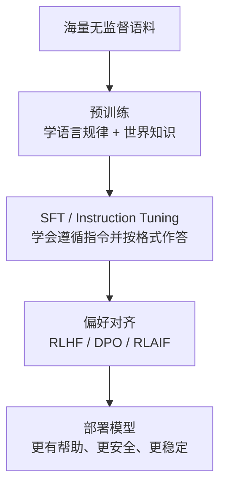
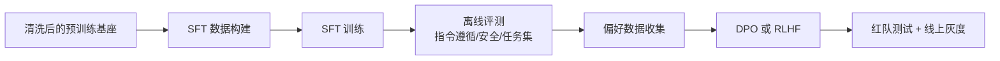

# 预训练 vs 微调 vs RLHF

## 面试高频考点
- 预训练、微调、RLHF 分别解决什么问题？
- 为什么不能直接用预训练模型做对话？
- Instruction Tuning 和传统微调有什么区别？
- 冷启动 SFT 数据为什么常常比规模更重要？
- 什么时候只做 SFT 就够，什么时候必须进入偏好对齐？

---

## 三个阶段概览



一个更工程化的理解是：

- **预训练**解决"模型有没有基础能力"。
- **SFT**解决"模型会不会按人类期望的输入输出协议工作"。
- **偏好对齐**解决"模型在多个可行答案里，会不会选更安全、更有帮助、更符合偏好的那个"。

---

## 预训练（Pre-training）

**目标**：在海量文本上学习语言的统计规律和世界知识。

**训练任务（Causal LM）**：给定前缀，预测下一个 Token：
```text
输入：The capital of France is
目标：Paris
```

**数据规模**：万亿级 Token（LLaMA 3 使用 15T token）。

**学到了什么？**
- 语法、语义、逻辑推理
- 百科知识、代码、数学
- 但不会"听话"，输出格式混乱，可能有害

**本质上在学什么？**
- 学下一个 token 的条件分布 `P(x_t | x_<t)`。
- 把大量共现模式压缩进参数里，形成可迁移表征。
- 这种训练目标天然擅长"续写"，并不天然擅长"完成指令"。

**工程侧关心的不只是 loss：**
- 数据是否足够干净，否则模型会把噪声当模式学进去。
- tokenizer 是否合理，否则中文、代码、公式的 token 效率会很差。
- 训练配比是否合适，否则会出现会聊天但不会代码、会背知识但不会推理的偏科。

---

## 为什么预训练模型不能直接用？

预训练的目标是**补全文本**，不是**回答问题**。给它一个问题，它可能直接续写更多问题，而不是给出答案。同时它没有拒绝有害请求的能力。

典型表现有三类：

1. **格式错位**：用户要 JSON，模型却输出一大段自然语言。
2. **角色错位**：用户问问题，模型继续模拟论坛帖子、论文段落或对话历史。
3. **偏好缺失**：多个答案都可能成立时，模型不会自动选更安全、更简洁、更有行动性的那个。

所以预训练模型更像一个"基础语言引擎"，而不是可直接交付的助手。

---

## SFT（Supervised Fine-Tuning）

用人工标注的**指令-回答对**对预训练模型继续训练，使模型学会：
- 理解并遵循指令
- 以对话格式输出
- 保持输出结构化

**数据格式示例：**
```text
[Instruction] 请总结以下文章：...
[Output] 这篇文章主要讲了...
```

**特点**：数据量不需要很大（几万到几十万条），但质量要求高。

### SFT 到底在改什么

SFT 不是给模型硬塞知识，而是在重塑下面三件事：

- **输入协议**：什么样的 user/system 指令应该如何理解。
- **输出协议**：答案应该以解释、步骤、代码、表格还是 JSON 的形式给出。
- **任务分布**：让模型高频见到"真实用户最常问的问题类型"。

### Instruction Tuning 的关键价值

传统微调常常只优化一个任务，例如情感分类、摘要、NER。Instruction Tuning 则把许多任务统一成"指令 -> 回答"形式，逼模型学会任务迁移，因此它更像是在学习一个通用接口，而不是某个单点技能。

### 冷启动数据为什么特别重要

很多团队在做对齐时，第一批高质量 SFT 数据决定了模型的上限方向：

- 回答风格是啰嗦还是精炼
- 遇到不确定问题时会不会承认不知道
- 代码题是只给答案还是带解释和边界条件
- 安全拒答是模板化还是自然化

LIMA 这类工作强调的就是：**少量但高质量的数据，也能把预训练模型的能力"拽出来"。**

---

## RLHF（Reinforcement Learning from Human Feedback）

SFT 后模型会"听话"，但未必输出**人类偏好**的内容（安全、有帮助、无害）。RLHF 用人类偏好进一步对齐。

**三步流程：**

1. **收集偏好数据**：对同一 prompt，模型生成多个回复，人工标注哪个更好
2. **训练奖励模型（RM）**：学习预测人类的偏好分数
3. **PPO 优化**：用 RM 作为奖励信号，用 PPO 算法更新语言模型

**KL 散度惩罚**：防止模型过度优化 RM（reward hacking），保持与 SFT 模型不偏离太远：
```text
reward = RM(x, y) - β · KL(π_RL || π_SFT)
```

### RLHF 想解决的不是"正确性"，而是"偏好排序"

很多问题并没有唯一标准答案，但人类会稳定偏好：

- 更直接的表达
- 更完整但不冗余的解释
- 更安全的拒答
- 更符合角色设定的语气

RLHF 的核心是把这些偏好转成训练信号，让模型在多个可行输出里选"更像人类会接受的那个"。

### DPO 为什么近两年更受欢迎

RLHF 的工程链条很长：采样、标注、训练 RM、跑 PPO、控稳定性。DPO 把问题改写成"给定 chosen/rejected，直接让模型提高 chosen 的相对概率"，因此：

- 实现更简单
- 训练更稳定
- 不需要单独训练奖励模型

但这不代表 DPO 永远替代 RLHF。对于复杂在线交互、长时序决策、工具调用反馈，RL 路线依然有空间。

---

## 三阶段如何分工

| 阶段 | 训练信号 | 解决的问题 | 常见瓶颈 |
|------|----------|------------|----------|
| 预训练 | 下一个 token | 基础能力、知识覆盖、泛化表征 | 数据质量、算力、收敛效率 |
| SFT | 标准答案 | 指令遵循、输出格式、角色行为 | 数据质量、任务覆盖、风格一致性 |
| RLHF / DPO | 偏好排序或奖励 | 帮助性、安全性、主观质量 | 奖励偏差、训练稳定性、标注成本 |

---

## 什么时候只做 SFT，什么时候继续偏好对齐

**只做 SFT 就够的场景：**
- 垂直任务边界清晰，比如 SQL 生成、客服分类、结构化抽取
- 输出是否正确可以用规则或测试集直接判断
- 更在意稳定复现，而不是开放式对话体验

**需要偏好对齐的场景：**
- 通用助手、聊天机器人、开放问答
- 用户对语气、安全、拒答方式很敏感
- 存在多个都"勉强正确"但质量差异很大的回答

很多企业模型实际上停在 SFT 或 SFT + 少量 DPO，就已经足够上线。不是所有系统都需要完整 RLHF。

---

## 工程实践视角

### 一个常见训练流水线



### 实际项目里最容易低估的成本

- 标注规范制定：同一问题什么叫"更好"，需要可执行规则。
- 数据去重：SFT 与评测集泄漏会让离线分数虚高。
- 模板迁移：system prompt、chat template、tokenizer 不一致会直接拖垮效果。
- 多轮数据建模：单轮答得好，不代表多轮跟踪上下文也稳定。

---

## Instruction Tuning vs 传统微调

| | 传统微调 | Instruction Tuning |
|--|---------|-------------------|
| 数据 | 特定任务标注数据 | 多样化指令-回答对 |
| 目标 | 单任务性能最优 | 泛化到未见任务 |
| 效果 | 专才 | 通才 |

再补一层理解：

- **传统微调**关注单点 KPI，例如某个分类任务准确率。
- **Instruction Tuning**关注通用交互能力，是面向"使用方式"而不是单一标签空间。
- 很多团队会先做 instruction tuning，再做领域 SFT，把通才底座收敛成"可工作的专才助手"。

---

## 常见误区

### 误区 1：SFT 就是在给模型注入新知识

不准确。SFT 更常见的作用是让模型学会**如何把已有能力以正确接口释放出来**。如果底座根本没学到相关知识，只靠少量 SFT 很难补齐。

### 误区 2：RLHF 一定提升事实正确率

不一定。RLHF 优化的是偏好，不是客观真值。它可能让回答更像人喜欢的样子，但未必让事实更真。

### 误区 3：偏好数据越多越好

偏好数据标签噪声通常比 SFT 更大。低一致性标注会把模型往模糊方向推，导致输出风格摇摆。

### 误区 4：开源基座差一点，靠后训练都能补回来

这是典型高估后训练的说法。基座能力不够，后训练更多是在"整形"，不是"重建大脑"。

---

## 面试延伸

**Q：RLHF 的主要挑战是什么？**
> 1. 奖励模型不完美，存在 reward hacking 风险；2. PPO 训练不稳定；3. 人工标注成本高、一致性差。

**Q：DPO 如何解决 RLHF 的问题？**
> DPO 将 RLHF 的优化目标重参数化，直接用偏好数据对语言模型做有监督训练，无需单独训练 RM 和运行 PPO。详见 [07_RLHF_DPO_PPO.md](./07_RLHF_DPO_PPO.md)。

**Q：为什么说 SFT 是"把基座能力唤醒"而不是"重新训练一个模型"？**
> 因为预训练已经把大量知识和模式压进参数里，SFT 更多是在调整条件分布，让模型在看到 instruction/chat 格式输入时，优先走符合人类任务期望的输出路径。参数更新量相对小，但行为变化会非常明显。

**Q：企业里做领域模型，预训练和微调怎么取舍？**
> 如果领域数据规模有限、预算有限，通常优先选强基座做 SFT/DPO；如果领域语料非常独特且与通用互联网差异大，比如金融内参、医疗病历、工业日志，才考虑持续预训练（continued pretraining）或领域自适应预训练，再进入 SFT。

**Q：Continued Pretraining 和 SFT 有什么边界？**
> Continued Pretraining 仍然是语言建模目标，用领域原始语料继续训练，解决的是知识分布迁移；SFT 用的是指令-回答对，解决的是任务接口和行为模式。前者补底座，后者补交互。

---

## 学完可以做什么

1. 用开源基座做一个垂直问答助手，对比 `base -> SFT -> DPO` 三个版本的回答差异。
2. 自己构造 200 条高质量 instruction 数据，观察少量高质数据对回答风格的影响。
3. 做一个"拒答策略"对齐实验，比较模板拒答和自然拒答的用户体验。

---

## 原始论文

| 论文 | 链接 |
|------|------|
| InstructGPT: Training language models to follow instructions with human feedback (Ouyang et al., 2022) | [arxiv.org/abs/2203.02155](https://arxiv.org/abs/2203.02155) |
| LIMA: Less Is More for Alignment (Zhou et al., 2023) | [arxiv.org/abs/2305.11206](https://arxiv.org/abs/2305.11206) |

## 延伸阅读与视频

| 平台 | 标题 | 说明 |
|------|------|------|
| 📺 B站 | [斯坦福CS336第十五课：详解SFT、RLHF](https://www.bilibili.com/video/BV17tNXzkESf/) | 斯坦福课程，从学术角度全面讲解三阶段训练 |
| 📺 B站 | [理解大模型训练的几个阶段：Pretraining、SFT、RLHF](https://www.bilibili.com/video/BV1q94y1W7hP/) | 1.4万播放，清晰区分三阶段的定义与边界 |
| 📺 B站 | [20分钟带你快速弄懂SFT、RLHF、DPO](https://www.bilibili.com/video/BV1HYBWBaEE3/) | 1.2万播放，从定义到适用边界全流程解析 |
