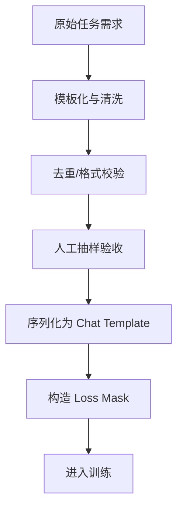

# SFT 有监督微调

## 面试高频考点

- SFT 的数据格式是什么？为什么只对 Assistant 部分计算 loss？
- SFT 和预训练的本质区别是什么？
- 如何防止 SFT 导致的灾难性遗忘？
- 数据质量和数量哪个更重要？LIMA 的核心结论是什么？
- SFT 数据如何构造、清洗和验收？
- 多轮 SFT 和单轮 SFT 的差异是什么？
- 什么时候只做 SFT 就够，什么时候还要继续做 DPO / RLHF？

---

## 一、SFT 是什么

Supervised Fine-Tuning（有监督微调）是在预训练模型基础上，用高质量的指令-回答对继续训练，让模型从“会续写文本”变成“会遵循指令完成任务”。


一个更准确的说法是：

- 预训练让模型拥有基础能力
- SFT 让这些能力以人类可用的接口释放出来

所以 SFT 常常不是“给模型补课”，而是“把模型调成能工作”。

---

## 二、SFT 数据格式

### Chat Template

现代模型通常把数据序列化成统一对话模板：

```text
<|system|>
你是一个专业、准确、有帮助的 AI 助手。
<|user|>
请用三句话解释什么是 Transformer
<|assistant|>
Transformer 是一种基于自注意力机制的神经网络架构...
```

### 为什么只对 Assistant 部分计算 loss

这通常叫 **loss masking**。

```text
[system] [user] [assistant]
   x        x        ✓
```

原因有三点：

1. 训练目标是学“如何回答”，不是学“如何提问”
2. 避免模型把用户问题模板背死
3. 保持推理时对任意输入格式的泛化能力

本质上，SFT 优化的是**回答分布**，不是用户输入分布。

---

## 三、SFT 和预训练的本质区别

| 维度 | 预训练 | SFT |
|------|--------|-----|
| 数据 | 海量无监督语料 | 高质量监督样本 |
| 目标 | 下一个 token 预测 | 指令遵循与任务执行 |
| loss 位置 | 全序列 | 主要在 assistant 回复上 |
| 关注点 | 知识与基础能力 | 行为、格式、交互方式 |
| 风险 | 数据噪声、配比不合理 | 过拟合、遗忘、风格僵化 |

### Continued Pretraining 和 SFT 的边界

- **Continued Pretraining**：补领域知识分布
- **SFT**：补任务接口和输出行为

如果模型“不知道”，优先考虑继续预训练；如果模型“知道但不会按要求答”，优先考虑 SFT。

---

## 四、数据质量为什么比数量更重要

### LIMA 的启示

LIMA 的核心结论不是“1000 条就够”，而是：

> 少量高质量 SFT 数据，也能显著改变模型行为。

这说明预训练模型很多能力早就存在，SFT 的作用主要是：

- 统一输出风格
- 建立任务接口
- 教模型何时结构化输出、何时承认不知道

### 什么算高质量数据

**好数据：**

- 指令清晰、可执行
- 回答准确、完整、格式稳定
- 推理步骤自然
- 有边界感，不乱答
- 多轮场景下上下文一致

**差数据：**

- 指令模糊
- 回答模板化、废话多
- 事实错误
- 格式前后不一致
- 风格过于机械

---

## 五、SFT 数据如何构造


> 图源：`Self-Instruct: Aligning Language Models with Self-Generated Instructions` 论文 HTML 图。它展示了从少量种子任务出发，自动生成指令、样本并过滤的流程。

### 1. 人工编写

优点：

- 质量高
- 风格可控

缺点：

- 贵
- 扩展慢

### 2. Self-Instruct / 数据合成

用强模型生成 instruction-response 数据，再做过滤与抽样。

### 3. 蒸馏强模型

让更强的 teacher 模型产出高质量答案，student 去学习。

### 4. 渐进式指令构造

例如从简单任务逐渐演化到复杂约束任务，让数据难度更平滑。



---

## 六、灾难性遗忘

### 是什么

SFT 数据分布过窄时，模型会越来越像这个数据集，导致其他能力退化。

例如：

- 对话能力涨了
- 代码能力掉了
- 数学能力掉了

### 常见缓解方案

| 方法 | 作用 |
|------|------|
| 混入少量通用数据 | 保留基础能力 |
| 小学习率 | 降低对原权重破坏 |
| LoRA / PEFT | 降低整体扰动 |
| 数据多样性 | 减少偏科 |
| 渐进式训练 | 平滑迁移 |

### 一个实用建议

如果你的 SFT 目标很垂直，不要把全部数据都换成该垂直任务，最好保留一部分通用任务样本做混合。

---

## 七、多轮 SFT 的特殊点

单轮 SFT 更像“问一次答一次”，多轮 SFT 还要学会：

- 追踪上下文
- 处理代词和省略
- 保持角色一致
- 接住用户追问和纠错

### 训练构造方式

1. **整段多轮一起训练**  
   更贴近真实聊天

2. **拆成带历史上下文的单轮样本**  
   更便于扩充样本和控制长度

多轮场景下，真正学到的是“对话状态管理”，不只是回答本身。

---

## 八、什么时候只做 SFT 就够

### 适合只做 SFT 的场景

- 任务边界清晰
- 输出质量可规则判断
- 主观偏好差异不大

例如：

- SQL 生成
- 结构化抽取
- 分类
- 模板化问答

### 需要继续做 DPO / RLHF 的场景

- 通用助手
- 主观体验差异大
- 安全、拒答、语气非常重要

一句话：

- SFT 解决“会不会做”
- 偏好对齐解决“做得讨不讨喜、稳不稳定”

---

## 九、工程实践视角

### 一个常见 SFT 配方

1. 统一 chat template
2. 数据去重和污染检查
3. 控制任务类型、难度和长度分布
4. 小学习率跑 1-2 epoch
5. 保留通用能力验证集

### 数据验收清单

| 检查项 | 重点看什么 |
|------|------------|
| 格式 | chat template 是否统一，role 是否错位 |
| Loss Mask | 是否只训练 assistant 回复，system/user 是否被 mask |
| 去重 | 是否有模板化重复、近重复、泄露评测集 |
| 事实性 | 专业问答是否可追溯，是否存在胡编引用 |
| 分布 | 长度、任务类型、语言、难度是否过窄 |
| 安全边界 | 是否有该拒答不拒答、该回答过度拒答的问题 |

### 评估时不要只看 loss

还要看：

- 指令遵循是否更稳
- 格式是否正确
- 通用能力是否掉
- 多轮表现是否崩

### 常见失败信号

- 训练集 loss 很低，但真实用户问题变差：过拟合或模板化严重
- 格式遵循变强，但推理能力下降：数据分布太窄或学习率过大
- 多轮对话容易丢上下文：样本构造只覆盖单轮
- 模型越来越啰嗦：训练数据里的回答风格被放大

---

## 十、常见误区

### 误区 1：SFT 就是在给模型灌新知识

不准确。很多时候它是在重新组织已有能力的使用方式。

### 误区 2：数据越多一定越好

低质量和模板化数据会很快把模型带偏。

### 误区 3：SFT 一定要训很多 epoch

通常不是。高质量数据下，1 到 2 个 epoch 往往已经足够。

### 误区 4：训练 loss 下降就说明效果好

不一定。模型可能只是更擅长模仿训练集风格，而不是更适合真实用户。

---

## 十一、面试延伸

**Q：SFT 数据多样性为什么重要？**
> 因为模型学的不该是某个固定任务答案，而是“如何处理不同类型指令”的元能力。数据分布太窄，很容易导致其他能力退化。

**Q：如何评估 SFT 效果？**
> 通常结合自动评测和人工评测：看指令遵循、格式正确率、多轮稳定性，以及领域专项任务表现。只看 loss 或 BLEU/ROUGE 这类指标不够。

**Q：SFT 要做几个 epoch？**
> 实践中大多是 1 到 3 个 epoch，高质量小数据集通常 1 到 2 个就够。再多容易过拟合和灾难性遗忘。

**Q：SFT 和 DPO 的分工是什么？**
> SFT 负责把模型从“会续写”变成“会回答”，DPO 负责在此基础上进一步优化偏好排序，比如更有帮助、更自然、更安全。

---

## 十二、学完可以做什么

1. 自己构造 200 条高质量 instruction 数据做一次小型 SFT。
2. 对比 `base -> SFT` 在格式遵循和任务完成率上的差异。
3. 做一个多轮对话样本构造器，练习 chat template 和 loss mask 生成。

---

## 原始论文

| 论文 | 链接 |
|------|------|
| LIMA: Less Is More for Alignment (Zhou et al., 2023) | [arxiv.org/abs/2305.11206](https://arxiv.org/abs/2305.11206) |
| Self-Instruct (Wang et al., 2023) | [arxiv.org/abs/2212.10560](https://arxiv.org/abs/2212.10560) |
| WizardLM (Xu et al., 2023) | [arxiv.org/abs/2304.12244](https://arxiv.org/abs/2304.12244) |
| InstructGPT (Ouyang et al., 2022) | [arxiv.org/abs/2203.02155](https://arxiv.org/abs/2203.02155) |
| Orca (Mukherjee et al., 2023) | [arxiv.org/abs/2306.02707](https://arxiv.org/abs/2306.02707) |

## 延伸阅读与视频

| 平台 | 标题 | 说明 |
|------|------|------|
| 📺 B站 | [大模型微调看这个视频就够了 SFT NEFTune](https://www.bilibili.com/video/BV1gmWDeLEMZ/) | SFT 全流程与技巧 |
| 📺 B站 | [20分钟带你快速弄懂SFT、RLHF、DPO](https://www.bilibili.com/video/BV1HYBWBaEE3/) | 适合理清边界 |
| 📺 B站 | [SFT 一行一行代码实现并跑通](https://search.bilibili.com/all?keyword=SFT%E4%B8%80%E8%A1%8C%E4%B8%80%E8%A1%8C%E4%BB%A3%E7%A0%81%E5%AE%9E%E7%8E%B0%E5%B9%B6%E8%B7%91%E9%80%9A&order=click) | 适合动手实践 |
