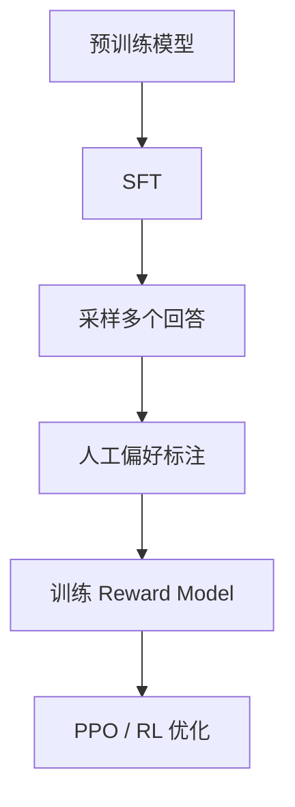

# RLHF / DPO / PPO 对比

## 面试高频考点

- RLHF 的完整流程是什么？
- PPO 在 LLM 对齐里为什么难训？
- DPO 为什么能绕开 RM 和 PPO？
- KL 惩罚项起什么作用？为什么不能去掉？
- GRPO 相比 PPO 的主要改动是什么？

---

## RLHF 在解决什么问题

**细化理解：** RLHF 解决的是模型输出和人类偏好之间的差距。预训练模型可能知道很多东西，但回答可能啰嗦、冒犯、不安全或不符合任务意图；RLHF 通过偏好数据把模型推向更有帮助、更安全、更符合人类评价的回答。它不等同于事实增强，奖励模型本身也可能带偏见或被策略模型利用。

SFT 让模型学会“按指令回答”，但不一定学会在多个可行回答中选择更符合人类偏好的那个。

RLHF 解决的是：

- 更有帮助
- 更安全
- 更符合偏好
- 更自然的拒答与表达

---

## RLHF 完整流程


> 图源：`Training language models to follow instructions with human feedback` 论文 HTML 图。它把 RLHF 拆成 SFT、Reward Model、PPO 三步。



### Stage 1: SFT

先用高质量 instruction 数据把模型变成可用助手。

### Stage 2: Reward Model

对同一个 prompt 的多个候选回答做人类排序，让 RM 学会：

- 哪种回答更好
- 哪种更差

### Stage 3: PPO

**细化理解：** PPO 在 RLHF 中负责根据奖励模型反馈更新策略模型，同时用 KL 约束避免模型偏离 SFT 初始分布太远。这个约束很重要，因为没有约束时模型可能为了拿高奖励而生成奇怪、模式化甚至欺骗奖励模型的文本。面试里可以把 PPO 讲成“在偏好奖励和保持语言质量之间做受控优化”。

把 RM 作为奖励信号，用强化学习更新模型策略。

---

## PPO 在 RLHF 中做什么

PPO 不是为了“让模型更聪明”，而是为了**稳住策略更新**。

如果直接做激进的策略梯度更新，模型很容易：

- 一步偏太远
- 奖励劫持
- 输出风格崩掉

### 一个关键目标

```text
max E[ reward(x, y) - β * KL(π || π_ref) ]
```

含义：

- 第一项：让奖励更高
- 第二项：别离参考模型太远

### KL 惩罚为什么重要

如果没有 KL，模型会专门钻 Reward Model 的漏洞，而不是学会真正更好的回答。

---

## PPO 为什么难训

### 1. 奖励稀疏

常常整段回答最后只得到一个总奖励，credit assignment 很难。

### 2. 显存和系统开销大

典型 RLHF 里同时要维护多套角色：

- Actor
- Critic
- Reference
- Reward Model

### 3. 超参敏感

- learning rate
- KL 系数
- clip range
- batch size

任何一个没调稳，训练都可能崩。

### 4. Reward Hacking

模型不是在学“更好”，而是在学“怎样骗高分”。

---

## DPO 的核心思想

DPO 的洞见是：

> 既然我们有 chosen / rejected 偏好对，就不一定非要先训 RM 再跑 PPO。

它直接让模型提高 chosen 的相对概率、压低 rejected 的相对概率。

### 直观理解

对于同一个 prompt：

- 好回答概率提高
- 差回答概率降低
- 同时相对参考模型保持约束

这就把复杂 RL 问题变成了更像监督学习的问题。

### DPO 的一句话公式直觉

DPO 训练时比较的是：

```text
模型更偏向 chosen 多少  vs  参考模型更偏向 chosen 多少
```

如果当前模型相对参考模型还不够偏向 chosen，就继续提高 chosen、压低 rejected。

这里的关键不是“chosen 概率绝对高”，而是“chosen 相对 rejected 的优势要比参考模型更大”。

---

## DPO vs RLHF

| 维度 | PPO / RLHF | DPO |
|------|------------|-----|
| 需要 RM | 是 | 否 |
| 需要 Critic | 是 | 否 |
| 训练方式 | 在线 RL | 离线偏好学习 |
| 实现复杂度 | 高 | 低 |
| 稳定性 | 更脆弱 | 更稳 |
| 可探索新策略 | 强 | 弱 |

### 什么时候 DPO 特别合适

- 已经有偏好对数据
- 想快速、稳定地做对齐
- 团队不想维护复杂 RL 栈

### 什么时候 RL 仍有价值

- 在线交互反馈
- 多步决策
- 工具调用和环境回报
- 需要真正 exploration 的场景

---

## 其他偏好优化方法

### SimPO

进一步简化 DPO 风格训练目标，减少对参考模型的依赖。

### ORPO

尝试把 SFT 和偏好优化更紧凑地合并。

### KTO

不要求严格的成对偏好数据，更适合从点赞/点踩这类弱反馈中学习。

这些方法本质上都在做一件事：

> 用更便宜、更稳的方式替代传统 RLHF 的重链路。

---

## Reward Hacking

### 典型表现

- 回答特别长但没信息量
- 过度礼貌、模板化
- 为了安全分数动不动拒答
- 专门迎合 judge 偏好而不是真正解决问题

### 缓解思路

| 层面 | 方法 |
|------|------|
| 数据 | 减少长度和格式偏差 |
| RM | 用更稳的标注和更广的覆盖 |
| PPO | 加 KL、控步长、做在线回补 |
| 替代方案 | 对可验证任务用规则奖励或 GRPO |

---

## GRPO 为什么值得提

GRPO 是推理强化路线里很重要的一步，核心变化是：

- 不单独训练 Critic
- 对同题多样本做组内相对比较

这带来两个好处：

1. 显存和训练复杂度下降
2. 对数学/代码等可验证任务更直接

所以 GRPO 特别适合：

- 有客观答案
- 可规则验证
- 长推理链优化

---

## 工程实践视角

### PPO 链路为什么重

传统 RLHF 训练时常常同时维护：

- `Actor`：正在被更新的策略模型
- `Reference`：计算 KL 的冻结参考模型
- `Reward Model`：给回答打偏好分
- `Critic`：估计 value，帮助 PPO 降低方差

这就是为什么 PPO 比 DPO 难落地：它不是多一个 loss，而是多了一整套训练角色和系统调度。

### 一个实际选择顺序

1. 先做强 SFT
2. 有偏好数据时优先试 DPO
3. 只有在确实需要在线反馈或环境奖励时，再上 PPO / RL 路线

### 为什么很多团队停在 DPO

因为它已经能解决很大一部分：

- 语气偏好
- 安全边界
- 格式偏好
- 帮助性排序

而 PPO 的系统和调参成本通常高很多。

---

## 常见误区

### 误区 1：RLHF 一定比 DPO 更先进

不对。RLHF 更通用，但不代表对所有场景都更划算。

### 误区 2：DPO 完全等价于 RLHF

也不对。DPO 能替代很多偏好学习场景，但对真正需要在线探索的任务并不等价。

### 误区 3：KL 只是一个小正则

在 RLHF 里它非常关键，很多时候是防止训练失控的主保险。

### 误区 4：奖励模型高分就说明回答质量高

不一定。高分也可能只是更会迎合奖励模型。

---

## 面试延伸

**Q：为什么 RLHF 需要 KL 惩罚？**
> 因为如果只追逐奖励，模型会专门钻 Reward Model 的漏洞。KL 惩罚把模型锚定在参考策略附近，避免一步偏得太远，是训练稳定性和抗 reward hacking 的关键。

**Q：DPO 的最大优势是什么？**
> 它把复杂的 RLHF 链路压缩成更像监督学习的训练问题，不需要单独的 RM 和 PPO，训练更稳、工程成本更低。

**Q：PPO 为什么在 LLM 上特别难？**
> 因为奖励稀疏、序列长、显存开销大、超参敏感，而且 RM 和策略之间会出现非平稳相互作用。

**Q：GRPO 和 PPO 的主要区别是什么？**
> PPO 依赖 Critic 估计 value；GRPO 用同题多样本的组内相对奖励代替显式 Critic，更省显存，也更适合可验证推理任务。

---

## 学完可以做什么

1. 画一张 `SFT -> RM -> PPO` 与 `SFT -> DPO` 的链路对照图。
2. 自己构造一小批 chosen/rejected 偏好对，做一个最小 DPO 实验。
3. 比较“更长、更礼貌”和“更准确、更简洁”两种偏好标签对模型风格的影响。

---

## 原始论文

| 论文 | 链接 |
|------|------|
| InstructGPT / RLHF (Ouyang et al., 2022) | [arxiv.org/abs/2203.02155](https://arxiv.org/abs/2203.02155) |
| PPO (Schulman et al., 2017) | [arxiv.org/abs/1707.06347](https://arxiv.org/abs/1707.06347) |
| DPO (Rafailov et al., 2023) | [arxiv.org/abs/2305.18290](https://arxiv.org/abs/2305.18290) |
| SimPO (Meng et al., 2024) | [arxiv.org/abs/2405.14734](https://arxiv.org/abs/2405.14734) |
| ORPO (Hong et al., 2024) | [arxiv.org/abs/2403.07691](https://arxiv.org/abs/2403.07691) |
| KTO (Ethayarajh et al., 2024) | [arxiv.org/abs/2402.01306](https://arxiv.org/abs/2402.01306) |
| DeepSeekMath / GRPO (Shao et al., 2024) | [arxiv.org/abs/2402.03300](https://arxiv.org/abs/2402.03300) |

## 延伸阅读与视频

| 平台 | 标题 | 说明 |
|------|------|------|
| 📺 YouTube | [RLHF Explained](https://www.youtube.com/watch?v=Im6ZwnEOy38) | 完整流程讲解 |
| 📺 B站 | [跟李沐学 AI - InstructGPT 论文精读](https://www.bilibili.com/video/BV1hd4y187CR) | 学术视角扎实 |
