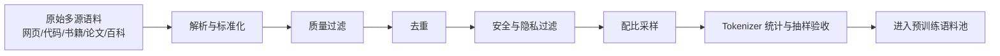
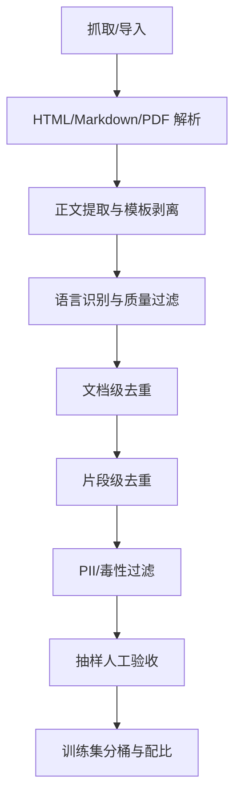

# 预训练数据处理

## 面试高频考点
- 预训练数据如何清洗？去重用什么方法？
- 数据配比（Data Mixture）如何影响模型能力？
- Common Crawl 的数据质量问题怎么处理？
- 为什么说"数据比模型更重要"？
- 数据治理链路里最容易踩坑的环节是什么？
- 文档级去重和 token 级去重分别解决什么问题？

---

## 数据来源与规模

**细化理解：** 预训练数据不是越多越好，而是要兼顾规模、质量、覆盖面和风险。网页数据带来广覆盖，代码数据增强程序能力，论文和书籍提升长文本与专业表达，合成数据可以补任务格式但容易放大模型偏差。数据配比会直接影响模型能力画像，因此现代训练通常会做多轮数据 ablation。

主流预训练数据集的构成（以 LLaMA 3 为例，15T tokens）：

| 数据来源 | 占比 | 特点 |
|---------|------|------|
| Web 网页（Common Crawl）| ~80% | 规模最大，质量参差不齐 |
| 代码（GitHub）| ~8% | 高质量，提升推理能力 |
| 书籍（Books）| ~5% | 长文本，提升连贯性 |
| 学术论文（ArXiv 等）| ~3% | 专业知识 |
| 维基百科 | ~2% | 高质量百科知识 |
| 其他（对话、新闻等）| ~2% | 多样性 |



真正的大头工作不是"找到数据"，而是把数据从"能抓到"变成"能放心训练"。

---

## 数据清洗流程

### 1. 语言过滤

用 fastText 等语言识别模型过滤非目标语言内容。

工程上通常还要补两层：

- **编码修复**：修复乱码、非法 UTF-8、HTML 转义残留。
- **文档边界校正**：很多网页抽取后会把导航栏、页脚、评论区、正文混在一起，需要做模板剥离。

### 2. 质量过滤

- **启发式规则**：过滤过短/过长文本、特殊字符比例过高、重复 n-gram 比例过高的文档
- **质量分类器**：训练一个分类器区分高质量（维基百科级别）和低质量文本
- **困惑度过滤**：用小型语言模型计算困惑度，过滤难以理解的文本

可以把它理解成三层筛子：

| 层级 | 作用 | 优点 | 缺点 |
|------|------|------|------|
| 规则过滤 | 快速剔除脏数据 | 便宜、稳定 | 覆盖面有限 |
| 分类器过滤 | 学习高低质量边界 | 更灵活 | 依赖标注样本 |
| LM 打分 | 从语言流畅性和自然性角度判断 | 效果强 | 成本高 |

很多工业系统会先用规则过滤掉 80% 明显垃圾，再对候选集跑质量分类器，而不是把所有文档都扔给语言模型。

### 3. 去重（Deduplication）

**细化理解：** 去重既节省算力，也降低模型记忆和评测污染。文档级去重能清掉完全重复网页，片段级或 MinHash 去重能处理转载、模板页和轻微改写。去重过强也会误伤合法重复模式，例如 API 文档、代码模板和法律条文，所以工程上要结合抽样审查。

去重是预训练数据处理最关键的步骤之一，重复数据会导致模型记忆而非泛化。

**精确去重**：URL 去重、MD5 哈希匹配（完全相同的文档）

**模糊去重（MinHash LSH）**：
1. 对每个文档计算 MinHash 签名（用多个哈希函数）
2. 通过 LSH（局部敏感哈希）找到签名相似的文档对
3. 去除 Jaccard 相似度超过阈值（如 0.8）的重复文档

**n-gram 去重**：在 token 级别检测重复片段（suffix array 方法，LLaMA 使用）

**去重效果**：FineWeb 数据集通过去重将 Common Crawl 从 90T tokens 压缩到 15T tokens，同时质量显著提升。

### 文档级去重 vs 片段级去重

| 维度 | 文档级去重 | 片段级去重 |
|------|------------|------------|
| 目标 | 删除整篇重复网页/文档 | 删除大规模重复段落、模板内容 |
| 方法 | URL、MD5、MinHash | n-gram、suffix array、shingling |
| 适合问题 | 镜像站、转载站、整页拷贝 | 页脚模板、重复免责声明、批量洗稿 |

两者都要做。只做文档级去重，会留下大量"不完全相同但高度重复"的内容；只做片段级去重，又会保留整页镜像垃圾。

### 4. 毒性与安全过滤

- 过滤色情、暴力、仇恨言论等有害内容
- 过滤包含个人隐私信息（PII）的文本（邮箱、电话、身份证号）

这一层的目标不是把世界上所有负面内容删干净，而是控制数据分布，避免模型在普通交互中异常容易生成有害模式。对于医疗、法律、金融等高风险场景，还会额外加领域敏感过滤规则。

---

## 数据配比策略（Data Mixture）

不同领域数据的比例对模型能力影响显著：

**代码数据的重要性**：研究发现增加代码比例可以提升模型的推理能力（即使是非代码任务）。LLaMA 3 代码数据占比远高于 LLaMA 2。

**多轮动态配比（DoReMi、Data Mixing Laws）**：
- 不同训练阶段使用不同配比（前期偏重多样性，后期偏重高质量）
- 可通过小模型实验确定最优配比后再大规模训练

### 为什么配比比直觉更重要

模型不是平均地吸收所有数据，而是会被高频模式塑形：

- 代码比例高，通常会提升结构化推理、符号操作和工具使用倾向。
- 高质量长文本比例高，通常会提升连贯性和长程依赖建模。
- 社交媒体和低质量网页比例过高，容易把口语噪声、模板废话、错误事实也学进去。

所以"加更多数据"只有在**新增数据质量和分布合理**时才成立。

### 一个常见的数据混合策略

1. 先按来源切桶：网页、代码、论文、书籍、百科、对话。
2. 每桶内先做质量分层：高、中、低。
3. 小模型预实验，比较不同 mixture 对下游验证集的影响。
4. 大模型正式训练时分阶段调整采样权重，而不是全程固定。

---

## SFT 数据格式规范

有监督微调数据通常用对话格式：

```json
{
  "messages": [
    {"role": "system", "content": "你是一个有帮助的助手"},
    {"role": "user", "content": "什么是梯度消失？"},
    {"role": "assistant", "content": "梯度消失是指..."}
  ]
}
```

要注意，SFT 数据虽然不属于预训练数据，但它跟预训练数据治理是一脉相承的：格式统一、角色定义清晰、去重和泄漏控制同样重要。

**偏好数据格式（DPO/RLHF）**：
```json
{
  "prompt": "请解释量子纠缠",
  "chosen": "量子纠缠是一种...",
  "rejected": "量子纠缠就是..."
}
```

---

## 重要数据集

| 数据集 | 规模 | 特点 |
|--------|------|------|
| Common Crawl | PB 级 | 最大网页语料，需大量清洗 |
| FineWeb | 15T tokens | HuggingFace 清洗版 CC，质量高 |
| RedPajama | 1.2T tokens | LLaMA 开源复现数据集 |
| Dolma | 3T tokens | AI2 开源，含详细数据卡片 |
| The Pile | 825GB | 22 种来源，学术界常用 |
| StarCoder | 300B tokens | 代码数据，多语言 |

---

## 工程实践视角

### 真实数据管线长什么样



### 三个最常见的工程坑

1. **只看自动指标，不做人抽样**  
   过滤器分数再漂亮，也可能留下导航栏、广告文案、乱码和半截正文。

2. **数据切分在去重之前做**  
   这样会让原本重复的整篇文档被切成不同 chunk，重复更难发现。

3. **训练集和评测集隔离不严格**  
   一旦泄漏，loss 和 benchmark 分数都会虚高，后面很难判断真实收益。

### 一个实用的质量验收清单

- 随机抽 100 篇文档，人工看正文占比是否够高。
- 统计不同来源的 token 占比，检查是否偏桶。
- 用 n-gram overlap 或 MinHash 对验证集做泄漏扫描。
- 检查 PII 召回率，至少覆盖邮箱、手机号、身份证、地址等模式。

---

## 面试延伸

**Q：为什么说"数据比模型架构更重要"？**
> Chinchilla Scaling Law 表明，对于给定的计算预算，增加数据量比增加模型参数量更有效。LLaMA 用较小的模型（7B）训练更多 token（1T+），效果优于同期更大的模型。

**Q：MinHash 去重的时间复杂度是多少？**
> MinHash 签名计算是 O(d×k)（d 为文档长度，k 为哈希函数数量）。LSH 的查找接近 O(1)。整体可以高效处理万亿级 token 的数据集。

**Q：预训练数据中的重复对模型有什么影响？**
> 重复数据会导致模型过度记忆（memorization）而非泛化，增加训练 loss 对重复内容的权重，降低模型的多样性和创造力，还可能导致版权风险。

**Q：为什么 Common Crawl 不能直接拿来训？**
> 因为它本质上是原始网页快照，包含大量模板页、SEO 垃圾、导航栏、版权声明、乱码、低质量转载和重复站点。直接训练会让模型把这些噪声也当成语言分布的一部分，浪费算力并污染输出风格。

**Q：数据处理里最值钱的能力是什么？**
> 不是会不会写爬虫，而是能不能建立一套稳定的数据治理闭环：知道什么是高质量、怎样度量、怎样抽样复核、怎样避免训练和评测污染。这决定了你能否持续迭代，而不是一次性清洗完就结束。

---

## 常见误区

### 误区 1：数据越多越好

错。低质量数据会稀释高质量模式，甚至拖累模型。更多数据只有在质量和分布可控时才有意义。

### 误区 2：去重只影响训练成本

不止。去重还直接影响泛化、记忆风险、版权风险和 benchmark 污染。

### 误区 3：质量过滤就是删脏话

真正难的是识别"看起来像自然语言、但信息密度极低"的文档，例如 SEO 软文、自动洗稿、模板拼接页。

### 误区 4：配比可以靠经验一次定死

不现实。不同模型规模、tokenizer、训练阶段和目标能力，对最优 mixture 的偏好都可能不同。

---

## 学完可以做什么

1. 用 Common Crawl 小样本或开源网页语料做一个迷你清洗管线，比较清洗前后的文本质量。
2. 实现一次 MinHash 去重，观察重复率和 token 压缩比。
3. 设计一个小型 data mixture 实验，对比"多加代码数据"对数学/代码 benchmark 的影响。

---

## 原始论文

| 论文 | 链接 |
|------|------|
| Scaling Laws for Neural Language Models (Kaplan et al., 2020) | [arxiv.org/abs/2001.08361](https://arxiv.org/abs/2001.08361) |
| Training Compute-Optimal LLMs / Chinchilla (Hoffmann et al., 2022) | [arxiv.org/abs/2203.15556](https://arxiv.org/abs/2203.15556) |
| Deduplicating Training Data Makes Language Models Better | [arxiv.org/abs/2107.06499](https://arxiv.org/abs/2107.06499) |
| Dolma: Open Corpus for Language Model Pretraining (AI2, 2024) | [arxiv.org/abs/2402.00159](https://arxiv.org/abs/2402.00159) |
| FineWeb: Decanting the Web for Finest Text Data (HuggingFace, 2024) | [arxiv.org/abs/2406.17557](https://arxiv.org/abs/2406.17557) |

## 延伸阅读与视频

| 平台 | 标题 | 说明 |
|------|------|------|
| 📺 B站 | [Andrej Karpathy【中英】从零构建GPT（重制版）](https://www.bilibili.com/video/BV1mqrTBvEaf/) | 4.6万播放，Karpathy亲授预训练全流程，包含数据处理 |
| 📺 B站 | [翁家翌：OpenAI、强化学习、Infra、后训练全访谈](https://www.bilibili.com/video/BV1darmBcE4A/) | 110万播放，OpenAI内部预训练工程实践深度访谈 |
