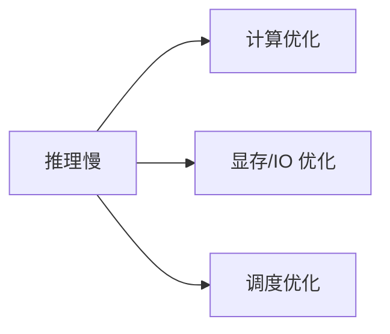
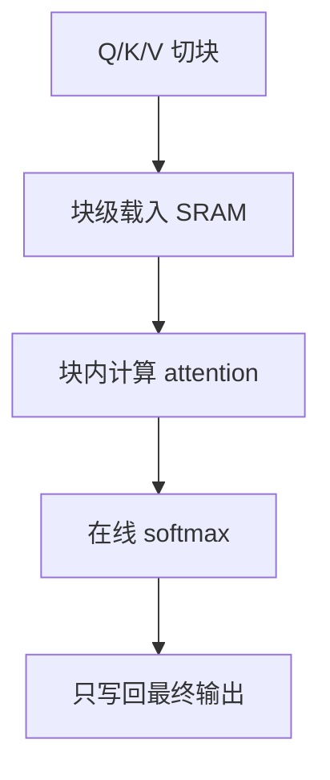
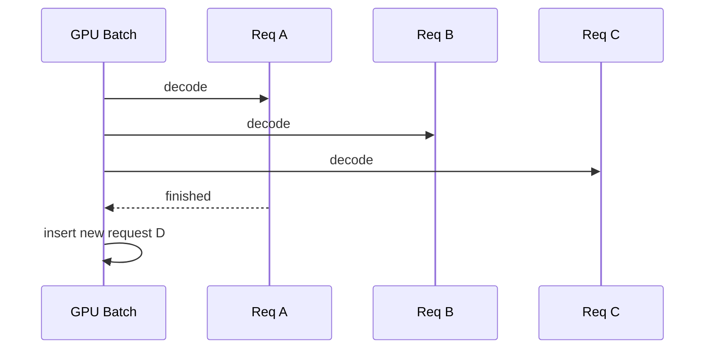

# 推理加速

## 面试高频考点

- FlashAttention 为什么快？它优化的是算力还是 IO？
- Continuous Batching 是什么？为什么服务端收益很大？
- Speculative Decoding 为什么能加速且不改最终分布？
- Chunked Prefill、Prefix Caching、CUDA Graph 各解决什么瓶颈？
- 推理加速常见瓶颈到底在算力、显存还是调度？

---

## 推理为什么慢

LLM 推理慢，不只因为模型大，还同时受三类瓶颈约束：

1. **计算瓶颈**：attention / matmul FLOPs 高
2. **内存瓶颈**：权重和 KV Cache 搬运重
3. **调度瓶颈**：多请求并发时 GPU 利用率低

---

## FlashAttention

### 标准 Attention 的问题

标准 attention 真正贵的常常不是公式本身，而是：

- 中间 `n x n` 分数矩阵要频繁读写
- HBM 和 SRAM 之间来回搬运
- 序列长时 IO 成本爆炸

### FlashAttention 的核心思路

把 Q/K/V 切块，尽量在片上 SRAM 内完成局部 attention 计算，不把大中间矩阵完整写回 HBM。

### 它到底优化了什么

- 不是近似算法
- 数学上仍等价于标准 attention
- 核心收益来自**减少显存 IO**

一句话概括：

> FlashAttention 主要是 IO-aware kernel 优化，不是模型算法改写。

---

## Continuous Batching

### Static Batching 的浪费

传统静态 batch 里，短请求先结束后，GPU 会空等长请求。

### Continuous Batching 的做法

每一步 decode 后，立刻：

- 移出已完成请求
- 补入新请求
- 让 batch 始终尽量满载

### 为什么服务端收益大

因为线上请求长度分布极不均匀，continuous batching 能显著提升：

- 吞吐
- GPU 利用率
- 并发能力

---

## Speculative Decoding

### 核心想法

先让一个小模型快速猜多个 token，再让大模型并行验证。

### 流程

1. 小模型一次猜 `k` 个 token
2. 大模型并行验证这 `k` 个位置
3. 接受正确前缀，拒绝错误部分
4. 继续下一轮

### 为什么不改最终分布

因为最终接受与拒绝由目标模型控制，草稿模型只是提案者，不是裁判。

所以本质上是：

- 用便宜模型提候选
- 用贵模型保真

---

## 其他常见加速技术

| 技术 | 主要优化点 | 典型收益 |
|------|------------|----------|
| Quantization | 降低权重/激活精度 | 降显存，提吞吐 |
| KV Cache Quantization | 压缩 KV Cache | 长上下文收益明显 |
| Prefix Caching | 复用公共前缀 KV | system prompt 重用场景很好用 |
| Chunked Prefill | 避免长 prompt 堵塞 decode | 改善首 token 延迟 |
| CUDA Graph | 减少 kernel launch 开销 | 稳定提速 |
| Tensor Parallel | 拆单层算子 | 大模型必要手段 |

---

## Prefill 和 Decode 是两种世界

### Prefill

- 处理整个输入 prompt
- 并行度高
- 更偏 compute-bound

### Decode

- 逐 token 生成
- 串行性强
- 更偏 memory-bound

所以很多优化技术是分阶段生效的：

- FlashAttention 对两阶段都有帮助，但收益模式不同
- Continuous batching 主要改善 decode 阶段利用率
- Chunked prefill 专门缓解长输入阻塞

---

## 工程实践视角

### 一条常见推理优化路线

1. 先量化，解决显存和吞吐
2. 上 FlashAttention / fused kernels
3. 用成熟 serving 框架做 continuous batching
4. 视任务加 speculative decoding
5. 再看 prefix cache、chunked prefill、CUDA graph 这些细项

### 真正要问的问题

不是“哪个技术最先进”，而是：

- 我的瓶颈是 TTFT、TPS 还是并发？
- 是单请求慢，还是集群利用率低？
- 是权重太大，还是 KV Cache 爆了？

---

## 常见误区

### 误区 1：推理慢主要是 FLOPs 不够

很多时候不是。Decode 阶段经常更受显存访问和缓存管理限制。

### 误区 2：FlashAttention 是近似注意力

不是。它通常与标准 attention 数学等价，优势在 kernel 和 IO。

### 误区 3：Speculative Decoding 一定大幅提速

不一定。草稿模型太弱或任务随机性太高时，接受率不高，收益会下降。

### 误区 4：上了大推理框架就自动快

框架提供基础，但模型结构、量化策略、batch 配置和 KV Cache 管理仍决定最终结果。

---

## 面试延伸

**Q：FlashAttention 和 PagedAttention 有什么区别？**
> FlashAttention 解决的是单次 attention 计算的 IO 效率；PagedAttention 解决的是 KV Cache 的分页管理和显存碎片问题。前者偏 kernel 计算，后者偏 serving 内存管理。

**Q：Speculative Decoding 为什么能保证输出分布不变？**
> 因为最终接受与拒绝由目标模型的分布决定，草稿模型只是提出候选，不直接决定最终采样结果，所以理论上可以保持与目标模型一致的输出分布。

**Q：Continuous Batching 和 Chunked Prefill 怎么配合？**
> Continuous batching 解决 decode 阶段请求动态插拔，chunked prefill 解决长 prompt prefill 阻塞。两者配合能同时改善吞吐和首 token 延迟。

---

## 学完可以做什么

1. 用 vLLM 或 SGLang 跑一组不同 batch 策略的吞吐对比。
2. 对比 `FlashAttention on/off` 的显存和速度差异。
3. 在代码补全任务上试一次 speculative decoding，观察接受率和加速比。

---

## 原始论文

| 论文 | 链接 |
|------|------|
| FlashAttention (Dao et al., NeurIPS 2022) | [arxiv.org/abs/2205.14135](https://arxiv.org/abs/2205.14135) |
| FlashAttention-2 (Dao et al., 2023) | [arxiv.org/abs/2307.08691](https://arxiv.org/abs/2307.08691) |
| FlashAttention-3 (Shah et al., 2024) | [arxiv.org/abs/2407.08608](https://arxiv.org/abs/2407.08608) |
| Speculative Decoding (Chen et al., ICML 2023) | [arxiv.org/abs/2302.01318](https://arxiv.org/abs/2302.01318) |
| Medusa: Simple Framework for Accelerating LLM Generation (Cai et al., ICML 2024) | [arxiv.org/abs/2401.10774](https://arxiv.org/abs/2401.10774) |
| EAGLE: Speculative Sampling Requires Rethinking Uncertainty (Li et al., 2024) | [arxiv.org/abs/2401.15077](https://arxiv.org/abs/2401.15077) |

## 延伸阅读与视频

| 平台 | 标题 | 说明 |
|------|------|------|
| 📺 B站 | [Flash Attention 为什么那么快？原理讲解](https://www.bilibili.com/video/BV1UT421k7rA/) | 适合理解 IO 优化核心 |
| 📺 B站 | [什么是 FlashAttention？为什么它能减少显存？](https://www.bilibili.com/video/BV1irPTzGEhG/) | 偏工程视角 |
| 📺 B站 | [Flash Attention 学习过程详解](https://www.bilibili.com/video/BV1FM9XYoEQ5/) | 系统梳理 |
