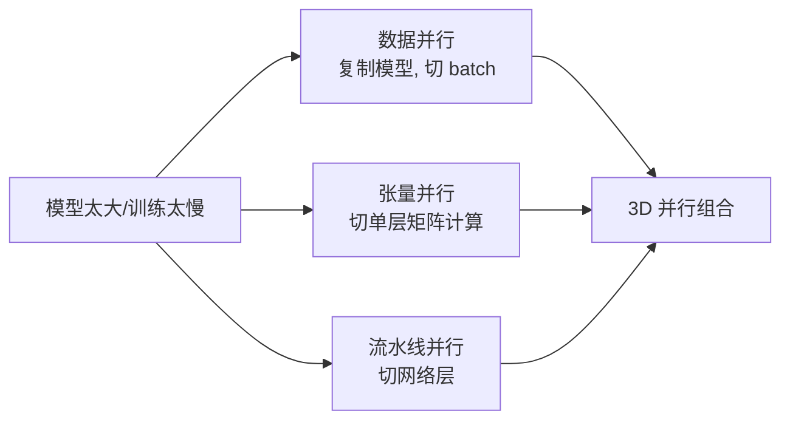
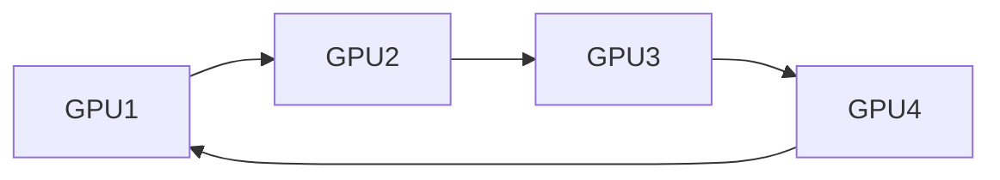
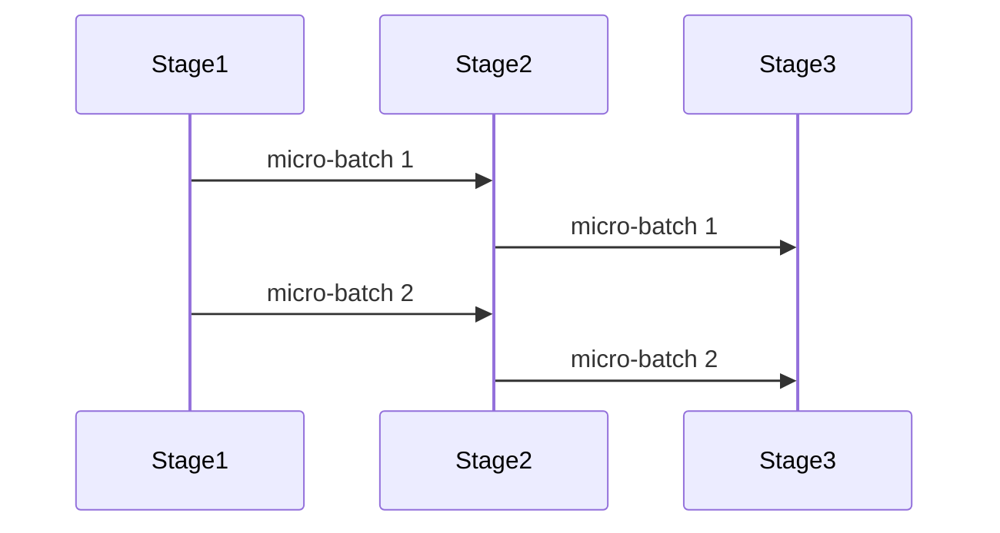

# 数据并行与模型并行

## 面试高频考点
- DDP 和 DP 的区别？Ring-AllReduce 如何工作？
- ZeRO 三个阶段分别优化了什么？
- 张量并行和流水线并行各自的优缺点？
- 为什么大模型训练需要 3D 并行？
- FSDP、ZeRO、TP、PP 分别解决的是哪类瓶颈？
- 并行策略到底是省显存、省时间，还是两者兼顾？

---

## 为什么大模型训练一定走向并行

单卡训练大模型会同时撞上三堵墙：

1. **参数放不下**：模型参数、梯度、优化器状态一起占显存。
2. **激活放不下**：长序列和大 batch 会让激活内存爆炸。
3. **算不完**：即使放得下，训练吞吐也不够。

因此不同并行策略本质上是在解决不同瓶颈：

- **数据并行（DP/DDP/FSDP/ZeRO）**：主要解决吞吐扩展和状态冗余。
- **张量并行（TP）**：把单层算子拆到多卡，解决单层算不下或单卡算力不够。
- **流水线并行（PP）**：把不同层分到不同卡，解决整网装不下。



---

## 数据并行（Data Parallelism）

### DP vs DDP

| 特性 | DP（DataParallel）| DDP（DistributedDataParallel）|
|------|------------------|------------------------------|
| 通信方式 | 主卡聚合 | Ring-AllReduce |
| 多进程 | 单进程多线程 | 多进程 |
| 负载均衡 | 主 GPU 负载重 | 均衡 |
| 性能 | 差 | 好 |
| 适用场景 | 单机调试 | 生产训练 |

DP 的问题很直白：主卡会承担模型复制、梯度聚合和输出收集，通信和显存热点都压在一张卡上。DDP 则是每张卡各跑一个进程，反向传播时自动同步梯度，因此扩展性更好。

### Ring-AllReduce

所有 GPU 组成一个环，梯度分两个阶段同步：
1. **Scatter-Reduce**：每个 GPU 将自己的梯度分块，逐步发送给下一个 GPU 并累加
2. **AllGather**：将累加好的梯度广播给所有 GPU

通信量：每张卡发送和接收 `2(N-1)/N × 参数量` 的数据，与 GPU 数量近似线性扩展。



直观理解：不是把所有梯度都扔给中心节点，而是每张卡只和邻居通信，边传边聚合。

---

## ZeRO（Zero Redundancy Optimizer）

DeepSpeed 提出的显存优化方案，将模型状态切分到所有 GPU 上：

| 阶段 | 切分内容 | 显存节省（N 卡）| 通信量 |
|------|---------|----------------|--------|
| ZeRO-1 | 优化器状态 | 4x（Adam 状态占大头）| 同 DDP |
| ZeRO-2 | 优化器状态 + 梯度 | 8x | 同 DDP |
| ZeRO-3 | 优化器状态 + 梯度 + 参数 | N×（线性）| 1.5× DDP |

**显存公式**（混合精度，Adam 优化器，参数量 `Φ`）：
- 完整副本：`16Φ` bytes（参数 2 + 梯度 2 + 优化器状态 12）
- ZeRO-3：`16Φ / N` bytes

**ZeRO-Offload**：将优化器状态和梯度卸载到 CPU 内存，单卡可训练更大模型。  
**ZeRO-Infinity**：进一步卸载到 NVMe SSD。

### ZeRO 真正在解决什么

DDP 的核心浪费是：每张卡都完整保存一份参数、梯度和优化器状态。卡数越多，冗余越大。ZeRO 的思路是把这些状态拆开存，让每张卡只负责一部分。

### FSDP 和 ZeRO-3 的关系

两者原理非常接近：

- 都是参数分片
- 前向/反向时按层临时 all-gather
- 用完再释放

区别更多在工程生态：

- **FSDP**：PyTorch 原生，和训练栈集成好。
- **ZeRO-3**：DeepSpeed 配套成熟，offload 能力更强。

---

## 张量并行（Tensor Parallelism）

将单个矩阵运算切分到多个 GPU 上并行执行，Megatron-LM 的核心方案。

**MLP 切分方式：**
```text
输入 X
  ↓
A = XW1   （W1 按列切分到 N 卡）
  ↓
B = GeLU(A)
  ↓
C = BW2   （W2 按行切分到 N 卡）
  ↓
输出
```

每次前向和反向都需要通信，因此 TP 的性能高度依赖卡间带宽，通常优先放在同一台机器内，通过 NVLink / NVSwitch 互联。

### TP 的优点和代价

**优点：**
- 单层算子可以横向拆开，单卡放不下的大矩阵能训
- 可提升单层并行度

**代价：**
- 通信频繁，尤其 attention/MLP 都要同步
- 带宽不够时很容易算得越并行越慢

所以 TP 不是卡越多越好，而是要和机器拓扑匹配。

---

## 流水线并行（Pipeline Parallelism）

将模型不同层分配到不同 GPU，按流水线方式执行。

**GPipe**：将 batch 切成 micro-batch，但存在 bubble（空闲等待）。  
**1F1B（One Forward One Backward）**：交错前向和反向，减少 bubble 到 `(N-1)/N` 量级。

**Bubble 比例**：`(p-1)/(m+p-1)`，其中 `p` 为流水线阶段数，`m` 为 micro-batch 数。增大 `m` 可减小 bubble。



### 流水线并行的核心问题不是能不能跑，而是负载均衡

如果某个 stage 层数太多、attention 太重，整条流水线都会被它卡住。实际部署时经常需要：

- 按 layer 计算量而不是按层数平均切分
- 使用 virtual pipeline stage 做更细粒度均衡
- 控制 micro-batch 数，避免显存和 bubble 两头受损

---

## 3D 并行

大规模训练通常将三种并行组合使用：

```text
数据并行（DP）× 张量并行（TP）× 流水线并行（PP）
```

**选择策略：**
- TP：优先用于卡间 NVLink 互联（带宽高）
- PP：用于跨节点或跨机柜拆层（通信频率低）
- DP/FSDP/ZeRO：在 TP×PP 之外继续扩展吞吐

### 一个常见的组合例子

假设有 64 张卡：

- 每 8 张卡做 1 个 TP 组
- 2 个 TP 组串成 1 条 PP 流水线
- 剩余维度做 4 路 DP

即：
`64 = TP(8) × PP(2) × DP(4)`

这种设计会同时兼顾单层切分、整网切分和 batch 吞吐扩展。

---

## 工程实践视角

### 并行策略怎么选

| 场景 | 推荐策略 |
|------|----------|
| 模型不算特别大，但想提吞吐 | DDP / FSDP |
| 参数显存是最大瓶颈 | ZeRO-3 / FSDP |
| 单层矩阵太大放不下 | TP |
| 模型层数太深、整网放不下 | PP |
| 千亿级以上训练 | 3D 并行 + 激活重计算 + 混合精度 |

### 常见配套优化

- **Activation Checkpointing**：省激活显存，代价是重复前向计算。
- **FlashAttention**：减少 attention 的显存访问和 IO 开销。
- **Sequence Parallelism / Context Parallelism**：长上下文时代进一步拆序列维。
- **混合精度训练**：BF16/FP16 显著降低显存占用。

### 真正决定上限的是系统瓶颈

训练速度不只由 FLOPs 决定，还受这些因素制约：

- NCCL 通信拓扑是否合理
- 节点间网络带宽和时延
- 数据加载是否跟得上
- checkpoint 写盘是否拖慢训练
- 异常恢复成本高不高

很多时候，论文里写的是并行策略，工程里打架的是网络和 IO。

---

## 常见误区

### 误区 1：数据并行就是把 batch 分给多卡，没什么难的

表面是这样，但高效数据并行的关键在梯度同步、bucket 划分、通信重叠和拓扑映射，不处理这些就扩不起来。

### 误区 2：ZeRO-3 一定优于 ZeRO-2

不一定。ZeRO-3 显存最省，但通信和实现复杂度更高。模型没大到那个程度时，ZeRO-2/FSDP 可能性价比更高。

### 误区 3：TP 只要切得更细就更快

错。TP 通信很重，切太细会让同步开销吃掉算力收益。

### 误区 4：流水线并行天然适合跨机

只对一部分情况成立。虽然 PP 通信频率低于 TP，但跨机仍然会受 stage 不平衡、micro-batch 调度和激活传输影响。

---

## 面试延伸

**Q：ZeRO-3 前向传播时参数在哪里？**
> ZeRO-3 每张卡只保存 1/N 的参数。前向传播时，需要哪一层就临时 all-gather 该层完整参数，用完立即释放，因此不会长期保留完整副本。

**Q：流水线并行的 bubble 怎么消除？**
> 完全消除很难，但可以通过增大 micro-batch 数量、使用 Interleaved 1F1B、做更均衡的 stage 切分，以及新型调度策略来逼近更低 bubble。

**Q：FSDP（PyTorch）和 ZeRO-3 有什么区别？**
> 原理相近，都是状态分片。FSDP 是 PyTorch 原生实现，生态集成更好；ZeRO-3 是 DeepSpeed 体系，offload 和超大模型训练配套更成熟。

**Q：为什么 TP 通常优先放在 NVLink 域内？**
> 因为 TP 每层都要频繁通信，带宽和时延非常敏感。跨节点网络通常扛不住这种高频同步，因此更适合把 PP 或 DP 放到节点间。

---

## 学完可以做什么

1. 在 2 到 4 张卡上分别跑 DDP 和 FSDP，观察显存和吞吐差异。
2. 用 Megatron-LM 或 DeepSpeed 跑一个小型 TP/PP 组合实验，理解通信瓶颈。
3. 做一份不同并行策略的 profile 报告，拆出 compute、communication、data loading 三类耗时。

---

## 原始论文

| 论文 | 链接 |
|------|------|
| ZeRO: Memory Optimizations Toward Training Trillion Parameter Models (Rajbhandari et al., 2020) | [arxiv.org/abs/1910.02054](https://arxiv.org/abs/1910.02054) |
| Megatron-LM: Training Multi-Billion Parameter Language Models (Shoeybi et al., 2019) | [arxiv.org/abs/1909.08053](https://arxiv.org/abs/1909.08053) |
| GPipe: Efficient Training of Giant Neural Networks (Huang et al., 2019) | [arxiv.org/abs/1811.06965](https://arxiv.org/abs/1811.06965) |
| Efficient Large-Scale Language Model Training on GPU Clusters Using Megatron-LM (Narayanan et al., 2021) | [arxiv.org/abs/2104.04473](https://arxiv.org/abs/2104.04473) |
| Synergistic Tensor and Pipeline Parallelism (2025) | [arxiv.org/abs/2510.27257](https://arxiv.org/abs/2510.27257) |
| MegaScale-Omni: Hyper-Scale MultiModal LLM Training (字节跳动, 2026) | [arxiv.org/abs/2605.08962](https://arxiv.org/abs/2605.08962) |
| AsyncMesh: Fully Async Data and Pipeline Parallelism (2026) | [arxiv.org/abs/2601.22442](https://arxiv.org/abs/2601.22442) |

## 延伸阅读与视频

| 平台 | 标题 | 说明 |
|------|------|------|
| 📺 B站 | [动画理解PyTorch大模型分布式训练：DP、DDP、DeepSpeed ZeRO](https://www.bilibili.com/video/BV1mm42137X8/) | 5.5万播放，动画直观展示三种并行策略原理 |
| 📺 B站 | [细节怪-手撕LLM：DeepSpeed详解（ZeRO三阶段和底层通信原理）](https://search.bilibili.com/all?keyword=%E7%BB%86%E8%8A%82%E6%80%AA-%E6%89%8B%E6%92%95LLM%EF%BC%9ADeepSpeed%E8%AF%A6%E8%A7%A3%EF%BC%88ZeRO%E4%B8%89%E9%98%B6%E6%AE%B5%E5%92%8C%E5%BA%95%E5%B1%82%E9%80%9A%E4%BF%A1%E5%8E%9F%E7%90%86%EF%BC%89&order=click) | 5189播放，ZeRO三阶段底层通信原理深入解析 |
| 📺 B站 | [DeepSpeed优化器并行ZeRO1/2/3原理](https://www.bilibili.com/video/BV1fb421t7KN/) | 1.6万播放，ZOMI酱系统讲解ZeRO三阶段 |
