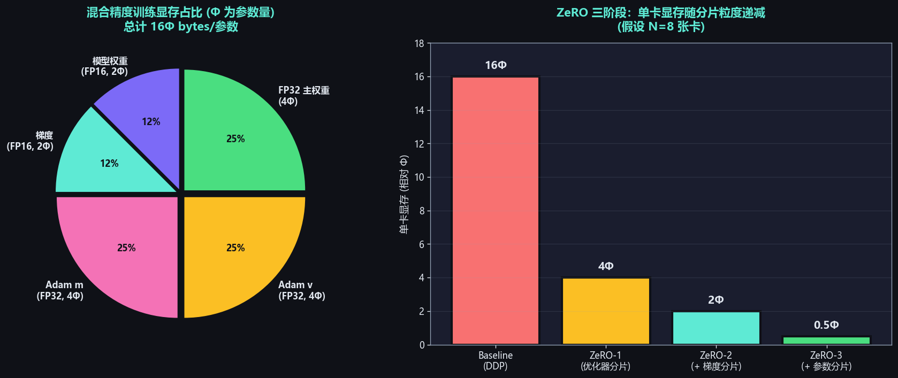

# 显存优化技巧

## 面试高频考点
- 训练一个模型需要多少显存？怎么计算？
- 梯度检查点（Gradient Checkpointing）牺牲了什么换显存？
- FP16 和 BF16 的区别，训练时用哪个？
- 为什么 Adam 优化器比 SGD 占更多显存？
- ZeRO 的三个阶段分别分片什么？
- Flash Attention 如何节省显存？

---

## 一、显存占用全景图

### 训练时的显存五大来源



混合精度训练（AdamW），参数量 Φ 时单卡显存占用：

| 组成部分 | 精度 | 占用 | 说明 |
|----------|------|------|------|
| 模型参数（前向用）| FP16/BF16 | 2Φ bytes | 当前训练用的低精度副本 |
| 梯度 | FP16/BF16 | 2Φ bytes | 反向传播产生 |
| Adam 一阶矩 m | FP32 | 4Φ bytes | 动量平均（β₁≈0.9） |
| Adam 二阶矩 v | FP32 | 4Φ bytes | 平方梯度平均（β₂≈0.999） |
| FP32 主权重 | FP32 | 4Φ bytes | 优化器更新用，避免精度损失 |
| **合计** | | **16Φ bytes/参数** | |

### LLaMA-7B 训练显存估算

```
模型状态：16 × 7 × 10⁹ bytes ≈ 112 GB
+ 激活值（batch=4, seq=4096）：~30-50 GB
+ 临时变量、CUDA Workspace：~5-10 GB

总计约 150-170 GB
单张 80GB A100 完全放不下，必须用并行或优化技术
```

### 推理时的显存

```
推理显存 = 模型权重 + KV Cache + 临时变量

LLaMA-7B (FP16, batch=8, seq=2048):
  权重: 14 GB
  KV Cache: 2 × 32 × 32 × 128 × 2048 × 8 × 2 ≈ 8.6 GB
  临时变量: ~2 GB
  总计: ~25 GB

→ 单张 24GB 显卡（如 RTX 4090）勉强能跑，3090 不够
→ 解决方案：量化（INT8 减半，INT4 减 75%）
```

---

## 二、混合精度训练（AMP）

### 为什么需要 FP32 主权重？

```
FP16 的精度问题：
  最小正数：6 × 10⁻⁸
  常见梯度更新量：~10⁻⁷ 到 10⁻⁹

  当 grad × lr ≈ 10⁻⁹ 时（比 FP16 最小数还小）
  → FP16 round 后变成 0
  → 权重停止更新！

混合精度的解决：
  - 前向/反向用 FP16/BF16（快）
  - 优化器维护一份 FP32 主权重（精度高）
  - 更新时：FP32_weight = FP32_weight + lr × FP32_gradient
  - 然后 FP32 → FP16 复制回训练副本
```

### FP16 vs BF16 详细对比

```
FP16 (IEEE 754 half precision):
  ┌─┬─────┬──────────┐
  │S│ EEEEE│ MMMMMMMMMM │   1 + 5 + 10 = 16 bits
  └─┴─────┴──────────┘
  动态范围：[6e-8, 6e+4]   ← 范围小，易溢出/下溢
  精度：~3.3 位十进制

BF16 (Brain Floating Point):
  ┌─┬────────┬───────┐
  │S│ EEEEEEEE│ MMMMMMM │   1 + 8 + 7 = 16 bits
  └─┴────────┴───────┘
  动态范围：[1e-38, 3e+38]  ← 与 FP32 完全相同
  精度：~2.4 位十进制 ← 比 FP16 略低
```

| 特性 | FP16 | BF16 |
|------|------|------|
| 动态范围 | 小 | 大（与 FP32 同） |
| 精度 | 高 | 略低 |
| 是否需要 Loss Scaling | **是** | 否 |
| 适用硬件 | V100, T4 | **A100, H100, TPU** |
| 现代 LLM 选择 | 较少 | **主流** |

### Loss Scaling（FP16 必备技巧）

```
问题：FP16 的最小正数 ~6e-8，但梯度可能小到 1e-9 → underflow → 权重不更新

解决：将 loss 乘以一个大数（scale factor，通常 2¹² 到 2¹⁵）：
  scaled_loss = loss * scale_factor    ← 放大
  scaled_loss.backward()                 ← 反向，梯度也被放大
  optimizer.step() 之前：
    grad / scale_factor                  ← 还原
    if 梯度溢出（出现 inf/NaN）:
      跳过这一步，scale_factor /= 2
    else:
      scale_factor *= 2  （定期增大）

PyTorch 的 GradScaler 自动管理：
  scaler = torch.cuda.amp.GradScaler()
  with autocast(): loss = model(x)
  scaler.scale(loss).backward()
  scaler.step(optimizer)
  scaler.update()
```

---

## 三、梯度检查点（Gradient Checkpointing）

### 原理：用计算换显存

```
标准反向传播：
  前向：层1 → 层2 → 层3 → ... → 层N，每层激活值都存下来
  反向：从层N 向前，用存下的激活值计算梯度
  显存：O(N) 层的激活值

梯度检查点：
  前向：每隔 K 层存一个 checkpoint，其余层只算不存
  反向：到达每个 checkpoint 时，重新做一次前向计算补全激活值，再算梯度
  显存：O(N/K) checkpoints + 当前段激活值

最优 K = √N → 显存从 O(N) 降到 O(√N)
计算代价：约多 30%（一次额外前向）
```

### PyTorch 实现

```python
from torch.utils.checkpoint import checkpoint

# 标准用法（包裹一层）
output = checkpoint(layer, input, use_reentrant=False)

# Sequential 风格（每个 block 都做 checkpoint）
class TransformerBlock(nn.Module):
    def forward(self, x):
        return checkpoint(self._inner_forward, x, use_reentrant=False)

    def _inner_forward(self, x):
        x = x + self.attention(self.norm1(x))
        x = x + self.ffn(self.norm2(x))
        return x
```

### Selective Recomputation（选择性重算）

不是所有层都该 checkpoint：
- **Attention**：计算便宜但激活值大 → checkpoint 收益高
- **FFN**：计算昂贵但激活值小 → checkpoint 收益低

NVIDIA Megatron 的策略：只对 Attention 做 checkpoint，FFN 保留激活值。

---

## 四、ZeRO（Zero Redundancy Optimizer）三阶段

ZeRO 是 DeepSpeed 的核心，本质是**把训练状态分片到所有 GPU 上**：

```
                  Baseline (DDP)            ZeRO-3
                  ─────────────             ──────
                  GPU 0: [全部状态]          GPU 0: [1/N 状态]
                  GPU 1: [全部状态]          GPU 1: [1/N 状态]
                  ...                       ...
                  GPU N: [全部状态]          GPU N: [1/N 状态]
                  ↑ 每张卡有完整副本           ↑ 每张卡只存 1/N
```

### ZeRO 三阶段递进

| 阶段 | 分片内容 | 单卡显存 (Φ) | 通信增量 |
|------|---------|-------------|---------|
| **Baseline (DDP)** | 不分片，每卡完整副本 | 16Φ | 只 AllReduce 梯度 |
| **ZeRO-1** | 优化器状态（m, v, FP32 weight） | 4Φ + 12Φ/N | 同 DDP |
| **ZeRO-2** | + 梯度 | 4Φ + 14Φ/N | 同 DDP |
| **ZeRO-3** | + **参数本身** | 16Φ/N | **+50%**（需 all-gather 参数） |

### ZeRO-3 的工作流程

```
训练第 i 层时：
  1. 该层参数当前不在本卡 → AllGather 从其他卡获取完整参数
  2. 本卡用完整参数计算前向/反向
  3. 用完立即丢弃完整参数，只保留自己负责的 1/N

类似"按需借书"：
  - 不是把整个图书馆复制到每个家里
  - 需要看哪本就借哪本，看完还回去
  - 显存（家里空间）少 N 倍，但要多跑几次图书馆（通信增加）
```

### ZeRO-Offload / ZeRO-Infinity

```
ZeRO-Offload：将优化器状态卸载到 CPU 内存
  → 单卡可训练 10x 大小的模型
  → 速度损失 ~30%（CPU↔GPU 数据搬运）

ZeRO-Infinity：进一步卸载到 NVMe SSD
  → 理论上单机可训练 1T 参数模型
  → 速度损失更大，仅适合实验性场景
```

---

## 五、梯度累积（Gradient Accumulation）

### 问题：希望大 batch 训练但显存不够

大 batch 通常对训练稳定性和最终效果有益，但显存有限。

### 解决：累积多个 micro-batch 的梯度

```python
accumulation_steps = 8
optimizer.zero_grad()

for i, (input, label) in enumerate(dataloader):
    loss = model(input, label) / accumulation_steps   # 缩放 loss
    loss.backward()                                     # 累积梯度，不立即更新

    if (i + 1) % accumulation_steps == 0:
        optimizer.step()
        optimizer.zero_grad()

# 等价效果：batch_size = 实际 batch_size × accumulation_steps
# 显存占用：仅与 micro-batch 相关
```

### 与 DDP 的配合：no_sync()

```python
# 错误用法：每个 micro-step 都触发 AllReduce → 浪费通信
for i, batch in enumerate(loader):
    loss = model(batch).backward()  # 每次都 AllReduce
    if (i+1) % 8 == 0:
        optimizer.step()

# 正确用法：只在最后一个 micro-step 触发 AllReduce
for i, batch in enumerate(loader):
    if (i+1) % 8 != 0:
        with model.no_sync():       # 跳过 AllReduce
            loss = model(batch).backward()
    else:
        loss = model(batch).backward()  # 触发 AllReduce
        optimizer.step()
```

---

## 六、其他显存优化技术

### 8-bit Adam（bitsandbytes）

```
将优化器状态量化为 INT8 存储：
  FP32 m, v (各 4Φ) → INT8 (各 1Φ)
  显存节省：8Φ → 2Φ，节省 75%

实现：
  - 块状量化（block-wise）：每 2048 个元素独立 scale
  - 动态范围调整：跟踪 m, v 的实际范围
  - 精度损失极小（< 0.5%）

代码：
  from bitsandbytes.optim import AdamW8bit
  optimizer = AdamW8bit(model.parameters(), lr=1e-4)
```

### Paged Optimizer（QLoRA 使用）

```
利用 NVIDIA Unified Memory：
  - 优化器状态在 GPU 显存
  - GPU 显存不够时 → 自动换出到 CPU RAM
  - 需要时 → 自动换入

类似操作系统的虚拟内存分页
QLoRA 用此方案让 65B 模型可在 48GB GPU 上微调
```

### Flash Attention 节省 Attention 显存

```
标准 Attention:
  存储 N×N 的 attention matrix → O(N²) 显存
  对于 seq_len=8192，FP16 下 = 8192×8192×2 = 128 MB（每层）

Flash Attention:
  Tiling + Online Softmax，不存储完整 attention matrix
  显存：O(N) （只存最终输出）

  对于 seq_len=8192，节省 128 MB × 32 层 = 4 GB（per batch per head group）
```

---

## 七、综合显存优化策略

### 优先级（从无损到有损）

| 优先级 | 技术 | 显存节省 | 代价 |
|--------|------|---------|------|
| 1 | BF16 混合精度 | ~50% (vs FP32) | **无** |
| 2 | Flash Attention | O(N²)→O(N) | **无**（更快） |
| 3 | 梯度累积 | 无（但能用更大 effective batch） | **无** |
| 4 | 梯度检查点 | ~60-70% 激活值 | +30% 计算 |
| 5 | ZeRO-1/2 | 优化器/梯度 1/N | +0% 通信 |
| 6 | 8-bit Adam | 优化器状态 75% | < 0.5% 精度 |
| 7 | ZeRO-3 | 参数 1/N | +50% 通信 |
| 8 | LoRA / QLoRA | 99% 训练参数 | 表达力受限 |
| 9 | CPU Offload | 看情况 | 大幅速度损失 |

### 实战配方

```
单机 8 卡训练 LLaMA-7B 全量微调：
  ✓ BF16 + ZeRO-2 + Flash Attention
  ✓ Gradient Checkpointing
  ✓ batch=4 per GPU, accumulation=4 → effective batch=128

单卡训练 LLaMA-65B：
  ✓ QLoRA (NF4 量化基础模型)
  ✓ LoRA r=16
  ✓ Paged Optimizer
  ✓ Gradient Checkpointing
```

---

## 八、面试延伸

**Q：为什么 Adam 比 SGD 多占 3 倍显存？**

> SGD 只需要梯度（2Φ bytes，FP16）。Adam 额外需要：① 一阶矩 m（4Φ，FP32）；② 二阶矩 v（4Φ，FP32）。合计 8Φ 额外显存。如果再算上 FP32 主权重（4Φ），Adam 优化器状态共 12Φ 是模型参数的 3 倍。这就是为什么大模型训练显存压力主要来自优化器，也是 ZeRO-1 优先分片优化器状态的原因。

**Q：梯度检查点一定选每隔一层保存吗？**

> 不是。理论最优是每隔 √N 层保存一次（显存从 O(N) 降到 O(√N)，计算代价 +30%）。实践中通常按 Transformer Block 粒度做 checkpoint（每个 Block 一个），实现简单且效果接近最优。Megatron 的 Selective Recomputation 进一步优化：只对 Attention 做 checkpoint（计算便宜激活值大），FFN 保留激活值（计算贵但激活值小），整体效率更高。

**Q：显存不够训练时，优先用哪个优化手段？**

> 优先级（按"代价小"排序）：① BF16 混合精度（无损必开）；② Flash Attention（无损必开）；③ 梯度累积（无损，等效大 batch）；④ 梯度检查点（+30% 计算）；⑤ ZeRO-2（多卡场景）；⑥ 8-bit Adam（极小精度损失）；⑦ ZeRO-3（多卡 + 通信开销）；⑧ LoRA/QLoRA（限制可训练参数）；⑨ CPU Offload（最后手段，速度大幅下降）。

**Q：FSDP 和 ZeRO-3 是什么关系？**

> 二者原理相同——都是把参数、梯度、优化器状态分片到所有 GPU。区别：FSDP 是 PyTorch 原生实现（更新维护好、生态好），ZeRO-3 是 DeepSpeed 实现（特性更丰富，有 Offload/Infinity 等扩展）。生产环境中：用 PyTorch + transformers → 选 FSDP；用 DeepSpeed 框架 → 选 ZeRO-3。两者性能基本相当。

---

## 原始论文

| 论文 | 链接 |
|------|------|
| ZeRO: Memory Optimizations Toward Training Trillion Parameter Models (Rajbhandari et al., 2020) | [arxiv.org/abs/1910.02054](https://arxiv.org/abs/1910.02054) |
| FlashAttention-2 (Dao et al., 2023) | [arxiv.org/abs/2307.08691](https://arxiv.org/abs/2307.08691) |
| QLoRA: Efficient Finetuning of Quantized LLMs (Dettmers et al., 2023) | [arxiv.org/abs/2305.14314](https://arxiv.org/abs/2305.14314) |
| Training Deep Nets with Sublinear Memory Cost — 梯度检查点原始论文 (Chen et al., 2016) | [arxiv.org/abs/1604.06174](https://arxiv.org/abs/1604.06174) |
| 8-bit Optimizers via Block-wise Quantization (Dettmers et al., ICLR 2022) | [arxiv.org/abs/2110.02861](https://arxiv.org/abs/2110.02861) |
| FSDP: Fully Sharded Data Parallel (Zhao et al., 2023) | [arxiv.org/abs/2304.11277](https://arxiv.org/abs/2304.11277) |

## 延伸阅读与视频

| 平台 | 标题 | 说明 |
|------|------|------|
| 📺 B站 | [动画理解PyTorch大模型分布式训练：DP、DDP、DeepSpeed ZeRO](https://www.bilibili.com/video/BV1mm42137X8/) | 5.5万播放，含ZeRO显存优化原理的直观演示 |
| 📺 B站 | [细节怪-手撕LLM：DeepSpeed详解（ZeRO三阶段和底层通信原理）](https://search.bilibili.com/all?keyword=%E7%BB%86%E8%8A%82%E6%80%AA-%E6%89%8B%E6%92%95LLM%EF%BC%9ADeepSpeed%E8%AF%A6%E8%A7%A3%EF%BC%88ZeRO%E4%B8%89%E9%98%B6%E6%AE%B5%E5%92%8C%E5%BA%95%E5%B1%82%E9%80%9A%E4%BF%A1%E5%8E%9F%E7%90%86%EF%BC%89&order=click) | 深入ZeRO显存分片与通信优化细节 |
