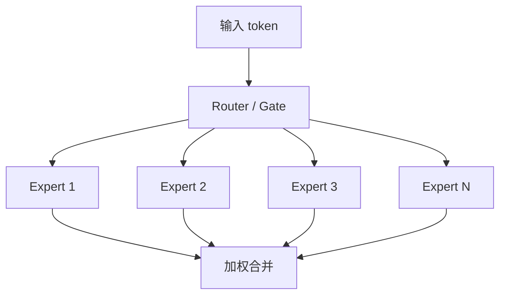

# MoE（混合专家模型）

## 面试高频考点

- MoE 的基本结构是什么？
- 为什么 MoE 能在不线性增加推理成本的前提下扩模型容量？
- 路由器、专家、Top-K 激活分别做什么？
- 负载均衡为什么难？Expert Collapse 是什么？
- DeepSeek / Mixtral 这类模型在 MoE 上的关键工程点是什么？

---

## MoE 的核心直觉

传统 dense 模型里，每个 token 都走完整个 FFN 路径。MoE 的思路是：

- 放很多专家网络
- 每个 token 只激活其中少数几个

这样就能做到：

- **总参数很大**
- **单次激活参数较少**



---

## MoE 的基本结构

MoE 通常把 Transformer 中的 FFN 替换成：

1. Router / Gate
2. 多个 Experts
3. Top-K 选择与加权合并

### Router 做什么

给每个 expert 一个分数，选出 Top-K。

```text
scores = x W_g
probs = softmax(scores)
只保留 Top-K expert
output = Σ g_i * Expert_i(x)
```

### Experts 做什么

专家通常本质上还是 FFN，只是每个专家参数不同，因此会学出不同偏好。

---

## 为什么 MoE 省推理成本

### Dense 模型

每个 token 都过全部参数。

### MoE 模型

每个 token 只过少数专家。

例如：

- 总共有 64 个专家
- 每次只激活 2 个

那么总容量很大，但单 token 实际使用参数只占很小一部分。

### 关键结论

> MoE 的价值是把“总容量”和“单次激活成本”解耦。

---

## Dense vs MoE 的真实 trade-off

| 维度 | Dense | MoE |
|------|------|-----|
| 总参数利用 | 每次全用 | 每次只用一部分 |
| 推理成本 | 随总参数涨 | 更接近随激活参数涨 |
| 工程复杂度 | 低 | 高 |
| 通信复杂度 | 相对低 | 高 |
| 稳定性 | 更稳 | 更敏感 |

所以 MoE 不是“白拿容量”，而是用更复杂的系统工程换参数效率。

---

## 负载均衡问题

MoE 最大的经典问题是：Router 可能总把 token 发给少数专家。

### Expert Collapse

表现是：

- 少数专家特别忙
- 大部分专家几乎不工作

结果：

- 训练退化
- 大量参数白白浪费
- 通信热点严重

### 常见解决思路

| 方法 | 作用 |
|------|------|
| Auxiliary Load Balancing Loss | 惩罚路由不均衡 |
| Capacity Factor | 给每个专家设置容量上限 |
| Router Z-Loss | 稳定 router logits |
| Expert Choice / 变体路由 | 调整 token-expert 分配机制 |

---

## DeepSeek / Mixtral 路线的亮点

### Mixtral

Mixtral 让很多人第一次直观看到：

- 开源 MoE 也能做得很实用
- Top-2 激活的性价比很高

### DeepSeek 的工程亮点

常被提到的点包括：

1. 更细粒度专家设计
2. 共享专家（shared experts）
3. 更激进的系统优化
4. 更先进的负载均衡策略

### Shared Experts 的意义

共享专家负责更通用的语言能力，路由专家负责更专门的能力。

这种设计的直觉是：

- 通用知识别每次都重新分派
- 专业能力再交给路由选择

---

## MoE 的工程难点

### 1. All-to-All 通信

如果不同专家分布在不同 GPU 上，token 被路由后就要跨卡发送。

这带来：

- 高频 all-to-all
- 网络带宽压力
- 延迟抖动

### 2. 显存压力

虽然单 token 激活少，但总专家参数还是要放进系统里。

### 3. 训练稳定性

router 很敏感，超参不稳时容易：

- 路由失衡
- loss 波动
- 专家利用率异常

### 4. 微调更难

MoE 在 SFT / DPO 时往往比 dense 更敏感，因为数据分布一变，router 行为也可能跟着变。

---

## 专家会不会自动专业化

会，而且这是 MoE 最有意思的现象之一。

训练中常能观察到：

- 某些专家更偏代码
- 某些更偏数学
- 某些更偏中文
- 某些更偏长句结构或特定风格

这通常不是手工指定的，而是训练中自发涌现的。

---

## 什么时候该用 MoE

### 适合

- 想要更大总容量
- 有较强训练和推理系统能力
- 多领域、多任务、大规模训练场景

### 不适合

- 资源有限，系统栈不成熟
- 强调单机部署简单性
- 更看重稳定微调和低工程复杂度

一句话：

> MoE 更像大规模系统能力的放大器，不是所有团队都该一上来就用。

---

## 常见误区

### 误区 1：MoE 参数大，就一定更强

不对。总参数大不等于激活参数强，数据、路由和系统优化都决定最终效果。

### 误区 2：MoE 推理成本和激活参数完全等价

不完全。实际还要付通信和调度成本。

### 误区 3：负载均衡只是工程问题

不是。它直接影响训练质量和专家是否真正学到不同能力。

### 误区 4：MoE 一定更适合微调

恰恰相反，很多时候 dense 更稳、更省心。

---

## 面试延伸

**Q：为什么说 MoE 能做到“鱼和熊掌兼得”？**
> 因为它把总参数容量做大，但每个 token 只激活少量专家，因此在推理时不用付出与总参数完全等比例的成本。不过这只是计算层面的近似，实际还要承担路由和通信开销。

**Q：Expert Collapse 是什么？**
> 就是路由器把大量 token 集中发给少数专家，其他专家几乎不工作，导致模型退化、参数浪费和通信热点。负载均衡机制就是为了解决这个问题。

**Q：MoE 和 Dense 哪个更容易落地？**
> Dense 更容易。MoE 的收益建立在更复杂的训练、通信、显存和 serving 系统之上，没有这些配套时，Dense 往往更稳。

---

## 学完可以做什么

1. 画一个 Top-2 MoE 层的 forward 路由图。
2. 比较一个 dense 模型和一个 MoE 模型的“总参数 vs 激活参数”。
3. 做一个小实验，统计不同 token 被路由到哪些专家。

---

## 原始论文

| 论文 | 链接 |
|------|------|
| Outrageously Large Neural Networks: The Sparsely-Gated MoE Layer (Shazeer et al., ICLR 2017) | [arxiv.org/abs/1701.06538](https://arxiv.org/abs/1701.06538) |
| Switch Transformers (Fedus et al., JMLR 2022) | [arxiv.org/abs/2101.03961](https://arxiv.org/abs/2101.03961) |
| GShard: Scaling Giant Models with Conditional Computation (Lepikhin et al., ICLR 2021) | [arxiv.org/abs/2006.16668](https://arxiv.org/abs/2006.16668) |
| Mixtral of Experts (Jiang et al., 2024) | [arxiv.org/abs/2401.04088](https://arxiv.org/abs/2401.04088) |
| DeepSeek-V2 (DeepSeek-AI, 2024) | [arxiv.org/abs/2405.04434](https://arxiv.org/abs/2405.04434) |
| DeepSeek-V3 (DeepSeek-AI, 2024) | [arxiv.org/abs/2412.19437](https://arxiv.org/abs/2412.19437) |

## 延伸阅读与视频

| 平台 | 标题 | 说明 |
|------|------|------|
| 📺 B站 | [Bilibili 搜索“MoE 混合专家 大模型”](https://search.bilibili.com/all?keyword=MoE%E6%B7%B7%E5%90%88%E4%B8%93%E5%AE%B6%E5%A4%A7%E6%A8%A1%E5%9E%8B&order=click) | 中文讲解入口 |
| 📺 YouTube | [Mixture of Experts Explained](https://www.youtube.com/results?search_query=mixture+of+experts+transformer) | 适合补充直觉 |
