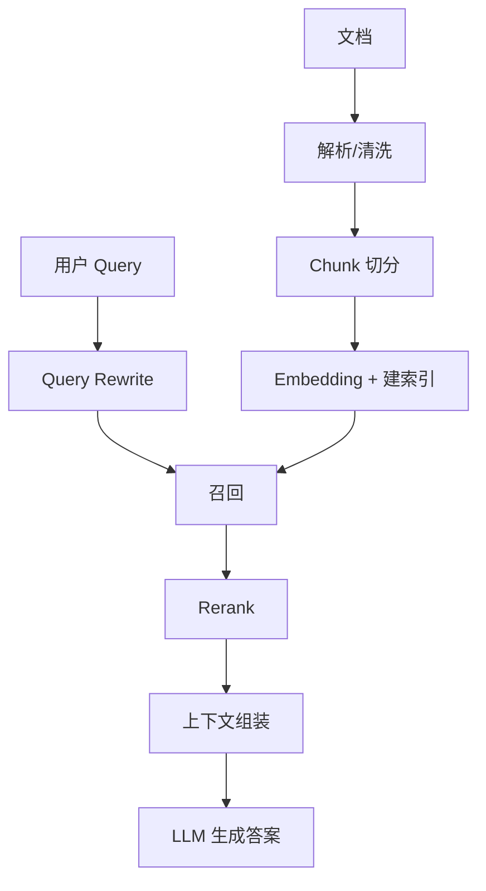
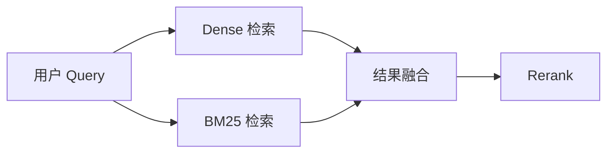

# RAG（检索增强生成）

## 面试高频考点

- RAG 的完整链路是什么？每一步有哪些关键设计选择？
- 向量检索和关键词检索的区别是什么？什么时候该做混合检索？
- Query Rewrite、Reranker、Hybrid Search 各自解决什么问题？
- RAG、Fine-tuning、Long Context 各自适合什么场景？
- 如何评估 RAG 系统效果？Recall、Faithfulness、RAGAS 分别看什么？

---

## 为什么需要 RAG

LLM 的参数知识有天然边界：

- 有知识截止日期
- 不能直接访问私有知识库
- 难以提供可靠引用
- 开放问答中容易幻觉

RAG 的目标不是让模型“更会背”，而是让模型在回答时**先找证据，再基于证据作答**。


---

## RAG 完整链路

### 离线阶段（Indexing）

1. 文档接入
2. 清洗解析
3. Chunk 切分
4. 生成 Embedding
5. 建向量索引 / 倒排索引

### 在线阶段（Querying）

1. Query 改写
2. 检索召回 Top-K
3. Rerank 精排
4. 上下文压缩与拼接
5. LLM 生成答案
6. 可选引用与校验



---

## 每一步的关键设计选择

| 步骤 | 常见选项 | 核心 trade-off |
|------|----------|----------------|
| Chunking | 固定大小、递归切分、语义切分 | 精度 vs 上下文完整性 |
| Embedding | OpenAI、BGE、E5、M3E 等 | 效果 vs 成本 vs 多语言 |
| 索引 | 向量库、倒排索引、双索引 | 简单性 vs 召回质量 |
| 检索 | Dense、BM25、Hybrid | 语义匹配 vs 精确关键词 |
| Rerank | Cross-Encoder、LLM Judge | 精度 vs 延迟 |
| 生成 | 小模型、强模型、长上下文模型 | 成本 vs 事实性 vs 体验 |

很多 RAG 失败，不是败在模型不够强，而是败在切分、召回、重排和上下文构造这些前置步骤。

---

## 检索方式详解

### Dense Retrieval

把 query 和文档都编码成向量，在向量空间找最近邻。

**优点：**
- 擅长语义匹配
- 对同义改写较鲁棒

**缺点：**
- 对数字、代码、专有名词不够稳定
- 可解释性弱

### Sparse Retrieval / BM25

基于关键词、词频和逆文档频率检索。

**优点：**
- 对报错码、接口名、专有词很强
- 速度快、解释性强

**缺点：**
- 语义泛化差

### Hybrid Search

把 Dense 和 BM25 结合，通常是生产 RAG 的默认起点。



### RRF（Reciprocal Rank Fusion）

常见融合方法：

```text
RRF = Σ 1 / (k + rank_i)
```

优点是：

- 简单
- 稳
- 不依赖复杂调权

---

## Query 改写技术

用户问题常常并不适合直接检索，所以会做 query rewrite。

| 方法 | 作用 | 典型场景 |
|------|------|---------|
| HyDE | 先生成假设答案再检索 | 解释类问题 |
| Multi-Query | 生成多个改写问题分别召回 | 提高 recall |
| Step-back | 回到更抽象的问题层 | 专业复杂问题 |
| Query Decomposition | 拆成子问题 | 多跳问题 |
| Contextual Rephrase | 结合历史补全指代 | 多轮问答 |

判断原则：

- 问题短、抽象、模糊：优先改写
- 问题里有明确关键词或错误码：要保留原 query 信息

---

## Reranker 为什么重要

初检索负责“尽量别漏”，Reranker 负责“别把噪声排太前”。

典型流程：

1. Dense/BM25 召回 Top-50
2. Cross-Encoder Rerank
3. 保留 Top-5 到 Top-10
4. 再送给 LLM

很多生产系统里，Reranker 带来的收益比单纯换更大模型还稳定。

---

## RAG 如何评估

### 检索层指标

- `Recall@K`：相关文档有没有召回到
- `MRR`：第一个相关文档排得靠不靠前
- `NDCG@K`：排序质量

### 生成层指标

- `Faithfulness`：答案是否忠于检索证据
- `Answer Relevance`：答案是否真正回答问题
- `Citation Accuracy`：引用是否对应正确证据

### RAGAS 常见指标

| 指标 | 看什么 |
|------|--------|
| Faithfulness | 是否胡编 |
| Answer Relevancy | 是否答到点上 |
| Context Precision | 召回结果脏不脏 |
| Context Recall | 关键证据漏没漏 |

关键点是：RAG 评估必须拆成检索层和生成层，不然出了问题很难定位。

---

## RAG vs Long Context vs Fine-tuning

| 维度 | RAG | Long Context | Fine-tuning |
|------|-----|--------------|-------------|
| 知识更新 | 强 | 中 | 弱 |
| 可追溯性 | 强 | 中 | 弱 |
| 成本 | 中 | 高 | 前期高，单次低 |
| 适合私有知识 | 强 | 中 | 弱 |
| 适合改行为风格 | 弱 | 弱 | 强 |

一个务实的结论：

- 知识更新问题优先看 RAG
- 长文深读问题优先看 Long Context
- 行为/格式/风格问题优先看 Fine-tuning

---

## 高级 RAG 方向

### Self-RAG

模型自己判断要不要检索、检索结果有没有用、生成是否被支持。

### Corrective RAG（CRAG）

先检查检索质量，再决定是否补搜或重检。

### Agentic RAG

把检索当成 Agent 的工具，而不是固定流水线的一步。适合多轮、多源、多跳任务。

---

## 常见误区

### 误区 1：RAG 就是“向量数据库 + LLM”

错。真正影响效果的是切分、召回、改写、rerank、上下文构造和评估闭环。

### 误区 2：检索到了文档就不会幻觉

不对。模型仍可能误读、拼错、忽略证据，或者在证据不足时自行补全。

### 误区 3：Chunk 越大越安全

太大常常会拉低召回精度，还增加上下文噪声。

### 误区 4：RAG 可以替代所有微调

不能。RAG 解决的是外部知识接入，不是输出行为控制。

---

## 面试延伸

**Q：如何评估 RAG 系统？**
> 要拆成两层：检索层看 Recall@K、MRR、NDCG；生成层看 Faithfulness、Answer Relevance、Citation Accuracy。RAGAS 可以做自动化评估，但关键任务仍然需要人工抽样和业务数据集验证。

**Q：RAG 和 Fine-tuning 怎么选？**
> 知识频繁更新、要溯源、要接私有文档时优先 RAG；想改变输出格式、语气、任务执行风格时优先 Fine-tuning。很多企业是 Fine-tuning 学行为，RAG 接知识。

**Q：RAG 为什么仍然会幻觉？**
> 可能是没召回、召回错了、证据冲突、上下文太长被忽略，或模型虽然看到了证据但总结错了。解决思路是先提升检索质量，再约束生成和引用。

---

## 学完可以做什么

1. 做一个 `BM25 + Vector + Reranker` 的最小 RAG demo。
2. 在自己的知识库上测 `Recall@5` 和 `Faithfulness`。
3. 对比 `不做 query rewrite` 和 `multi-query` 的召回差异。

---

## 原始论文

| 论文 | 链接 |
|------|------|
| RAG: Retrieval-Augmented Generation for Knowledge-Intensive NLP Tasks (Lewis et al., NeurIPS 2020) | [arxiv.org/abs/2005.11401](https://arxiv.org/abs/2005.11401) |
| Self-RAG: Learning to Retrieve, Generate, and Critique (Asai et al., ICLR 2024) | [arxiv.org/abs/2310.11511](https://arxiv.org/abs/2310.11511) |
| Corrective RAG (CRAG) (Yan et al., 2024) | [arxiv.org/abs/2401.15884](https://arxiv.org/abs/2401.15884) |
| RAGAS: Automated Evaluation of RAG (Es et al., 2024) | [arxiv.org/abs/2309.15217](https://arxiv.org/abs/2309.15217) |
| HyDE: Precise Zero-Shot Dense Retrieval without Relevance Labels (Gao et al., 2023) | [arxiv.org/abs/2212.10496](https://arxiv.org/abs/2212.10496) |

## 延伸阅读与视频

| 平台 | 标题 | 说明 |
|------|------|------|
| 📺 YouTube | [Retrieval Augmented Generation (RAG) Explained](https://www.youtube.com/watch?v=T-D1OfcDW1M) | IBM Technology，适合快速入门 |
| 📺 B站 | [Bilibili 搜索“RAG 检索增强生成”](https://search.bilibili.com/all?keyword=RAG%E6%A3%80%E7%B4%A2%E5%A2%9E%E5%BC%BA%E7%94%9F%E6%88%90&order=click) | 按播放量筛选中文讲解 |
