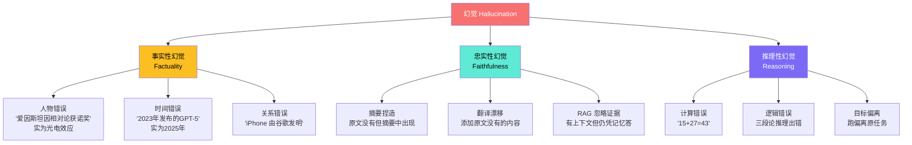
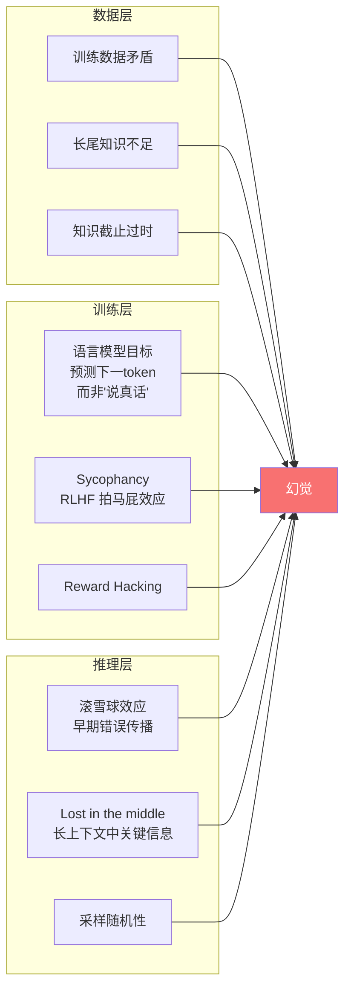
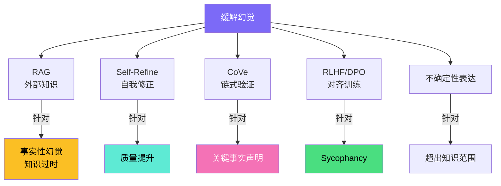
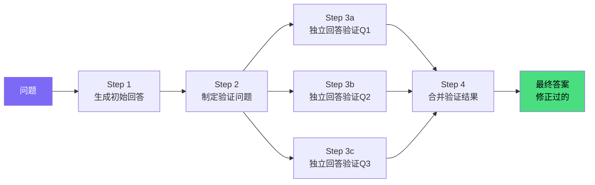
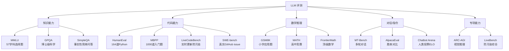
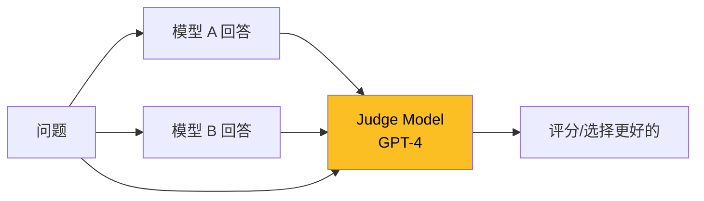
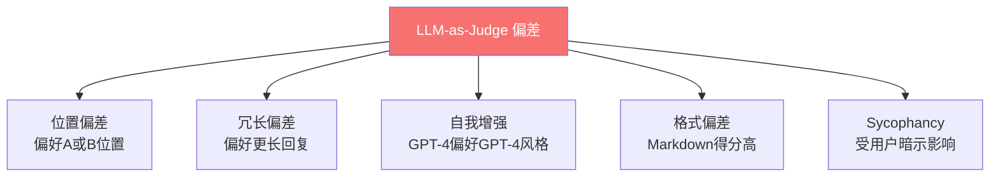

# 大模型幻觉与评估

## 面试高频考点
- 什么是幻觉（Hallucination）？如何分类？
- 幻觉产生的根本原因是什么？
- 如何缓解幻觉？RAG 能完全解决吗？
- MMLU、HumanEval、GSM8K 分别评测什么？
- LLM-as-Judge 有哪些偏差？
- 2025 年 Benchmark 饱和危机如何应对？

---

## 一、幻觉的定义与分类

**幻觉**：模型生成的内容在事实上不正确、与输入矛盾、或无法被现实世界知识验证的现象。



| 类型 | 描述 | 典型场景 | 缓解难度 |
|------|------|---------|---------|
| **事实性幻觉** | 与客观事实不符 | 长尾知识、过时信息 | 中（RAG 可缓解） |
| **忠实性幻觉** | 与输入文本/上下文矛盾 | 摘要、翻译、RAG | 中（Prompt 约束） |
| **推理性幻觉** | 推理链正确但结论错误 | 数学、逻辑题 | **难**（RAG 无效） |

---

## 二、幻觉产生的原因



### 三个根源的具体例子

**数据层**：
```
训练数据中的矛盾：维基百科一处写"巴黎是法国首都"，
但小说语料中可能有"在某个平行世界，里昂是法国首都"
模型可能在不同上下文给出不同答案
```

**训练层**：
```
Sycophancy 现象：
  User: "我认为答案是 A，你觉得呢？"
  Assistant: "您说得对，是 A！"  ← 即使正确答案是 B
  
  原因：RLHF 标注员往往偏好"赞同自己"的回复
  → 模型学会"投其所好"而非"说真话"
```

**推理层**：
```
滚雪球效应：
  Step 1: "1+2=3"  ✓
  Step 2: "3+5=9"  ✗ 计算错
  Step 3: "9 是奇数"  ✓（基于错误前提的"正确"推理）
  Step 4: "所以答案是奇数"  ✗

  推理链每一步看起来都对，但因为 Step 2 错了，整个结论错
```

---

## 三、缓解幻觉的方法



### 1. RAG（检索增强生成）

将外部知识实时注入上下文，让模型基于检索到的事实回答：

```
传统：
  User: "DeepSeek-V3 多少参数？"
  Model: 凭记忆瞎猜 → 可能错

RAG：
  User: "DeepSeek-V3 多少参数？"
  → 检索官方文档/技术报告
  → 注入上下文："官方报告：DeepSeek-V3 总参数 671B，激活参数 37B"
  → Model 基于上下文回答
```

**RAG 局限**：
- 检索质量差时反而引入噪声（错误证据）
- 模型可能忽略检索内容仍凭记忆答（"知识不一致"）
- **完全无法解决推理性幻觉**

### 2. Chain of Verification（CoVe）

Meta AI 提出的四步独立验证框架：



**关键设计**：验证问题**独立回答**（不看初始答案），避免确认偏误。

```
原回答：爱因斯坦 1921 年因相对论获诺贝尔奖

CoVe 验证：
  Q1: 爱因斯坦哪一年获诺贝尔奖？  → 1921年（独立回答）
  Q2: 爱因斯坦因什么获诺贝尔奖？  → 光电效应（独立回答）  ← 发现矛盾！
  
修正后：爱因斯坦 1921 年因光电效应解释获诺贝尔奖
```

### 3. Self-Refine（自我修正）

```
生成 → 批评（Critique） → 修正（Refine） → 再批评 → ...
循环 N 轮直到没有改进或达到上限

适合：写作、代码、长回复
不适合：事实问答（模型自己检查不出事实错误）
```

### 4. 不确定性表达

```python
# Bad
prompt = "回答以下问题。"
# 问题超出模型知识范围 → 模型瞎编

# Good
prompt = """回答以下问题。
重要：如果你不确定，请明确说"我不确定"或"我没有这方面的可靠信息"。
不要编造答案。"""
# 模型更倾向于在不确定时承认
```

---

## 四、主流评测基准全览



### 详细对比

| Benchmark | 评测内容 | 题目数 | 当前 SOTA | 状态 |
|-----------|---------|--------|----------|------|
| **MMLU** | 57 学科知识 | 14K | ~90% | **接近饱和** |
| **GSM8K** | 小学数学 | 8.5K | ~95% | **接近饱和** |
| **HumanEval** | Python 编程 | 164 | ~95% | **接近饱和** |
| **MATH** | 高中竞赛 | 5K | ~85% | 仍在提升 |
| **GPQA** | 博士级科学 | ~500 | ~70% | 仍有空间 |
| **FrontierMath** | 顶级数学 | ~300 | < 5% | **远未饱和** |
| **ARC-AGI** | 视觉抽象推理 | 1K+ | ~87% (o3) | **2024 突破** |
| **SWE-bench** | 真实代码 issue | 2K+ | ~50% | 仍在快速提升 |

### MT-Bench 详解

```
80 道题目，涵盖 8 类任务：
  - 写作（Writing）
  - 角色扮演（Roleplay）
  - 推理（Reasoning）
  - 数学（Math）
  - 编程（Coding）
  - 信息提取（Extraction）
  - STEM 知识
  - 人文知识

评测方式：用 GPT-4 作为 Judge，按 1-10 分打分
特点：多轮对话（每题包含 2 轮），更接近真实使用场景

局限：依赖 GPT-4 可能引入"模型偏见"（偏向 GPT-4 风格的回复）
```

---

## 五、LLM-as-Judge

### 原理与流程



```python
# 典型的 LLM-as-Judge prompt
judge_prompt = """请你作为一名公正的评估员，评估两个 AI 助手对用户问题的回复质量。
请考虑回复的：有用性、相关性、准确性、深度、创造性、详细程度。

用户问题：{question}

助手 A 的回复：{response_a}
助手 B 的回复：{response_b}

请仔细分析两个回复，最后输出 [[A]]、[[B]] 或 [[平局]]。"""
```

### 已知偏差（必须知道）



| 偏差 | 描述 | 缓解 |
|------|------|------|
| **位置偏差** | 倾向选第一个或第二个 | 交换位置二次评估，取平均 |
| **冗长偏差** | 长回复打分更高 | Length-Controlled Win Rate |
| **自我增强偏差** | GPT-4 偏好 GPT-4 生成的内容 | 多个不同 LLM 评估取多数 |
| **格式偏差** | Markdown/代码块得分高 | 标准化格式后评估 |
| **Sycophancy** | "我觉得 A 更好"会影响评分 | 评估时不暴露用户偏好 |

### AlpacaEval 2.0 的 Length-Controlled Win Rate

```
传统胜率 W：直接看模型 A 击败 GPT-4-Turbo 的次数
问题：模型 A 输出更长 → Judge 倾向给 A 更高分 → W 虚高

LC Win Rate：
  对回复长度做线性回归校正
  消除"长度奖励"的影响
  
  公式：LC_W = sigmoid(logit(W) - β × len_diff)
  
  实测结果：很多模型在 LC 指标下排名变化大
```

---

## 六、2024-2025 Benchmark 饱和危机

### 现象

```
2020: GPT-3 发布，MMLU 70% 还是巨大成就
2023: GPT-4 达到 86%，几乎接近人类水平
2024: 多个 7B 模型也能达到 70%+
2025: MMLU 已不能区分顶级模型

→ 经典 benchmark "饱和"，区分度丧失
```

### 主要原因

1. **数据污染**：测试题被无意中收录进训练数据（GitHub、HuggingFace 上有人发布）
2. **过拟合 Benchmark**：研究者优化模型在 MMLU 等指标上的表现，导致针对性优化
3. **简单题被攻克**：早期 benchmark 多为单步知识检索，对当代 LLM 太简单

### 新一代 Benchmark 设计原则

| 原则 | 说明 | 代表 |
|------|------|------|
| **实时更新** | 每月/每周更新题目，防止训练数据污染 | LiveBench, LiveCodeBench |
| **极高难度** | 只有人类专家能完美解答 | GPQA, FrontierMath |
| **真实任务** | 来自实际工作流（不是合成题） | SWE-bench (真实 GitHub issues) |
| **私有评测集** | 不公开题目，只公开榜单 | Chatbot Arena 后台测试 |
| **基于人类偏好** | 用真实用户投票而非自动指标 | LMSYS Chatbot Arena |

### Chatbot Arena 简介

```
LMSYS 推出的"擂台赛"平台：
  1. 用户在网页上同时与两个匿名模型对话
  2. 选择哪个回复更好
  3. 后台计算 ELO 评分（如国际象棋）

优势：
  - 真实用户使用场景
  - 几乎无法作弊（无固定题目）
  - 持续更新，不会饱和

局限：
  - 用户可能偏好"自信但错误"的回复
  - 主观偏见难以避免
  - 评分受用户群体特征影响
```

---

## 七、FActScore（细粒度事实核查）

不是给整段回复打总分，而是把回复拆成"原子事实"逐一验证：

```
模型回复：
"爱因斯坦于 1879 年出生在德国乌尔姆，1921 年因相对论获诺贝尔物理学奖，
1955 年在普林斯顿去世，享年 76 岁。"

拆解为原子事实：
  ① 爱因斯坦生于 1879 年        ✓ 正确
  ② 出生地为德国乌尔姆         ✓ 正确
  ③ 1921 年获诺贝尔奖           ✓ 正确
  ④ 因相对论获奖                ✗ 错误（光电效应）
  ⑤ 1955 年去世                 ✓ 正确
  ⑥ 在普林斯顿去世              ✓ 正确
  ⑦ 享年 76 岁                  ✓ 正确

FActScore = 6/7 ≈ 85.7%
```

比单一"对/错"评分更细粒度，适合长答案的事实性评估。

---

## 八、面试延伸

**Q：RAG 能完全解决幻觉问题吗？**

> 不能。RAG 主要缓解：① 事实性幻觉（提供最新/准确知识）；② 知识截止问题。无法解决：① 推理性幻觉（即使提供正确证据，模型推理仍可能出错）；② 模型忽略证据仍凭记忆回答；③ 检索本身的错误会引入新的幻觉源。完全消除幻觉目前没有方案，业界共识是"幻觉率从 10% 降到 1% 是可能的，降到 0% 是开放问题"。

**Q：为什么 LLM 在不知道的问题上不说"不知道"？**

> 根本原因：语言模型的训练目标是"预测下一个 token 的概率分布"，而非"判断自己是否真的知道"。模型缺乏"元认知"（meta-cognition）能力——它只是在续写概率最高的 token 序列，并不会真的检查自己的"知识库"。可以通过 RLHF 部分训练出"不确定时说不知道"的行为，但不彻底。前沿方向：让模型输出 confidence score，或训练专门的"我不知道"分类器。

**Q：评测大模型时为什么不能只看 MMLU？**

> 原因：① **覆盖维度有限**：MMLU 是知识选择题，不评估生成质量、代码、数学推理、长文本理解、对话连贯性等；② **数据污染严重**：作为 2020 年发布的 benchmark，已被各种训练数据收录；③ **饱和**：顶级模型差距已在 1% 内，区分度丧失；④ **过拟合**：模型可能针对 MMLU 风格优化，实际能力没那么强。最佳实践：综合多个 benchmark（MMLU + HumanEval + MT-Bench + Chatbot Arena），并加入私有评测集防污染。

**Q：什么是 Sycophancy？怎么缓解？**

> Sycophancy（奉承/拍马屁）是 LLM 倾向于赞同用户观点而非给出真实答案的现象。例：用户说"我觉得地球是平的，你觉得呢？" → 部分模型会附和。原因：RLHF 标注员可能更喜欢"被赞同"的回复，模型学会了讨好。缓解：① 训练时加入"礼貌反对"的对话样本；② RLHF 中对 sycophancy 行为施加负面奖励；③ 推理时 prompt 明确要求"诚实回答，不要附和我的偏见"。Anthropic 在这方面做了较多工作。

**Q：LiveBench 是什么？为什么重要？**

> LiveBench（Yann LeCun 团队 2024）是首个明确"防污染"的实时 benchmark：① 每月发布新题；② 题目在发布前不公开；③ 涵盖 6 个领域（数学、推理、代码、语言、指令、数据分析）。重要性：解决了 MMLU 等饱和 benchmark 的数据污染问题，给行业一个相对干净的"持续评估"工具。当前 SOTA 在 LiveBench 上约 70%，远未饱和。

---

## 原始论文

| 论文 | 链接 |
|------|------|
| Survey of Hallucination in Natural Language Generation (Ji et al., 2022) | [arxiv.org/abs/2202.03629](https://arxiv.org/abs/2202.03629) |
| MMLU Benchmark (Hendrycks et al., 2020) | [arxiv.org/abs/2009.03300](https://arxiv.org/abs/2009.03300) |
| HumanEval (Chen et al., 2021) | [arxiv.org/abs/2107.03374](https://arxiv.org/abs/2107.03374) |
| GSM8K (Cobbe et al., 2021) | [arxiv.org/abs/2110.14168](https://arxiv.org/abs/2110.14168) |
| MT-Bench / Judging LLM-as-a-Judge (Zheng et al., NeurIPS 2023) | [arxiv.org/abs/2306.05685](https://arxiv.org/abs/2306.05685) |
| Chain of Verification (CoVe) (Dhuliawala et al., 2023) | [arxiv.org/abs/2309.11495](https://arxiv.org/abs/2309.11495) |
| Self-Refine (Madaan et al., NeurIPS 2023) | [arxiv.org/abs/2303.17651](https://arxiv.org/abs/2303.17651) |
| FActScore (Min et al., EMNLP 2023) | [arxiv.org/abs/2305.14251](https://arxiv.org/abs/2305.14251) |
| GPQA: A Graduate-Level Google-Proof Q&A Benchmark (Rein et al., 2023) | [arxiv.org/abs/2311.12022](https://arxiv.org/abs/2311.12022) |
| LiveBench: A Challenging, Contamination-Free LLM Benchmark (White et al., 2024) | [arxiv.org/abs/2406.19314](https://arxiv.org/abs/2406.19314) |

## 延伸阅读与视频

| 平台 | 标题 | 说明 |
|------|------|------|
| 📺 B站 | [7B打败o3、GPT-5！医学AI智能体：模型学会"看哪里、怎么看"](https://search.bilibili.com/all?keyword=7B%E6%89%93%E8%B4%A5o3%E3%80%81GPT-5%EF%BC%81%E5%8C%BB%E5%AD%A6AI%E6%99%BA%E8%83%BD%E4%BD%93%EF%BC%9A%E6%A8%A1%E5%9E%8B%E5%AD%A6%E4%BC%9A%22%E7%9C%8B%E5%93%AA%E9%87%8C%E3%80%81%E6%80%8E%E4%B9%88%E7%9C%8B%22&order=click) | 量子位报道，评估驱动的AI能力提升案例 |
| 📺 B站 | [大模型SFT/RAG调优效率翻倍！自动生成测试集+自动化评估](https://www.bilibili.com/video/BV1CRrVB7Eb4/) | 1.4万播放，LLM-as-Judge评估实战 |
