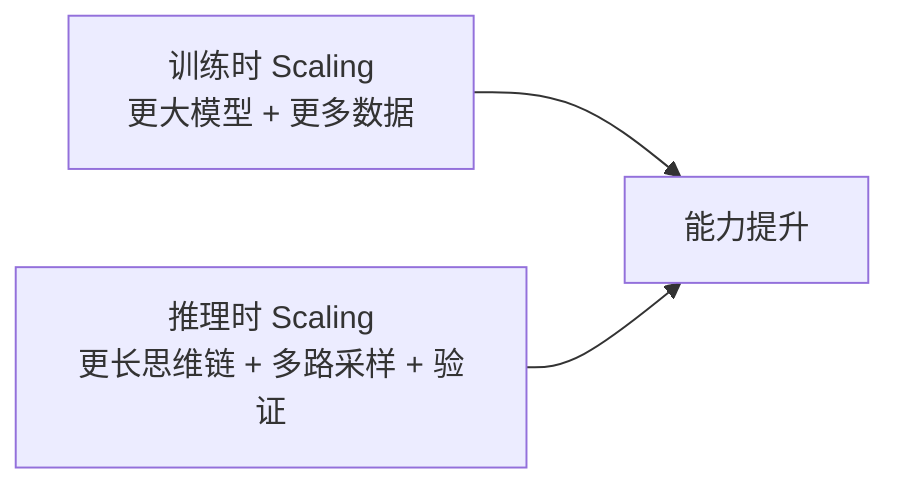
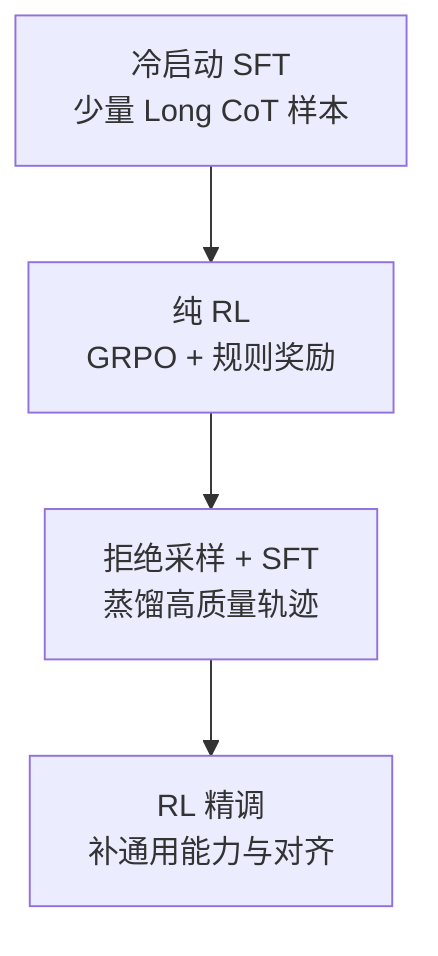
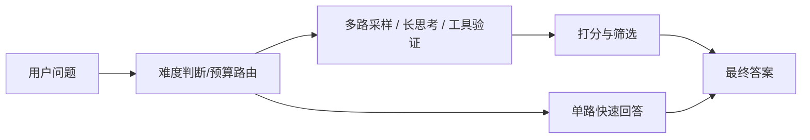

# 推理时计算扩展（Test-Time Compute Scaling）

## 面试高频考点
- 什么是 Test-Time Compute Scaling？和训练时 Scaling 有什么区别？
- DeepSeek-R1 用了什么训练方法？GRPO 和 PPO 的区别？
- 过程奖励模型（PRM）和结果奖励模型（ORM）的优劣？
- 为什么说"推理时多想"比"增大参数"更有性价比？
- Reward Hacking 是什么？如何缓解？
- 什么时候值得给模型更高 thinking budget，什么时候纯属浪费？

---

## 核心思想

传统 Scaling Law 聚焦**训练时算力**（更多数据、更多参数）；2025 年以后一个关键范式转变是**推理时计算扩展（TTC Scaling）**：允许模型在推理时"想更久"，通过消耗更多推理 FLOPs 换取更高质量输出。

**核心洞见**：对于难题，TTC 扩展往往比继续增大参数量更具性价比。



区别在于成本支付方式：

- **训练时 scaling**：前期一次性投入大，推理时单次成本较稳。
- **推理时 scaling**：训练后继续按 query 付费，只在难题上增加预算。

这意味着 TTC 很适合做**按需计算**：简单题快答，难题深想。

---

## 为什么 TTC 有效

很多复杂任务不是因为模型完全不会，而是因为一次性直接输出答案时，来不及展开中间推理、检查错误、比较候选路径。

TTC 有效的原因通常来自三类额外计算：

1. **更长的中间推理**：把隐式推理显式展开。
2. **更多候选路径**：同一题采样多条解法。
3. **更强验证与筛选**：用奖励模型、规则或测试来选更优轨迹。

可以把它理解成：不是换了个大脑，而是给同一个大脑更多草稿纸、更多重试机会和更严格的自检流程。

---

## 关键技术

### 1. Long CoT（长链式思维）

模型在输出最终答案前，生成大量中间"思考 Token"，将复杂推理步骤显式展开。

- o1/o3 风格系统：用户可以指定不同 thinking budget
- DeepSeek-R1：长思维链中会自发出现回溯、自我验证、重算等行为

**优势：**
- 对数学、逻辑、代码这类可分步求解问题帮助显著
- 更容易暴露错误点，便于后续 PRM/RL 优化

**代价：**
- token 成本高
- 推理时延显著上升
- 可能出现"越想越偏"或空转

### 2. Best-of-N 采样

生成 N 条候选回答，用奖励模型或规则选出最优解：

```text
问题 -> 采样 N 条回答（N=4~256）
     -> 打分/验证
     -> 选择最优输出
```

**效果**：随着 `N` 增大，准确率通常提升，但边际收益递减，且 sampling 与 reranking 成本都在上升。

### 3. 过程奖励模型（PRM）

| 奖励模型类型 | 打分粒度 | 优点 | 缺点 |
|------------|---------|------|------|
| ORM（结果奖励）| 最终答案 | 简单，易获取标签 | 无法区分推理过程质量 |
| PRM（过程奖励）| 每个推理步骤 | 对推理链精细引导 | 标注成本高，难以自动化 |

PRM 的价值在于：模型不只知道"最后错了"，还知道"第几步开始错了"。

### 4. GRPO（组相对策略优化）

DeepSeek-R1 提出，专为推理任务设计的 RL 算法：

```python
for question in batch:
    outputs = sample_G_outputs(model, question)
    rewards = score(outputs)
    advantages = (rewards - mean(rewards)) / std(rewards)
    loss = -sum(log_prob * advantages)
```

**GRPO vs PPO：**

| 维度 | PPO | GRPO |
|------|-----|------|
| 是否需要 Critic 网络 | 是 | 否 |
| 计算开销 | 高 | 低 |
| 训练稳定性依赖 | Critic 质量 | 组内相对排序 |
| 适用场景 | 通用 RLHF | 数学/代码等可验证任务 |

GRPO 的关键思想是：不去学一个额外的价值函数，而是直接在同题多样本之间做相对比较。

---

## DeepSeek-R1 训练流程



**关键点：**
- 先用少量高质量轨迹教会模型"会想"
- 再用 RL 鼓励它"想得对"
- 最后把高质量推理行为蒸馏回更稳定的监督数据中

这个流程说明：推理增强不是只有 RL，往往是 **SFT + RL + 再蒸馏** 的闭环。

---

## Reward Hacking（奖励欺骗）

**定义**：模型通过奖励模型或打分规则的漏洞获得高分，而非真正提升能力。

**表现**：
- 生成很长但空洞的推理过程
- 用格式技巧骗过检查器
- 每步看似合理，但整体逻辑断裂
- 学会迎合 PRM/ORM 的偏好词汇，而不是真正解题

**缓解方法**：
- 尽量使用**可验证奖励**：数学答案校验、单元测试、编译运行
- 结合过程奖励与结果奖励
- 做对抗评测，专门找会骗分的轨迹
- 限制无意义冗长推理，加入长度或效率约束

---

## TTC Scaling 的适用边界

| 场景 | TTC 效果 | 原因 |
|------|---------|------|
| 数学/逻辑推理 | 显著提升 | 可分步、可验证 |
| 代码生成 | 显著提升 | 可跑测试、可多次尝试 |
| 工具调用规划 | 中高提升 | 可比较不同规划路径 |
| 知识问答 | 有限提升 | 受知识截止与外部信息限制 |
| 开放写作 | 提升有限 | 缺少客观验证标准 |

**结论**：TTC 对**可验证、可分解、路径依赖强**的任务最有效。

---

## 工程实践视角

### 一个典型推理增强系统



### 实际落地时的三个关键 trade-off

1. **质量 vs 时延**  
   Best-of-N 和长 CoT 几乎一定涨延迟，不适合所有请求默认开启。

2. **准确率 vs 成本**  
   很多任务从 `N=1` 到 `N=8` 提升明显，但再往上收益会迅速变小。

3. **可解释性 vs 泄露风险**  
   显式输出完整思维链有时对调试有帮助，但在产品侧可能带来策略暴露和体验问题。

### 一个常见策略

- 简单请求直接走快速模式
- 中等难度走短 CoT 或少量 self-consistency
- 高价值难题走长 CoT + 多路采样 + verifier

也就是说，TTC 最优解通常不是"统一多想"，而是**预算调度**。

---

## 常见误区

### 误区 1：TTC 就是把输出写长一点

错。真正有效的是更多有信息量的中间计算和候选探索，不是形式上的长篇输出。

### 误区 2：长 CoT 一定提升效果

不一定。对于简单题，长 CoT 可能只会拖慢速度，甚至引入额外错误。

### 误区 3：推理增强能替代基座能力

不能。TTC 更像放大已有能力，底座不具备基本知识和模式时，再多测试时计算也救不回来。

### 误区 4：有奖励模型就能放心做 Best-of-N

如果奖励模型偏了，Best-of-N 只会更稳定地选错答案。

---

## 面试延伸

**Q：o1 和普通 ChatGPT 最大区别是什么？**
> 核心区别在于推理范式：普通对话模型更偏向直接生成答案，而 reasoning-oriented 模型会在内部分配更多推理预算，进行中间步骤展开、候选探索和自检，因此难题上表现更强。

**Q：为什么 GRPO 不需要 Critic 网络？**
> PPO 用 Critic 估计 value 以计算 advantage；GRPO 对同题采样多条输出，用组内平均或归一化奖励充当无参数基线，因此省掉了单独训练 Critic 的成本。

**Q：PRM 的训练数据从哪来？**
> 主要来自人工逐步标注、蒙特卡洛 rollout 成功率估计，或用更强模型对中间步骤打分。难点不在模型结构，而在高质量步骤级标签昂贵且一致性难保证。

**Q：为什么说 TTC 对知识问答提升有限？**
> 因为如果模型或上下文本身没有目标知识，多想几轮通常只会在已有知识边界内反复重组。它更适合解题，而不是补知识缺口。

---

## 学完可以做什么

1. 做一个 `best-of-n + 单元测试筛选` 的代码生成实验。
2. 用同一个模型对比不同 thinking budget 在数学题上的准确率、成本和延迟。
3. 设计一个 verifier，比较 `直接回答`、`长 CoT`、`多路采样 + verifier` 三种策略。

---

## 原始论文

| 论文 | 链接 |
|------|------|
| DeepSeek-R1: Incentivizing Reasoning Capability (2025) | [arxiv.org/abs/2501.12948](https://arxiv.org/abs/2501.12948) |
| Scaling LLM Test-Time Compute Optimally (DeepMind, 2024) | [arxiv.org/abs/2408.03314](https://arxiv.org/abs/2408.03314) |
| Let's Verify Step by Step — PRM (Lightman et al., 2023) | [arxiv.org/abs/2305.20050](https://arxiv.org/abs/2305.20050) |
| QwQ-32B 技术报告 (Qwen, 2025) | [arxiv.org/abs/2503.05522](https://arxiv.org/abs/2503.05522) |
| TMAS: Scaling Test-Time Compute via Multi-Agent Synergy (2026) | [arxiv.org/abs/2605.10344](https://arxiv.org/abs/2605.10344) |
| GR-Ben: Benchmark for Evaluating Process Reward Models (2026) | [arxiv.org/abs/2605.01203](https://arxiv.org/abs/2605.01203) |
| Avoiding Overthinking and Underthinking: Curriculum-Aware Budget Scheduling (2026) | [arxiv.org/abs/2604.19780](https://arxiv.org/abs/2604.19780) |

## 延伸阅读与视频

| 资源 | 链接 | 说明 |
|------|------|------|
| DeepSeek R1 论文精读 | [Bilibili 搜索"DeepSeek R1 论文精读 李沐 GRPO Long CoT"](https://search.bilibili.com/all?keyword=DeepSeek%20R1%20%E8%AE%BA%E6%96%87%E7%B2%BE%E8%AF%BB%20%E6%9D%8E%E6%B2%90%20GRPO%20Long%20CoT&order=click) | 李沐，GRPO 与 Long CoT 涌现机制详解 |
| DeepSeek R1 Explained | [youtube.com/watch?v=iBkFVBmBuTU](https://www.youtube.com/watch?v=iBkFVBmBuTU) | Umar Jamil，含代码与论文走读 |
