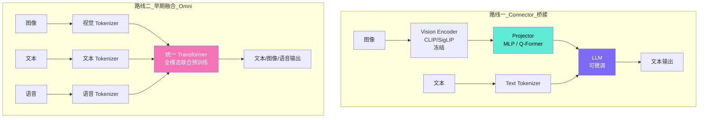
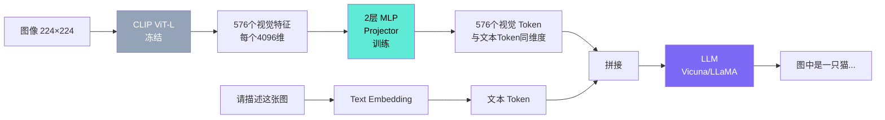
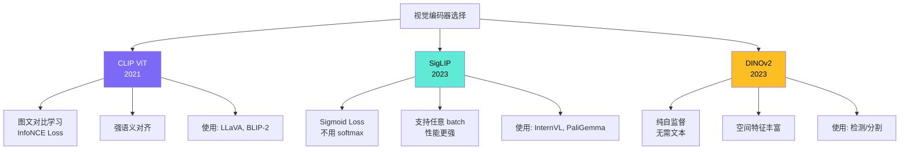
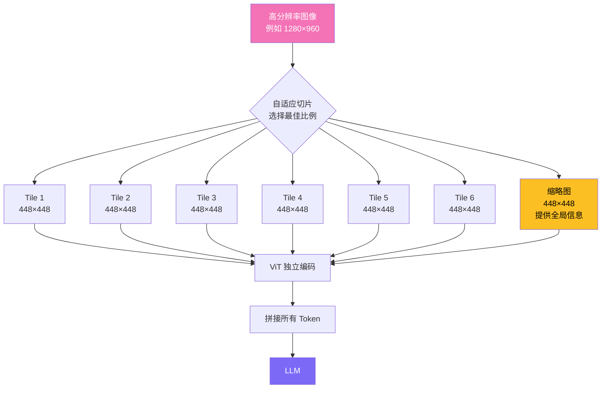
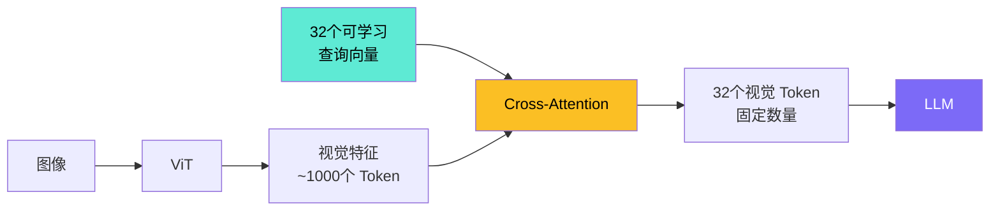
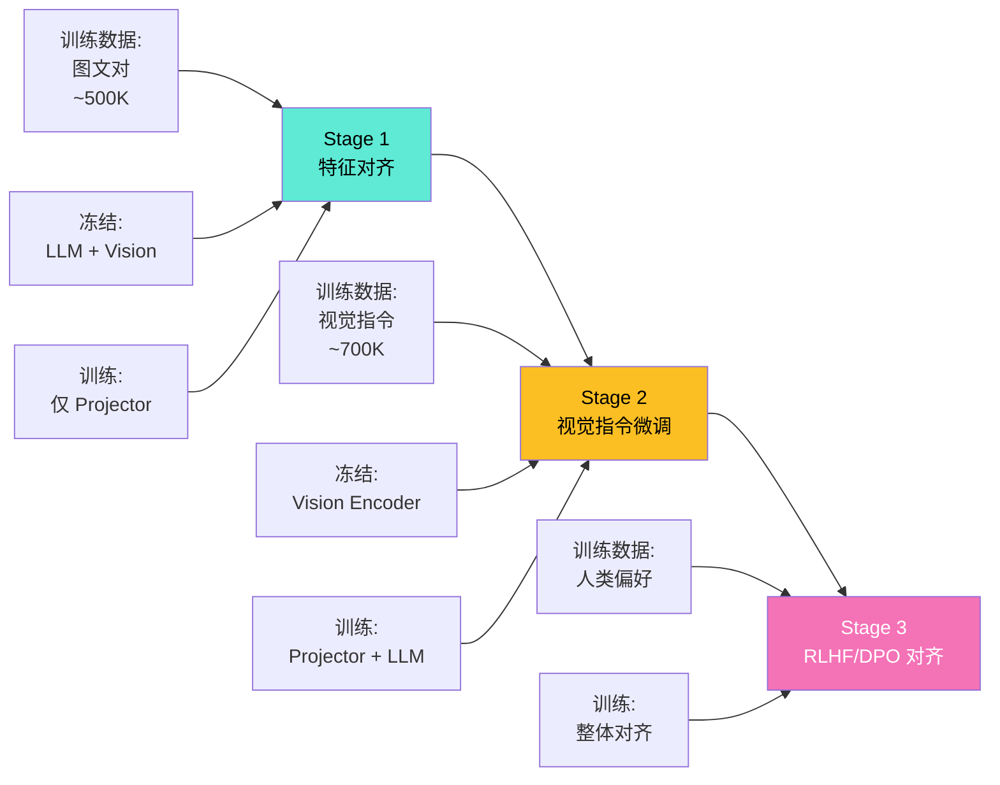
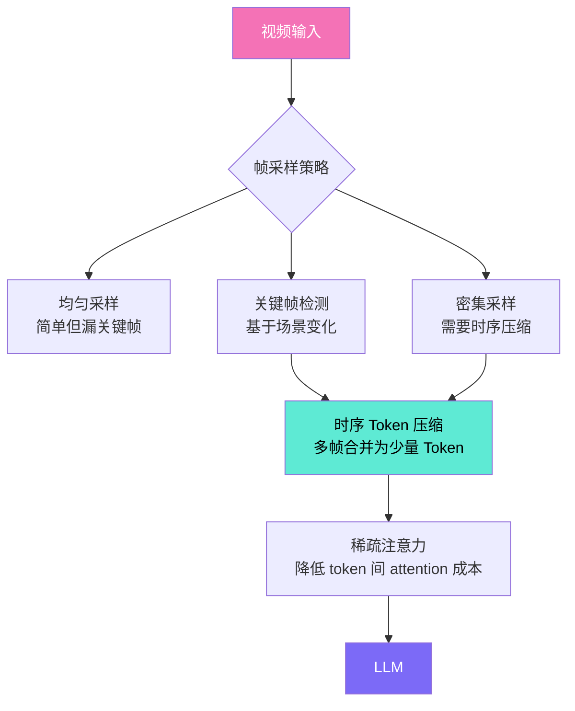

# 多模态大模型（Multimodal LLM / VLM）

## 面试高频考点
- 多模态模型的两条主流技术路线是什么？
- 视觉编码器（CLIP/SigLIP）如何与 LLM 对齐？
- 高分辨率图像如何处理？动态分辨率方案是什么？
- 早期融合（Early Fusion）和晚期融合（Late Fusion）的区别？
- 为什么说 GPT-4o 是"原生多模态"？
- 视频理解为什么比图像理解更难？

---

## 一、技术路线全景

2025 年多模态 LLM 已从"给 LLM 加视觉插件"进化为**原生 Any-to-Any 架构**。两条主流路线：



| 维度 | 路线一：Connector 桥接 | 路线二：早期融合（Omni） |
|------|------------------------|-----------------------|
| 代表模型 | LLaVA, InternVL, Qwen-VL | GPT-4o, Gemini 2.0, Chameleon |
| 视觉编码器 | 独立（CLIP/SigLIP，通常冻结） | 内嵌在统一模型中 |
| 训练成本 | 低（可冻结大部分参数） | 高（全模态联合预训练） |
| 输入支持 | 图像 + 文本 | 任意模态组合 |
| 输出支持 | 仅文本 | 任意模态（文/图/音） |
| 灵活性 | 可独立升级视觉/语言模块 | 紧耦合，但交互更自然 |
| 当前主流 | 开源生态主流 | 闭源前沿模型走向 |

---

## 二、连接器桥接（Connector-based）详解

### LLaVA 风格架构



```python
# LLaVA 的核心：把视觉特征"翻译"成 LLM 能理解的 token
class LLaVA(nn.Module):
    def __init__(self):
        self.vision_encoder = CLIPVisionModel.from_pretrained(...)  # 冻结
        self.projector = nn.Sequential(
            nn.Linear(1024, 4096),  # CLIP 1024 → LLaMA 4096
            nn.GELU(),
            nn.Linear(4096, 4096)
        )
        self.llm = LlamaForCausalLM.from_pretrained(...)

    def forward(self, image, text_ids):
        # 1. 图像 → 视觉特征
        vision_features = self.vision_encoder(image)  # [B, 576, 1024]

        # 2. 视觉特征 → LLM Token 空间
        vision_tokens = self.projector(vision_features)  # [B, 576, 4096]

        # 3. 与文本 token 拼接
        text_embeddings = self.llm.embed_tokens(text_ids)
        combined = torch.cat([vision_tokens, text_embeddings], dim=1)

        # 4. 送入 LLM
        return self.llm(inputs_embeds=combined)
```

---

## 三、视觉编码器对比



| 编码器 | 训练方式 | 优势 | 短板 | 主要使用 |
|--------|---------|------|------|---------|
| **CLIP ViT** | 图文对比学习（InfoNCE） | 强语义对齐，多语言支持好 | softmax 受 batch size 限制 | LLaVA, BLIP-2 |
| **SigLIP** | Sigmoid 损失 | 任意 batch size, 更强性能 | 较新，生态尚在建设 | InternVL, PaliGemma |
| **DINOv2** | 纯自监督（无文本） | 空间特征丰富，适合检测分割 | 缺乏语义对齐 | 检测/分割任务为主 |

---

## 四、高分辨率图像处理

### 问题：标准 ViT 难处理高分辨率

```
CLIP ViT 通常在 224×224 或 336×336 训练
如果输入 1024×1024 的高清图：
  ① 直接 resize 到 224 → 文字、细节全糊
  ② 直接喂给 ViT → 位置编码不匹配，效果崩

但很多任务需要高分辨率：
  - OCR：识别图片中的文字
  - 图表理解：精确读取数值
  - 医学影像：肿瘤等微小特征
  - 文档理解：表格、字段对齐
```

### 动态分辨率（InternVL/Qwen-VL 方案）



**关键点**：
- 切片之间无 Attention 交互（独立编码降低算力）
- 加入"缩略图 token"提供全局上下文（防止 LLM 看不到整体）
- LLM 通过位置 token 或特殊分隔符理解切片的空间关系

### InternVL 2.5 在 OCR 任务上的效果

```
固定 336×336 分辨率：               ✗ 长文档/小字识别失败
动态切片（最多 12 个 tile）：        ✓ OCR 精度接近商用引擎
                                    ✓ 图表数值读取准确
                                    ✓ 文档表格结构理解
```

---

## 五、Q-Former（BLIP-2 风格）



```
传统 LLaVA：图像 → 576 个视觉 Token → 占用大量上下文
Q-Former：图像 → 32 个固定 Token → 上下文压力小

Q-Former 优点：
  - 视觉 Token 数量固定（与图像分辨率无关）
  - LLM 上下文压力小，可处理多图输入

Q-Former 缺点：
  - 信息压缩损失，不适合 OCR/细粒度任务
  - 32 个 token 难以编码复杂场景
```

**适用场景**：图像描述、视觉问答等"粗粒度"任务。OCR/细粒度任务推荐用动态分辨率方案。

---

## 六、多模态对齐训练阶段

LLaVA 等模型通常分三阶段训练：



| 阶段 | 训练数据 | 冻结 | 目标 |
|------|---------|------|------|
| Stage 1：特征对齐 | 图文对（如 LAION-558K）| LLM + Vision Encoder | 训练 Projector 把视觉特征"翻译"成 LLM 语言 |
| Stage 2：指令微调 | 视觉指令数据（GPT-4 生成）| Vision Encoder | 联合训练 Projector + LLM，学会回答视觉问题 |
| Stage 3（可选）：RLHF | 视觉对话偏好数据 | - | 提升对话质量、安全性、视觉幻觉缓解 |

---

## 七、视频理解的额外挑战

视频 = 时序图像序列 + 音频，但简单"把视频拆成帧"会爆炸：

```
1 分钟视频 @ 1fps = 60 帧
每帧 256 个视觉 token
总计 60 × 256 = 15,360 token

如果 5 分钟视频 = 76,800 token，已经超出常规 LLM 上下文
更不用说细粒度的 30fps 视频
```

### 主流解决方案



| 策略 | 描述 | 代表 |
|------|------|------|
| **均匀采样** | 每 N 秒取 1 帧 | 简单基线，常用于评测 |
| **关键帧检测** | 用 SAM 等模型识别场景变化 | LLaVA-Video |
| **时序 Token 压缩** | 多帧 token 在时间维度池化/聚合 | Video-ChatGPT |
| **时序 Attention** | 在时间维度做轻量 Attention 学习时序关系 | Qwen2.5-VL |
| **专门时序模块** | 用 TimeSformer 等替代静态 ViT | InternVideo |

---

## 八、当前 SOTA 模型对比（2025）

| 模型 | 开源 | 参数量 | 上下文 | 输出模态 | 特色 |
|------|------|--------|--------|---------|------|
| GPT-4o | 否 | - | 128K | 文/图/音 | 原生 Any-to-Any，实时语音 |
| Gemini 2.0 Flash | 否 | - | 1M | 文/图/音/视频 | 超长上下文 + 原生视频 |
| Claude 3.5 Sonnet | 否 | - | 200K | 文 + 图理解 | 视觉推理强 |
| **InternVL 2.5** | **是** | 1B-78B | 32K | 文 | **开源最强 VLM**，动态分辨率 |
| **Qwen2.5-VL** | **是** | 3B-72B | 128K | 文 | 中文好，视频理解强 |
| LLaMA 3.2 Vision | 是 | 11B/90B | 128K | 文 | Meta 开源 VLM |
| MiniCPM-V 2.6 | 是 | 8B | 32K | 文 | 端侧最强，OCR 出色 |
| DeepSeek-VL2 | 是 | 28B MoE | 32K | 文 | MoE + 视觉 |

---

## 九、面试延伸

**Q：为什么视觉 Token 数量很重要？**

> 每张图片通常生成 256-4096 个 token，直接占用 LLM 上下文窗口。例如：① 8K 上下文模型，输入 4 张图片（每张 1024 token）就用掉一半上下文；② 视觉 token 越多 → KV Cache 越大 → 推理延迟越高、显存压力越大。所以 Q-Former（固定 32 token）、动态分辨率（按需切片）、视觉 token 压缩等技术都很重要。生产环境中通常按场景选：粗粒度任务用 Q-Former 风格压缩、细粒度（OCR/图表）用动态切片。

**Q：多模态模型为什么在 OCR 和图表理解上困难？**

> 文字和图表识别需要**像素级的高分辨率感知**：① 标准 ViT 训练分辨率（224/336）下，小字直接变模糊；② ViT 的 patch（如 14×14 像素）粒度对单个字符来说太大；③ CLIP 等编码器的预训练目标是"语义对齐"，不是精确字符识别。解决路径：动态分辨率切片 + 更大的视觉编码器 + OCR 专项训练数据。InternVL/Qwen-VL 的 OCR 能力强主要靠这条路线。

**Q：语音模态通常如何加入？**

> 两种方式：① **桥接方式**：Whisper 等 ASR 模型提取声学特征，通过 Projector（类似视觉的 MLP）映射到 LLM token 空间，与文本 token 拼接（如 LLaSM、Qwen-Audio）。② **原生方式**：把语音离散化为 token（用 codec 模型），与文本 token 联合训练一个统一 Transformer（如 GPT-4o 的语音模式、Moshi）。桥接方式实现简单但延迟高（先 ASR 再 LLM），原生方式延迟低但训练成本高。

**Q：为什么 GPT-4o 被称为"原生多模态"？**

> "原生"指的是同一个 Transformer 在 token 级别处理多模态，而不是用桥接器把各模态外挂到 LLM 上。具体表现：① 语音输入端到端处理（不先 ASR），延迟 ~320ms（人类反应级别）；② 可以直接输出语音（不依赖 TTS）；③ 训练时是图/文/音联合预训练，而非"先训语言模型再加多模态"。代价是训练成本极高，目前只有几家头部公司能做到。

---

## 原始论文

| 论文 | 链接 |
|------|------|
| CLIP (Radford et al., 2021) | [arxiv.org/abs/2103.00020](https://arxiv.org/abs/2103.00020) |
| LLaVA (Liu et al., NeurIPS 2023) | [arxiv.org/abs/2304.08485](https://arxiv.org/abs/2304.08485) |
| BLIP-2 / Q-Former (Li et al., ICML 2023) | [arxiv.org/abs/2301.12597](https://arxiv.org/abs/2301.12597) |
| InternVL 2.5 (Chen et al., 2024) | [arxiv.org/abs/2412.05271](https://arxiv.org/abs/2412.05271) |
| SigLIP (Zhai et al., ICCV 2023) | [arxiv.org/abs/2303.15343](https://arxiv.org/abs/2303.15343) |
| Chameleon: Mixed-Modal Early-Fusion (Meta, 2024) | [arxiv.org/abs/2405.09818](https://arxiv.org/abs/2405.09818) |
| LLaVA-OneVision: Easy Visual Task Transfer (2024) | [arxiv.org/abs/2408.03326](https://arxiv.org/abs/2408.03326) |
| LLaVA-Video: Learning Video Representations (2024) | [arxiv.org/abs/2410.02713](https://arxiv.org/abs/2410.02713) |
| Qwen2.5-VL: Expanding Horizons for Vision-Language Models (2025) | [arxiv.org/abs/2502.13923](https://arxiv.org/abs/2502.13923) |
| InternVL3: Advanced Training for Multimodal Models (2025) | [arxiv.org/abs/2504.10479](https://arxiv.org/abs/2504.10479) |

## 官方仓库

| 项目 | 链接 |
|------|------|
| LLaVA GitHub | [github.com/haotian-liu/LLaVA](https://github.com/haotian-liu/LLaVA) |
| InternVL GitHub | [github.com/OpenGVLab/InternVL](https://github.com/OpenGVLab/InternVL) |

## 延伸阅读与视频

| 平台 | 标题 | 说明 |
|------|------|------|
| 📺 B站 | [多模态大模型LLaVA模型讲解——transformers源码解读](https://www.bilibili.com/video/BV1nw4m1S7nZ/) | 4万播放，LLaVA架构源码级深度解析 |
| 📺 B站 | [InternVL1.5：开源领先的多模态大模型](https://search.bilibili.com/all?keyword=InternVL1.5%EF%BC%9A%E5%BC%80%E6%BA%90%E9%A2%86%E5%85%88%E7%9A%84%E5%A4%9A%E6%A8%A1%E6%80%81%E5%A4%A7%E6%A8%A1%E5%9E%8B&order=click) | InternVL架构与动态分辨率机制讲解 |
| 📺 B站 | [课时3：大一统范式 LLaVA与GPT-4V](https://search.bilibili.com/all?keyword=%E8%AF%BE%E6%97%B63%EF%BC%9A%E5%A4%A7%E4%B8%80%E7%BB%9F%E8%8C%83%E5%BC%8F%20LLaVA%E4%B8%8EGPT-4V&order=click) | 从大一统视角理解多模态架构设计 |
| 📺 B站 | [【AI大模型-LLM多模态视觉大模型精讲教程 全40集】](https://www.bilibili.com/video/BV1sWXPYtE3d/) | 1.8万播放，系统完整的多模态学习课程 |
