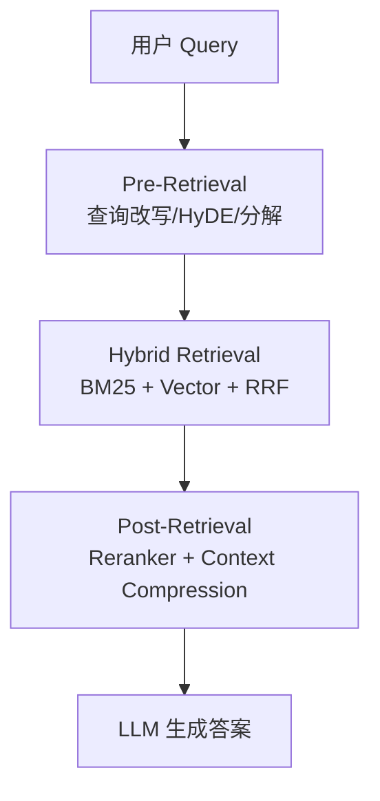
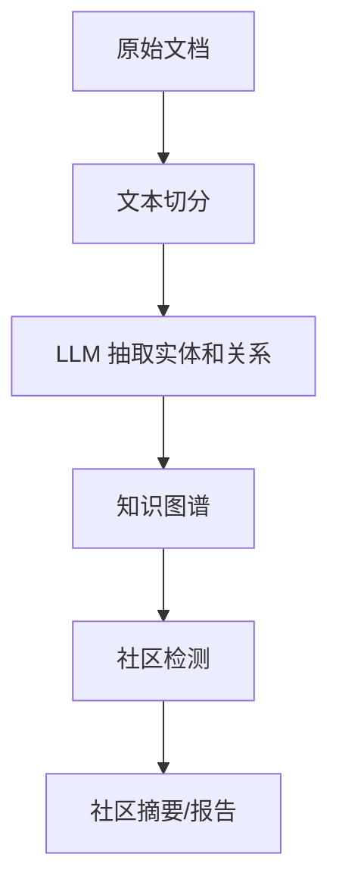

# GraphRAG 与高级 RAG

## 面试高频考点
- Naive RAG 的主要缺陷是什么？Advanced RAG 如何改进？
- GraphRAG 相比 RAG 解决了什么问题？核心流程是什么？
- HyDE 是什么？Self-RAG 如何判断是否需要检索？
- Chunk 切分策略如何选择？Embedding 模型如何选型？
- 如何评估 RAG 系统的质量？RAGAS 有哪些指标？
- RAG、Long Context、GraphRAG 到底怎么选型？

---

## RAG 演进三代

**细化理解：** Naive RAG 重点是向量召回加生成，Advanced RAG 加入 query rewrite、hybrid search、rerank、上下文压缩和评估闭环，GraphRAG/Agentic RAG 则进一步处理多跳关系、多源检索和任务规划。演进方向不是替代关系，而是随着问题复杂度增加引入更多结构化检索和控制能力。

### 第一代：Naive RAG

```text
用户 Query -> 向量检索 -> Top-K 文档 -> Prompt 拼接 -> LLM -> 答案
```

**主要问题**：
- Chunk 切分粗糙，上下文割裂
- 单路向量检索召回率有限
- 检索噪声直接影响生成质量
- 无法处理多跳推理（答案需要跨多个文档关联）

### 第二代：Advanced RAG

在检索前后增加处理步骤：



### 第三代：GraphRAG / Agentic RAG

核心不再只是"找相关片段"，而是构建可导航、可汇总、可多跳推理的知识结构。

---

## 为什么 Naive RAG 很快会撞墙

**工程细节：** Naive RAG 容易在实体关系、多跳问题、跨文档聚合和全局总结上失败。相似文本块不一定包含完整答案，Top-K 也可能被局部相似但无关的片段占满。解决思路包括混合检索、query decomposition、rerank、图谱关系、社区摘要和基于任务的多步检索。

Naive RAG 的前提是假设：问题的答案就在某几个语义相似 chunk 里。但现实常见的问题是：

- 关键信息分散在多个文档里
- 用户问题很抽象，不对应某段现成表述
- 需要先找实体，再找实体之间关系
- 检索到的文本很多，但真正有用的很少

所以后续所有高级 RAG 技术，本质上都在补三件事：

1. **召回更准**
2. **上下文更干净**
3. **推理更像知识操作，而不是纯文本拼接**

---

## 关键技术详解

### HyDE（假设文档嵌入）

**问题**：用户查询（短）和文档（长）在语义空间中分布差异大，直接匹配效果差。

**方案**：先让 LLM 生成一个"理想答案文档"，再拿这段假设文档做 embedding 检索：

```text
原始 Query: 什么是 RoPE 位置编码？
      ↓ LLM 生成假设文档
假设文档: 对 RoPE 的解释性段落
      ↓ 用假设文档 embedding 检索
真实文档库 -> 找到真实相关文档 -> 进入生成阶段
```

HyDE 的本质是做一次**查询扩展 + 表达空间对齐**。

### Self-RAG（自反思 RAG）

模型自主决定**何时检索、检索什么、如何评估检索结果**，通过特殊 reflection token 显式表达判断：

| Token 类型 | 含义 |
|-----------|------|
| `[Retrieve]` | 需要检索外部知识 |
| `[No Retrieve]` | 可直接回答 |
| `[Relevant]` | 检索内容相关 |
| `[Irrelevant]` | 检索内容不相关 |
| `[Fully Supported]` | 生成内容完全有依据 |
| `[Partially Supported]` | 只有部分有依据 |

Self-RAG 的价值是把 RAG 从静态管线推进到**动态决策系统**。

### 混合检索（Hybrid Retrieval）

| 检索方式 | 原理 | 适合场景 |
|---------|------|---------|
| BM25 | 词频-逆文档频率，关键词匹配 | 专有名词、精确查询 |
| 向量检索 | Embedding 语义相似度 | 语义相关、同义词、模糊查询 |
| 混合（RRF 融合） | 两路结果排名倒数加权融合 | 大多数生产场景 |

```python
def rrf_score(rank, k=60):
    return 1 / (k + rank)
```

混合检索几乎是生产 RAG 的默认起点，因为关键词与语义检索各有盲区。

---

## GraphRAG（微软 2024）

**核心问题**：标准 RAG 擅长找局部证据，但不擅长回答"全局总结型"和"跨文档关联型"问题。

### 构建阶段（Indexing）



### 查询阶段（Query）

- **Local Search**：图谱 + 向量检索，适合精确实体查询
- **Global Search**：跨社区摘要做 map-reduce 推理，适合主题综合、趋势总结、多跳关系查询

### GraphRAG 相对传统 RAG 的核心增益

1. **显式实体与关系建模**：不再只依赖文本相似度。
2. **支持全局问题**：可以在社区摘要层回答"这批文档整体在讲什么"。
3. **更适合多跳推理**：先找节点，再沿关系扩展。

### 代价

- 建索引成本高，需要大量 LLM 调用
- 图谱质量高度依赖抽取质量
- 知识更新更复杂，不像向量库那样直接增量插入就结束

---

## Chunk 策略

| 策略 | 方式 | 适用场景 |
|------|------|---------|
| 固定大小 | 按字符/Token 数切分 | 快速实现 |
| 句子切分 | 按句子边界 | 逻辑完整 |
| 递归字符切分 | 段落 -> 句子 -> 词 | 通用文档 |
| 语义切分 | 根据 embedding 变化点切分 | 内容结构复杂文档 |
| 父文档检索 | 小 chunk 检索，返回大 chunk 上下文 | 精度 + 上下文平衡 |

**经验法则**：
- `chunk_size` 常见 256-512 token
- `overlap` 常见 50-100 token
- 不要为了整齐切分而打断定义、代码块、表格或公式

Chunk 不是越小越好。太小会丢上下文，太大又会拉低检索精度。

---

## RAG 评估（RAGAS 框架）

| 指标 | 衡量维度 | 含义 |
|------|---------|------|
| Faithfulness | 答案是否被检索上下文支撑 | 防幻觉 |
| Answer Relevancy | 答案是否真正回答问题 | 防跑题 |
| Context Recall | 该召回的证据有没有召回到 | 防漏召回 |
| Context Precision | 检索内容中有用信息比例 | 防噪声 |

理解这几个指标时要分清责任归属：

- **Recall 低**：多半是检索问题
- **Precision 低**：多半是召回太脏或 rerank 不够
- **Faithfulness 低**：生成阶段胡编或上下文利用差

---

## RAG、Long Context、GraphRAG 怎么选

| 方案 | 优势 | 劣势 | 适合场景 |
|------|------|------|---------|
| Naive/Advanced RAG | 成本可控、可更新、可溯源 | 多跳与全局总结有限 | 大多数企业知识库问答 |
| Long Context | 省去检索链路、上下文关系保真 | 成本高、窗口仍有限 | 文档数量不大但每篇很长 |
| GraphRAG | 擅长多跳和全局理解 | 索引复杂、构建成本高 | 研究档案、企业关系网络、复杂知识域 |

选型标准不是谁更先进，而是谁更匹配知识形态：

- 文档本身强结构、实体关系重，GraphRAG 值得做。
- 文档变化快、更新频繁、问题偏局部事实，Advanced RAG 更实用。
- 文档量不大但每次都要细读长原文，Long Context 更直接。

---

## 工程实践视角

### 一个更真实的生产 RAG 流程


### 四个最常见的工程坑

1. **把问题全推给 embedding 模型**  
   很多失败并不是 embedding 不好，而是切分、query rewrite、rerank 和 prompt 设计一起没做好。

2. **只看最终答案，不看检索中间态**  
   不拆召回、精排、生成三层指标，就不知道问题出在哪。

3. **引用链路没做干净**  
   用户问的是"有证据吗"，不是只要一个看起来像答案的段落。

4. **知识更新只做增量入库，不做失效治理**  
   旧文档过期、版本冲突、规范变化，会让 RAG 在"看似可追溯"的前提下稳定答错。

---

## 常见误区

### 误区 1：RAG 的核心是向量数据库

向量库只是存储和近邻搜索基础设施。真正决定质量的是查询改写、切分、召回融合、rerank、上下文构造和评估闭环。

### 误区 2：GraphRAG 一定比传统 RAG 更强

不一定。GraphRAG 对多跳和全局问题更强，但局部 FAQ 场景可能只会引入更多复杂度和成本。

### 误区 3：chunk overlap 越大越安全

过大 overlap 会显著增加冗余和索引成本，还可能让相似内容在 top-k 中重复出现，浪费上下文窗口。

### 误区 4：只要有引用就说明没幻觉

不对。模型完全可能引用了相关文档，但对文档内容总结错了、拼接错了，甚至借题发挥。

---

## 面试延伸

**Q：RAG 和 Long Context 长上下文，两者怎么选？**
> 长上下文适合知识库规模不大、文档关系重要、需要精读原文的场景；RAG 适合大规模、频繁更新、需要精确溯源且成本敏感的知识库。两者也可以组合，先检索再把候选长文送进大窗口模型。

**Q：Embedding 模型如何选型？**
> 不要只看总榜分数，重点看与业务场景接近的任务子榜。中文场景优先考虑中文检索强项模型，多语言场景再看跨语种表现，最后用自己的 query-doc 对做线下验证。

**Q：Reranker 为什么比向量检索精度更高？**
> 因为向量检索通常用 bi-encoder，query 和文档独立编码，交互建模弱；reranker 用 cross-encoder，把 query 和文档拼一起看，能捕捉细粒度匹配关系，但成本高，只适合精排少量候选。

**Q：什么时候必须上 GraphRAG？**
> 当你的问题经常需要实体关系、多文档汇总、跨章节因果链分析，而且普通 top-k 检索即使召回很多片段也拼不出完整答案时，GraphRAG 才真正值得投入。

---

## 学完可以做什么

1. 做一个 `BM25 + Vector + Reranker` 的混合检索 demo。
2. 用同一套知识库对比 Naive RAG 和 GraphRAG 在多跳问题上的差异。
3. 给自己的 RAG 系统加一套最小可用评估面板：recall、faithfulness、引用命中率。

---

## 原始论文

| 论文 | 链接 |
|------|------|
| RAG 原始论文 (Lewis et al., 2020) | [arxiv.org/abs/2005.11401](https://arxiv.org/abs/2005.11401) |
| GraphRAG (Edge et al., Microsoft, 2024) | [arxiv.org/abs/2404.16130](https://arxiv.org/abs/2404.16130) |
| Self-RAG (Asai et al., 2023) | [arxiv.org/abs/2310.11511](https://arxiv.org/abs/2310.11511) |
| HyDE (Gao et al., 2022) | [arxiv.org/abs/2212.10496](https://arxiv.org/abs/2212.10496) |
| RAPTOR (Sarthi et al., 2024) | [arxiv.org/abs/2401.18059](https://arxiv.org/abs/2401.18059) |
| RAG Survey 2024 | [arxiv.org/abs/2312.10997](https://arxiv.org/abs/2312.10997) |
| LightRAG: Simple and Fast Graph-based RAG (2024) | [arxiv.org/abs/2410.05779](https://arxiv.org/abs/2410.05779) |
| HippoRAG: Neurobiologically Inspired Long-Term Memory (2024) | [arxiv.org/abs/2405.14831](https://arxiv.org/abs/2405.14831) |
| HippoRAG 2: From RAG to Memory (2025) | [arxiv.org/abs/2505.03842](https://arxiv.org/abs/2505.03842) |

## 官方仓库

| 项目 | 链接 |
|------|------|
| LightRAG GitHub | [github.com/HKUDS/LightRAG](https://github.com/HKUDS/LightRAG) |
| Self-RAG GitHub | [github.com/AkariAsai/self-rag](https://github.com/AkariAsai/self-rag) |
| RAGAS GitHub | [github.com/vibrantlabs-ai/ragas](https://github.com/vibrantlabs-ai/ragas) |

## 延伸阅读与视频

| 平台 | 标题 | 说明 |
|------|------|------|
| 📺 B站 | [AI知识图谱GraphRAG是怎么回事？](https://www.bilibili.com/video/BV1zoKuzoENM/) | 13万播放，B站最受欢迎的GraphRAG讲解 |
| 📺 B站 | [面试官：什么场景下必须用GraphRAG？而不是RAG？](https://www.bilibili.com/video/BV1xjNFzgEmR/) | 3.2万播放，场景选型角度讲透两者差异 |
| 📖 Microsoft GraphRAG | [GraphRAG official docs](https://microsoft.github.io/graphrag/) | 官方 GraphRAG 流程、索引与查询文档 |
| 📖 LlamaIndex Docs | [RAG concepts](https://docs.llamaindex.ai/en/stable/understanding/rag/) | 明确资料页，补充基础 RAG 组件 |
| 📺 B站 | [RAG优化：17种RAG方案，谁才是RAG最佳选择？](https://www.bilibili.com/video/BV1DmzABsEty/) | 1.1万播放，全面对比高级 RAG 改进方案 |
