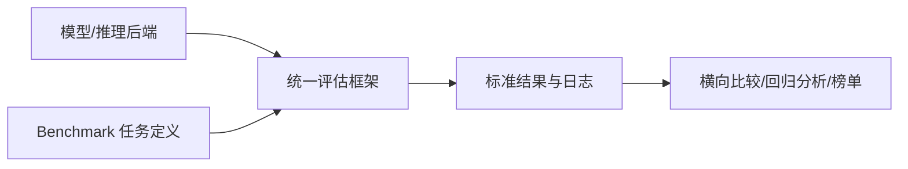
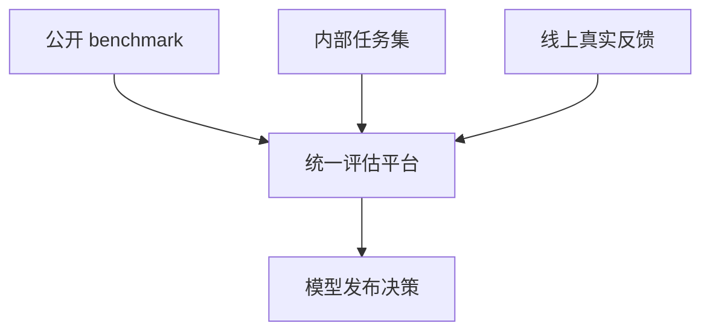

# LLM 评估框架（lm-evaluation-harness / Lighteval / OpenCompass）

## 面试高频考点
- lm-evaluation-harness 是什么？如何在自己的模型上跑评测？
- Open LLM Leaderboard v2 相比 v1 换了哪些 benchmark？为什么要换？
- Lighteval 和 lm-evaluation-harness 的区别是什么？
- OpenCompass 有什么特点？为什么在国内被广泛使用？
- 什么是 Benchmark 污染？如何通过动态评测缓解？
- 评估框架解决的是"怎么跑"，还是"评得准不准"？

---

## 外部图解：MTEB 多任务评估


> 图源：[MTEB: Massive Text Embedding Benchmark](https://arxiv.org/abs/2210.07316)。虽然 MTEB 主要评估 embedding，这张图很适合说明“评估不是单一任务分数，而是跨任务、跨数据集的矩阵”。

---

## 为什么需要统一评估框架

**细化理解：** 统一评估框架的价值是让模型、prompt、数据和系统改动可以在同一批任务上可复现比较。它解决的是评测流程标准化，不自动保证评测集适合业务。企业里常把公开 benchmark 当粗筛，把自建业务集当主指标，把线上 A/B 和人工抽检当最终确认。

模型评估最怕的不是分数低，而是**分数不可比**。如果每个人：

- 用不同 prompt template
- 用不同 few-shot 数
- 用不同解码参数
- 用不同数据版本
- 用不同打分脚本

那么同一个模型的结果可以差很多，最后你根本不知道变好的是模型，还是评测配置。

统一评估框架的价值在于：

1. **标准化任务定义**
2. **统一模型接入接口**
3. **固定 prompt / metric / postprocess**
4. **便于批量复现和横向对比**



---

## 一、lm-evaluation-harness

**lm-evaluation-harness** 是 EleutherAI 开发的开源大模型统一评测框架，支持大量任务，也是 HuggingFace Open LLM Leaderboard 的核心后端之一。

**GitHub**：[github.com/EleutherAI/lm-evaluation-harness](https://github.com/EleutherAI/lm-evaluation-harness)

### 核心架构

```text
lm-evaluation-harness
├── lm_eval/
│   ├── models/      # 模型适配器
│   ├── tasks/       # 任务定义
│   └── evaluator.py # 评测主逻辑
└── templates / configs / utils
```

### 快速上手

```bash
pip install lm-eval

lm_eval --model hf \
  --model_args pretrained=Qwen/Qwen3-8B \
  --tasks mmlu,gsm8k,hellaswag \
  --device cuda:0 \
  --batch_size 8 \
  --output_path ./results
```

### Python API

```python
import lm_eval

results = lm_eval.simple_evaluate(
    model="hf",
    model_args="pretrained=Qwen/Qwen3-8B",
    tasks=["mmlu", "gsm8k"],
    num_fewshot=5,
    batch_size=8,
)
```

### 它为什么常用

- 任务生态成熟
- CLI 和 Python API 都容易接
- 适配 HuggingFace、本地模型、vLLM、API 模型较方便
- 很适合做离线批量回归测试

---

## 二、Open LLM Leaderboard v2 的新 Benchmark 思路

Leaderboard v2 的核心变化不是单纯换题，而是把重心从"容易刷满分的老题"转向**更有区分度的推理与指令遵循任务**。

| Benchmark | 领域 | 主要考察 |
|-----------|------|----------|
| MMLU-Pro | 多学科知识 | 更难的知识与推理结合 |
| GPQA Diamond | 研究生级科学 | 高难专业推理 |
| IFEval | 指令遵循 | 格式和约束遵循能力 |
| MuSR | 多步推理 | 长链逻辑推理 |
| BBH | 综合推理 | 难任务泛化 |
| MATH-lvl-5 | 竞赛数学 | 高强度数学推理 |

### 为什么要升级

旧 benchmark 面临三个问题：

1. 题库太老，污染严重
2. 太多模型已接近满分，区分度下降
3. 更像知识记忆，不够反映新一代模型的推理能力

因此 v2 更关注**会不会推理、会不会遵循要求、会不会在难题上拉开差距**。

---

## 三、Lighteval（HuggingFace）

**Lighteval** 是 HuggingFace 自研的评测框架，和自家 datasets/hub 生态结合更自然。

| 维度 | lm-evaluation-harness | Lighteval |
|------|----------------------|-----------|
| 维护方 | EleutherAI | HuggingFace |
| 生态集成 | 通用 | HF 原生更强 |
| 任务定义 | YAML/代码 | Python + YAML |
| 使用场景 | 社区通用基线 | HF 生态内快速实验 |

### 什么时候选它

- 你本来就在 HF Hub 和 datasets 上组织实验
- 想快速拉通数据、模型、评测一体化流程
- 希望更贴近 HuggingFace 官方榜单与工具链

---

## 四、OpenCompass（上海 AI 实验室）

**OpenCompass** 在中文、国内模型、多模态评测方面很强，在国内基本是事实标准之一。

**GitHub**：[github.com/open-compass/opencompass](https://github.com/open-compass/opencompass)

### 核心特点

- 中文 benchmark 很全：C-Eval、CMMLU、GaoKao 等
- 多模态评测支持更完整
- 闭源 API 模型接入方便
- 有较强的国内社区实践积累

```bash
pip install opencompass
opencompass --models hf_qwen3_8b --datasets ceval_gen mmlu_ppl
```

### 它为什么在国内常见

因为很多国内团队的真实需求不是英文通用榜，而是：

- 中文能力评估
- 国内开源模型横评
- 多模态中文场景
- API 模型与本地模型统一比较

---

## 五、Benchmark 污染与动态评测

**细化理解：** Benchmark 污染指测试题或答案以某种形式进入训练数据、调参数据或 prompt 示例，使分数高估真实泛化能力。动态评测通过持续更新题目、隐藏答案、使用私有业务样本或生成变体来降低污染风险。面试时要强调：污染不是学术洁癖，而是会直接导致选型错误和上线风险。

### 污染的三种形式

| 污染类型 | 描述 | 风险 |
|---------|------|------|
| 直接污染 | 训练集含原题和答案 | 分数严重失真 |
| 间接污染 | 高度相似题或解答被见过 | 模型看似会做，实则见过 |
| 隐性污染 | 题目讨论、解析、镜像被爬进训练集 | 很难彻底排查 |

### 动态评测为什么重要

静态 benchmark 一旦公开足够久，就很难避免被训练数据吸收。动态评测的价值是不断产生模型没见过的新题。

| 方案 | 代表 | 核心思路 |
|------|------|---------|
| 动态更新 | LiveBench | 持续出新题 |
| 人类投票 | Chatbot Arena | 用户真实偏好对比 |
| 私有测试集 | 企业内部评测 | 不公开，难污染 |
| 程序验证 | LiveCodeBench | 新代码题 + 自动判题 |

### 框架能解决污染吗

不能彻底解决。评估框架最多提供统一执行方式，题本身是否被污染、指标是否反映真实能力，仍然需要单独治理。

---

## 评估框架解决什么，不解决什么

### 解决什么

- 统一执行入口
- 固定任务配置
- 可复现实验
- 批量跑回归和榜单

### 不解决什么

- benchmark 是否有污染
- 指标是否和业务 KPI 一致
- prompt 是否代表真实使用方式
- 某个任务高分是否意味着产品体验好

所以评估框架是**基础设施**，不是"真理机器"。

---

## 工程实践视角

### 企业里一套靠谱评估体系通常至少分三层



1. **公开 benchmark**：看行业相对位置  
2. **内部任务集**：看业务贴合度  
3. **线上指标**：看真实用户是否买账

只看第一层，通常会把模型调成"擅长刷题，不擅长工作"。

### 一个常见评估闭环

- 新模型出 checkpoint
- 用 harness/OpenCompass 跑标准离线任务
- 跑内部专项集：RAG、工具调用、客服、代码等
- 回归线上 badcase 集
- 再决定是否进入灰度

### 评测最常见的四个坑

1. **few-shot 设置不统一**  
   这会直接导致结果不可比。

2. **解码参数漂移**  
   `temperature`、`top_p`、`max_new_tokens` 不一致，分数可能波动很大。

3. **只看平均分**  
   平均分掩盖了某类关键任务崩掉的事实。

4. **离线高分直接等价上线可用**  
   这是最危险的误判。真实用户场景往往比 benchmark 更脏、更长尾。

---

## 常见误区

### 误区 1：跑了 harness 就等于做了完整评估

不是。你只是把公开 benchmark 跑规范了。

### 误区 2：榜单高就一定适合业务

不成立。榜单更偏通用能力，而业务常常看格式稳定性、拒答策略、中文术语、工具调用等细项。

### 误区 3：评估框架之间分数可以直接横比

前提是任务版本、prompt 模板、shot 数和 scoring 全一致，否则不能直接比较。

### 误区 4：污染问题只是学术界担心

企业同样会中招，特别是内部测试集被训练数据或合成数据链路污染时，误判成本更高。

---

## 面试延伸

**Q：为什么 GPQA Diamond 被认为很难？**
> 因为它考察的是高阶专业推理，不是简单检索式知识问答，而且题目设计尽量避免被搜索引擎直接找到现成答案，因此对模型的真实理解能力要求更高。

**Q：few-shot 数量对结果影响大吗？**
> 很大。少样本示例不仅提供格式示范，还会影响模型的任务理解方式。比较模型时必须统一 shot 数，否则结论不可信。

**Q：如何在企业内部建立防污染评测体系？**
> 至少要做三件事：维护私有测试集并隔离访问、引入动态更新题目、对训练数据和评测数据做相似度扫描。最终还要把线上真实 badcase 反哺回评估集。

**Q：OpenCompass 和 lm-evaluation-harness 怎么选？**
> 英文通用 benchmark 和国际社区兼容性优先时，harness 更常见；中文、多模态、国内模型生态和 API 统一评测更重要时，OpenCompass 往往更顺手。

---

## 学完可以做什么

1. 给自己的模型接入 `lm-evaluation-harness` 跑一套公开 benchmark。
2. 建一个内部 YAML/JSON 任务集，把业务 badcase 也纳入统一评测。
3. 做一张模型版本回归表，跟踪公开 benchmark、内部任务和线上指标三条线。

---

## 原始论文与资源

| 资源 | 链接 |
|------|------|
| lm-evaluation-harness GitHub | [github.com/EleutherAI/lm-evaluation-harness](https://github.com/EleutherAI/lm-evaluation-harness) |
| Open LLM Leaderboard v2 | [huggingface.co/spaces/open-llm-leaderboard](https://huggingface.co/spaces/open-llm-leaderboard/open_llm_leaderboard) |
| Lighteval GitHub | [github.com/huggingface/lighteval](https://github.com/huggingface/lighteval) |
| OpenCompass GitHub | [github.com/open-compass/opencompass](https://github.com/open-compass/opencompass) |
| GPQA 论文 (Rein et al., 2023) | [arxiv.org/abs/2311.12022](https://arxiv.org/abs/2311.12022) |
| Min-K% Prob 污染检测 (Shi et al., 2023) | [arxiv.org/abs/2310.16789](https://arxiv.org/abs/2310.16789) |
| LiveBench (White et al., 2024) | [arxiv.org/abs/2406.19314](https://arxiv.org/abs/2406.19314) |

## 延伸阅读与视频

| 平台 | 标题 | 说明 |
|------|------|------|
| 📺 B站 | [浙江大学《大模型原理与技术》6-2 RAG知识检索](https://www.bilibili.com/video/BV1xPFNe1E6o/) | 1.3万播放，学术视角的评估与检索讲解 |
| 📺 B站 | [大模型SFT/RAG调优效率翻倍！自动生成测试集+自动化评估](https://www.bilibili.com/video/BV1CRrVB7Eb4/) | 1.4万播放，评估工程化实践 |
| 📖 Hugging Face Docs | [Evaluate](https://huggingface.co/docs/evaluate/index) | 统一指标计算和评估脚本工具 |
| 📖 OpenCompass Docs | [OpenCompass documentation](https://opencompass.readthedocs.io/) | 中文和多模型评估生态入口 |
| 📖 EleutherAI | [lm-evaluation-harness tasks](https://github.com/EleutherAI/lm-evaluation-harness/tree/main/lm_eval/tasks) | 查看公开 benchmark 的任务定义、prompt 和 metric |
| 📖 OpenAI Cookbook | [Evals getting started](https://cookbook.openai.com/examples/evaluation/getting_started_with_openai_evals) | 面向应用的回归评估和自动评测示例 |
