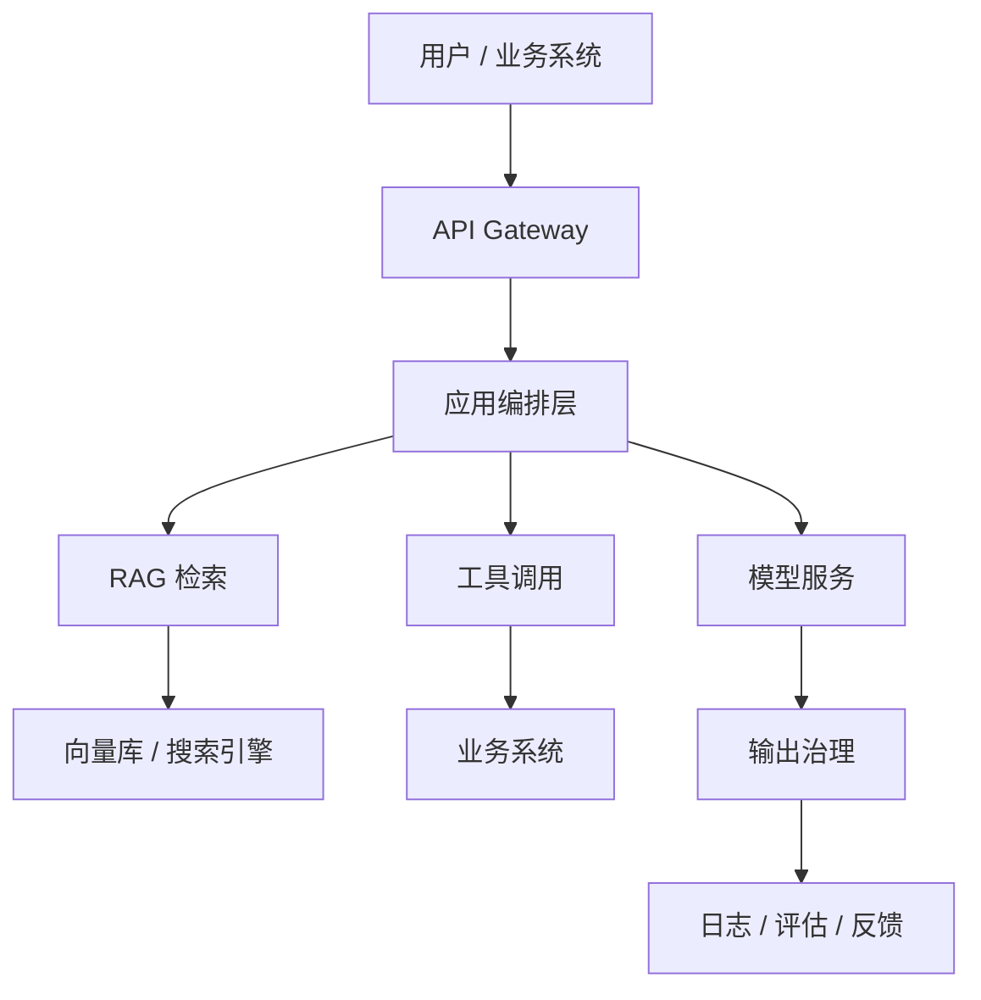

# LLM 应用架构与 LLMOps

## 面试高频考点

- 一个生产级 LLM 应用由哪些模块组成？
- Prompt、RAG、Agent、模型服务、评估、监控怎么组织？
- LLMOps 和传统 MLOps 有什么区别？
- 为什么日志、反馈和评估比单次 prompt 更重要？

---

## 外部图解：LLMOps 全流程


> 图源：[SigNoz LLMOps Guide](https://signoz.io/guides/llmops/)。这张图适合把模型开发、部署、监控、反馈和评估放在一个闭环里理解。

---

## 生产级 LLM 应用的基本结构



核心模块：

| 模块 | 作用 |
|------|------|
| API Gateway | 鉴权、限流、租户隔离 |
| 编排层 | prompt、RAG、工具、流程控制 |
| 检索层 | 接入外部知识 |
| 模型层 | 统一调用不同模型 |
| 工具层 | 查询业务系统、执行动作 |
| 安全层 | 权限、脱敏、拒答、审计 |
| 评估层 | 离线和线上质量监控 |
| 反馈层 | 收集用户反馈，驱动迭代 |

---

## 1. 模型网关

**工程细节：** 模型网关是业务和模型供应商之间的控制面，负责鉴权、路由、限流、重试、日志、成本统计和降级。它让业务代码不直接依赖某个模型 API，也方便做灰度、A/B 测试和多供应商容灾。没有网关时，prompt、参数、错误处理和成本通常会散落在各业务模块里，后期很难治理。

企业里通常不会让业务直接调某个模型 API，而是先经过模型网关。

模型网关负责：

- 统一 OpenAI-compatible 接口
- 模型路由
- 限流和熔断
- token 统计
- 成本归因
- fallback
- 版本控制

例子：

```text
简单 FAQ → 小模型
复杂推理 → 强模型
代码问题 → 代码模型
多模态输入 → VLM
```

---

## 2. Prompt 管理

Prompt 不是随手写在代码里的字符串。

生产里需要：

- 版本管理
- A/B 测试
- 变量 schema
- 输出格式约束
- 回滚机制
- 敏感指令隔离

Prompt 失败常见原因：

- 指令太多互相冲突
- 没有明确拒答条件
- 示例和真实输入分布不一致
- 输出格式没有校验
- 把权限控制交给 prompt

---

## 3. RAG 层

RAG 不是“向量库 + LLM”，而是一个完整检索系统。

生产 RAG 至少包括：

- 文档解析
- chunk 策略
- embedding
- 向量检索
- BM25
- 结果融合
- rerank
- 权限过滤
- 引用生成
- 评估闭环

面试里要强调：

> RAG 的质量上限经常由数据工程和检索工程决定，而不是由生成模型单独决定。

---

## 4. 工具调用层

工具调用让模型不只“说”，还能“查”和“做”。

常见工具：

- 查订单
- 查库存
- 查日志
- 查知识库
- 建工单
- 发通知
- 运行代码

工具调用必须有安全边界：

- 只读工具优先
- 写操作需要确认
- 参数 schema 校验
- 超时和重试
- 审计日志
- 高风险动作转人工

---

## 5. 输出治理

输出治理包括：

- 格式校验
- 引用校验
- 敏感信息过滤
- 事实性检查
- 安全拒答
- 置信度阈值
- 人工兜底

一个实用规则：

> 模型可以生成建议，但高风险动作不要让模型独立决定。

---

## 6. 评估与监控

**细化理解：** LLMOps 的监控不仅看 QPS、延迟和错误率，还要看答案质量、拒答率、工具调用成功率、RAG 召回质量、token 成本和安全事件。离线评估负责上线前回归，线上监控负责发现数据分布漂移和异常行为。高质量系统会把失败样本自动进入标注、评估和 prompt/检索优化闭环。

LLMOps 的关键是持续评估。

### 离线评估

- 固定黄金集
- 版本回归
- prompt 对比
- 模型对比
- RAG 检索指标

### 线上监控

- 延迟
- 成本
- 用户反馈
- 人工接管率
- 幻觉投诉
- 工具失败率
- 安全拦截率

---

## 7. LLMOps 和 MLOps 的区别

| 维度 | MLOps | LLMOps |
|------|------|--------|
| 输入 | 结构化特征较多 | 自然语言、多模态、上下文 |
| 输出 | 分类/回归为主 | 开放文本、工具动作 |
| 评估 | 指标较确定 | 自动评估 + 人工评估 |
| 迭代 | 模型训练为中心 | prompt、RAG、工具、模型共同迭代 |
| 风险 | 数据漂移、性能下降 | 幻觉、越权、注入、成本失控 |

---

## 常见误区

### 误区 1：LLM 应用就是调模型 API

真正上线需要网关、权限、检索、评估、监控和反馈闭环。

### 误区 2：Prompt 写好了就稳定

用户输入分布会变，知识库会变，模型版本会变，所以必须持续评估。

### 误区 3：安全靠模型自觉

权限、脱敏、工具白名单必须在系统层实现。

### 误区 4：只要模型强就不用 RAG

企业知识、实时数据、权限隔离和引用追溯仍然需要 RAG。

---

## 面试延伸

**Q：你会如何设计一个企业 LLM 应用？**

> 我会用模型网关统一调用，应用层负责编排 RAG 和工具，检索层做权限过滤和引用，输出层做校验与安全，最后用日志、反馈和黄金集做持续评估。

**Q：LLMOps 最核心的指标是什么？**

> 不能只看一个指标。系统层看延迟和成本，质量层看任务成功率、幻觉率、引用准确率，业务层看解决率、采纳率和人工接管率。

---

## 生产架构落地清单

如果面试官让你“讲一个完整 LLM 应用架构”，可以按下面顺序展开：

```text
前端/业务入口
  -> API Gateway / Auth
  -> LLM Orchestrator
  -> Model Gateway
  -> RAG / Tools / Memory
  -> Safety & Output Validator
  -> Trace / Eval / Feedback
```

各层职责：

| 层级 | 职责 | 典型问题 |
|------|------|----------|
| API Gateway | 鉴权、租户、限流 | 谁能用、用多少 |
| Orchestrator | prompt、RAG、工具编排 | 怎么完成任务 |
| Model Gateway | 模型路由、重试、降级 | 用哪个模型、失败怎么办 |
| RAG Layer | 检索、权限、引用 | 知识从哪里来 |
| Tool Layer | 工具 schema、执行、审计 | 能不能执行动作 |
| Safety Layer | 注入防护、脱敏、输出校验 | 会不会泄露或越权 |
| Eval Layer | 离线回归、线上反馈 | 改动有没有变好 |

这套讲法比“前端调后端，后端调 LLM”更像生产项目。

---

## 发布与回滚

LLM 应用的变更不只有代码，还包括：

- prompt 模板
- 模型版本
- embedding 模型
- reranker
- chunk 策略
- 工具 schema
- 安全规则
- 知识库内容

所以发布流程要支持：

1. **版本化**：prompt、模型、索引、评估集都有版本号。
2. **灰度**：按用户、租户、流量比例切新版本。
3. **回归评估**：上线前跑黄金集，比较准确率、拒答率、引用准确率。
4. **线上监控**：看延迟、成本、负反馈、安全拦截。
5. **快速回滚**：prompt 和模型路由能不发版回滚。

面试里可以强调：

> LLMOps 的难点是“非代码资产”也会改变系统行为，所以必须把 prompt、知识库和评估集当成可版本管理的工程资产。

---

## 商业项目指标

企业知识库问答与工单助手可以这样设指标：

| 指标 | 说明 |
|------|------|
| Self-Serve Resolution Rate | 用户不转人工就解决的比例 |
| Escalation Accuracy | 转工单/转人工是否分流正确 |
| Citation Accuracy | 引用是否真实支持答案 |
| First Response Latency | 首次响应延迟 |
| Cost per Resolved Case | 每个解决问题的平均模型成本 |
| Unsafe Request Block Rate | 安全拦截比例 |
| Knowledge Gap Rate | 因知识库缺失导致无法回答的比例 |

这些指标能把项目从 demo 拉到商业系统：既看质量，也看成本、安全和业务结果。

---

## 原始论文

| 论文 | 链接 |
|------|------|
| Retrieval-Augmented Generation for Knowledge-Intensive NLP Tasks (Lewis et al., 2020) | [arxiv.org/abs/2005.11401](https://arxiv.org/abs/2005.11401) |
| Toolformer: Language Models Can Teach Themselves to Use Tools (Schick et al., 2023) | [arxiv.org/abs/2302.04761](https://arxiv.org/abs/2302.04761) |
| ReAct: Synergizing Reasoning and Acting in Language Models (Yao et al., 2022) | [arxiv.org/abs/2210.03629](https://arxiv.org/abs/2210.03629) |
| RAGAS: Automated Evaluation of Retrieval Augmented Generation (Es et al., 2023) | [arxiv.org/abs/2309.15217](https://arxiv.org/abs/2309.15217) |
| PagedAttention / vLLM (Kwon et al., 2023) | [arxiv.org/abs/2309.06180](https://arxiv.org/abs/2309.06180) |

## 延伸阅读与视频

| 平台 | 标题 | 说明 |
|------|------|------|
| 📖 OpenAI Cookbook | [Evals examples](https://cookbook.openai.com/examples/evaluation/getting_started_with_openai_evals) | 学如何为 LLM 应用建立回归评估 |
| 📖 Anthropic Docs | [Prompt engineering overview](https://docs.anthropic.com/en/docs/build-with-claude/prompt-engineering/overview) | Prompt 管理和生产提示词设计 |
| 📖 OWASP | [Top 10 for LLM Applications](https://owasp.org/www-project-top-10-for-large-language-model-applications/) | LLM 应用安全风险清单 |
| 📖 LangChain Docs | [LangSmith evaluation](https://docs.smith.langchain.com/evaluation) | 线上 trace、评估和调试工具入口 |
