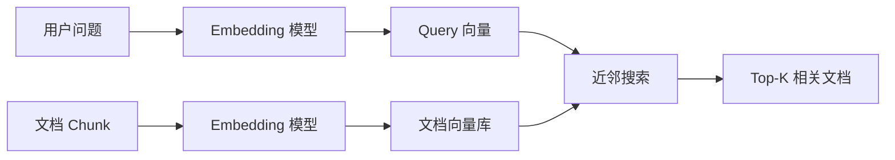

# Embedding 与向量检索

## 面试高频考点

- Embedding 模型和生成模型有什么区别？
- 向量检索为什么能做语义匹配？
- Dense Retrieval、BM25、Hybrid Search 怎么选？
- Cross-Encoder Rerank 为什么比单纯向量相似度更准？
- MTEB 这类 embedding benchmark 怎么看？

---

## 一句话理解

Embedding 模型把文本压成一个向量，向量检索通过距离或相似度找到语义接近的文本。

### 外部图解：Sentence-BERT 双塔编码


> 图源：[Sentence-BERT 原论文](https://arxiv.org/abs/1908.10084)。这张图适合解释 bi-encoder：query 和 document 可以分别编码成向量，因此适合大规模向量检索。



---

## Embedding 模型 vs 生成模型

| 维度 | Embedding 模型 | 生成模型 |
|------|----------------|----------|
| 输出 | 向量 | token 序列 |
| 用途 | 检索、聚类、分类、相似度 | 问答、写作、代码、推理 |
| 训练目标 | 对比学习、句向量学习 | next-token prediction |
| 关键指标 | Recall、NDCG、MTEB | 准确率、偏好、生成质量 |

不要把 embedding 模型理解成“小 LLM”。它的目标不是生成，而是把文本映射到适合检索或相似度计算的空间。

---

## Dense Retrieval

**细化理解：** Dense Retrieval 依赖 embedding 模型把语义相近的文本映射到相近向量，因此能处理同义改写和自然语言问题。它不擅长精确符号匹配，例如订单号、错误码、函数名、法律条款编号。生产系统常把 dense 作为语义召回的一路，而不是唯一召回来源。

Dense Retrieval 用向量相似度找相关文档。

常见相似度：

```text
cosine_similarity(q, d) = q · d / (||q|| ||d||)
```

优点：

- 能匹配同义改写
- 对自然语言问题友好
- 适合语义检索

缺点：

- 对错误码、版本号、接口名不稳定
- 向量空间可解释性弱
- 需要 embedding 模型适配语言和领域

---

## BM25

BM25 是关键词检索方法，依赖词频、逆文档频率和长度归一化。

优点：

- 对专有名词、错误码、API 名称很稳
- 可解释性强
- 不需要训练 embedding

缺点：

- 同义改写能力弱
- 用户问题表达模糊时容易漏召回

---

## Hybrid Search

生产 RAG 常用：

```text
Dense Retrieval + BM25 + RRF + Rerank
```

原因：

- Dense 补语义
- BM25 补精确词
- RRF 做稳定融合
- Rerank 做精排

| 场景 | 推荐 |
|------|------|
| 错误码 / 接口名 | BM25 权重大 |
| FAQ 自然语言 | Dense 权重大 |
| 企业知识库 | Hybrid 默认起步 |
| 法律/金融精确条款 | BM25 + Rerank |

---

## Rerank 为什么重要

Embedding 检索通常是 bi-encoder：

```text
query 单独编码
document 单独编码
再算相似度
```

Cross-Encoder Rerank 则把 query 和 document 放在一起判断：

```text
[query, document] -> relevance score
```

它更慢，但更准。

生产常用流程：

1. 初召回 Top-50
2. Rerank 精排
3. 取 Top-5 进入 prompt

---

## 向量库和 ANN

**工程细节：** 向量库解决的是大规模近邻搜索和元数据过滤，不等于 RAG 本身。ANN 索引用召回率换速度，例如 HNSW、IVF、PQ 等方法都有参数权衡；元数据过滤如果在 ANN 后做，可能导致权限过滤后结果不足，所以生产中要关注过滤前后 Top-K、召回率和延迟。

文档多时，不能暴力计算所有向量相似度，需要 Approximate Nearest Neighbor。

常见索引：

| 索引 | 特点 |
|------|------|
| HNSW | 召回高、查询快、内存占用较高 |
| IVF | 先聚类再查，适合大规模 |
| PQ | 压缩向量，节省内存但有精度损失 |

常见向量库：

- FAISS
- Milvus
- Qdrant
- Weaviate
- pgvector
- Elasticsearch / OpenSearch vector search

---

## Embedding 评估

不要只看模型排行榜。

要看：

- 语言：中文、英文、多语言
- 任务：检索、分类、聚类、STS
- 领域：法律、金融、代码、客服
- 维度：向量维度影响存储成本
- 延迟：embedding 生成速度影响 ingestion 和 online query

MTEB 是常用综合 benchmark，但企业项目最好自建领域评测集。

---

## 常见误区

### 误区 1：向量相似就等于答案正确

向量相似只说明语义接近，不保证能支持答案。

### 误区 2：embedding 模型越大越好

还要看语言、领域、延迟、成本和向量维度。

### 误区 3：有向量检索就不需要 BM25

企业问题里大量关键词、编号、日志、接口名，BM25 很重要。

### 误区 4：Rerank 可有可无

很多生产系统里，rerank 对最终答案质量的提升非常稳定。

---

## 面试延伸

**Q：为什么 RAG 里常用 Hybrid Search？**

> 因为向量检索适合语义改写，BM25 适合精确关键词。企业问题同时包含自然语言和错误码、接口名、产品名，所以混合检索更稳。

**Q：Embedding 模型怎么选？**

> 先看语言和领域，再看 MTEB/CMTEB 等 benchmark，最后一定要用自己的黄金问答集测 Recall@K 和排序质量。

**Q：Reranker 为什么比 embedding 检索更准？**

> Reranker 直接联合建模 query 和 document 的相关性，能捕捉更细粒度的匹配关系，但代价是慢，所以通常只对初召回结果精排。

---

## 生产项目怎么讲

如果把这个知识点放进“企业知识库智能问答与工单助手”，可以这样讲：

```text
用户问题 -> Query Rewrite -> Dense + BM25 双路召回 -> RRF 融合 -> Rerank 精排 -> Top-N 证据进入 LLM
```

关键不是“用了向量库”，而是解释清楚为什么每层存在：

| 层级 | 解决的问题 | 可观测指标 |
|------|------------|------------|
| Query Rewrite | 用户表达不完整、指代不清 | rewrite 后 Recall@K 是否提升 |
| Dense Retrieval | 同义改写、自然语言语义匹配 | Recall@K、MRR |
| BM25 | 错误码、接口名、版本号、日志片段 | keyword hit rate |
| RRF 融合 | 避免单一路径偏差 | fused recall |
| Rerank | 粗召回噪声多、排序不准 | NDCG、Context Precision |
| Metadata Filter | 权限、租户、文档类型过滤 | filter 后 Top-K 充足率 |

面试里不要只说“我用了 Milvus/FAISS”。更好的说法是：

> 我把检索拆成召回、融合、精排、过滤和评估五层。向量检索负责语义召回，BM25 兜住精确关键词，reranker 保证进入上下文的证据质量，最后用 Recall@K 和 Citation Accuracy 评估是否真的帮到回答。

---

## 排障清单

当用户说“搜不到”“答非所问”时，按这个顺序排：

1. **语料是否入库**：文档是否解析成功、chunk 是否为空、metadata 是否正确。
2. **Query 是否可检索**：是否包含缩写、错别字、指代、日志片段。
3. **Embedding 是否适配**：中文、代码、技术文档、表格是否表现差。
4. **ANN 参数是否过紧**：HNSW `efSearch`、IVF `nprobe` 是否导致召回损失。
5. **权限过滤是否过严**：filter 后 Top-K 是否不足。
6. **Rerank 是否误杀**：reranker 是否偏向短文本或标题党文本。
7. **上下文是否被截断**：正确证据是否进入最终 prompt。

一个实用 debug 日志：

```json
{
  "query": "...",
  "rewrite_query": "...",
  "dense_topk_ids": ["d1", "d2"],
  "bm25_topk_ids": ["d3", "d1"],
  "rrf_topk_ids": ["d1", "d3"],
  "rerank_scores": {"d1": 0.91, "d3": 0.77},
  "filtered_by_acl": 2,
  "final_context_ids": ["d1", "d3"]
}
```

---

## 面试追问模板

**追问：向量维度越高越好吗？**

> 不一定。高维可能表达力更强，但存储、索引内存、检索延迟都会增加。生产里要看领域评测收益是否覆盖成本。

**追问：为什么有些 query 明明语义相近却召回不到？**

> 可能是 embedding 模型没学到领域术语，也可能是 chunk 太大导致语义被稀释，或者 ANN 近似检索参数牺牲了召回。

**追问：Reranker 放在哪里？**

> 一般放在粗召回之后，只对 Top-50/Top-100 做精排，然后选 Top-5/Top-10 进入 prompt。它不适合直接全库扫描。

---

## 原始论文

| 论文 | 链接 |
|------|------|
| Sentence-BERT (Reimers & Gurevych, 2019) | [arxiv.org/abs/1908.10084](https://arxiv.org/abs/1908.10084) |
| Dense Passage Retrieval (Karpukhin et al., 2020) | [arxiv.org/abs/2004.04906](https://arxiv.org/abs/2004.04906) |
| ColBERT: Efficient and Effective Passage Search via Contextualized Late Interaction (Khattab & Zaharia, 2020) | [arxiv.org/abs/2004.12832](https://arxiv.org/abs/2004.12832) |
| MTEB: Massive Text Embedding Benchmark (Muennighoff et al., 2022) | [arxiv.org/abs/2210.07316](https://arxiv.org/abs/2210.07316) |

## 延伸阅读与视频

| 平台 | 标题 | 说明 |
|------|------|------|
| 📖 Hugging Face | [MTEB leaderboard](https://huggingface.co/spaces/mteb/leaderboard) | 查看 embedding 模型在不同任务上的表现 |
| 📖 Sentence Transformers | [Documentation](https://www.sbert.net/) | SBERT 和 sentence-transformers 工具链 |
| 📖 FAISS | [FAISS documentation](https://faiss.ai/) | 向量索引和 ANN 检索工程入口 |
| 📖 pgvector | [pgvector GitHub](https://github.com/pgvector/pgvector) | PostgreSQL 内做向量检索的常见方案 |
