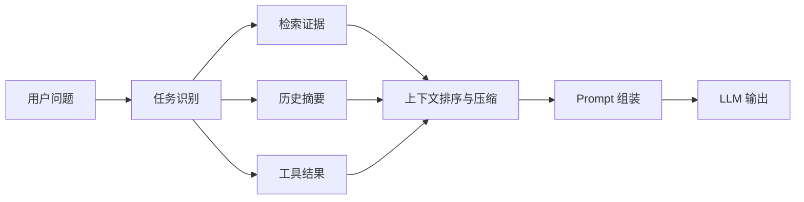

# 上下文工程与长上下文应用

## 面试高频考点

- Context Engineering 和 Prompt Engineering 有什么区别？
- 长上下文模型能不能替代 RAG？
- 上下文窗口很长时，为什么模型仍会漏信息？
- 如何做上下文压缩、排序和预算控制？
- 多轮对话如何管理历史？

---

## 外部图解：Lost in the Middle


> 图源：[Lost in the Middle](https://arxiv.org/abs/2307.03172)。这张图说明长上下文不是越长越稳：关键信息放在中间时，模型可能更容易忽略。

---

## 一句话理解

Prompt Engineering 关注“怎么写指令”，Context Engineering 关注“给模型看什么、按什么顺序看、看多少”。



---

## 为什么需要上下文工程

模型上下文窗口有限，即使是 128K、1M token，也不能随便塞。

原因：

- token 成本高
- 首 token 延迟上升
- 无关内容会干扰注意力
- 模型可能忽略中间位置的信息
- 权限和安全风险变大

所以核心不是“塞更多”，而是“塞对、排好、压紧”。

---

## 上下文由哪些部分组成

**细化理解：** 上下文通常包含系统指令、开发者约束、用户问题、历史对话、检索证据、工具返回、示例和输出格式要求。不同部分的优先级和可信度不同：系统指令约束行为，检索证据提供事实，工具返回提供环境状态，用户输入可能包含恶意指令。上下文工程就是在有限 token budget 内组织这些信息的顺序、边界和可信度。

| 部分 | 例子 |
|------|------|
| System 指令 | 角色、安全边界、输出格式 |
| 用户输入 | 当前问题 |
| 历史对话 | 多轮上下文、用户偏好 |
| 检索证据 | RAG chunks、引用文档 |
| 工具结果 | API 返回、数据库查询、日志 |
| 示例 | few-shot examples |
| 输出约束 | JSON schema、表格格式 |

上下文工程就是管理这些内容的优先级和预算。

---

## 长上下文 vs RAG

| 维度 | 长上下文 | RAG |
|------|----------|-----|
| 优点 | 可以一次读大量材料 | 可更新、可权限过滤、成本可控 |
| 缺点 | 成本高、延迟高、容易噪声干扰 | 检索失败会漏证据 |
| 适合 | 单份长文档深读 | 多源知识库、企业文档、实时知识 |

务实结论：

> 长上下文适合深读少量材料，RAG 适合从大量材料里找证据。生产里经常两者结合。

---

## 上下文排序

常见排序策略：

1. 系统指令放最前
2. 当前用户问题靠近生成位置
3. 高相关证据靠前或靠近问题
4. 历史对话只保留必要部分
5. 工具结果按任务阶段插入

有些模型对开头和结尾更敏感，所以重要证据不要随便埋在中间。

---

## 上下文压缩

压缩方法：

| 方法 | 说明 |
|------|------|
| 摘要压缩 | 把长历史总结成短摘要 |
| 证据抽取 | 只保留和问题相关句子 |
| Map-Reduce | 多段分别总结再合并 |
| Rerank 截断 | 排序后只保留 Top-K |
| 结构化压缩 | 表格、JSON、字段化结果 |

压缩风险：

- 丢关键条件
- 摘要引入幻觉
- 去掉引用来源

所以高风险业务里，压缩后最好保留原始引用。

---

## 多轮对话记忆

多轮对话不能无限拼历史。

常见做法：

| 方法 | 适合 |
|------|------|
| Sliding Window | 短对话 |
| Summary Memory | 长对话摘要 |
| Entity Memory | 记住用户、项目、偏好 |
| Retrieval Memory | 历史对话向量化检索 |
| State Machine | 任务型对话 |

面试里可以说：

> 聊天历史不是越多越好，要把历史转成可控状态。

---

## Token Budget

**工程细节：** Token budget 要同时给输入证据、历史记忆、工具结果和输出预留空间。常见策略是固定系统指令、压缩历史、证据按相关性排序、长文档只取关键片段、输出前预留最大回答长度。预算不足时应该优先保留任务目标、硬约束和关键证据，而不是简单截断末尾。

一个典型预算：

```text
system prompt: 800 tokens
user query: 300 tokens
history summary: 1000 tokens
retrieved evidence: 6000 tokens
tool results: 2000 tokens
output budget: 2000 tokens
```

如果超预算，优先裁：

1. 低相关证据
2. 旧历史
3. 重复内容
4. 冗长示例

不要裁安全规则、当前问题和关键证据。

---

## 常见误区

### 误区 1：上下文越长越好

长上下文会增加成本、延迟和噪声，不等于质量更好。

### 误区 2：RAG 已经召回了就随便拼

上下文顺序、长度和噪声都会影响生成。

### 误区 3：摘要一定安全

摘要可能丢条件或引入幻觉，关键证据要保留引用。

### 误区 4：多轮对话只要保存全部历史

真实产品里需要状态管理、摘要和检索记忆。

---

## 面试延伸

**Q：长上下文能替代 RAG 吗？**

> 不能完全替代。长上下文适合少量长材料深读，RAG 适合多源、频繁更新、需要权限过滤和引用追溯的知识库。生产里常常先 RAG 找证据，再用长上下文模型综合。

**Q：如何处理超长对话历史？**

> 我会保留最近窗口，压缩旧历史为摘要，把稳定事实存成结构化状态，必要时把历史向量化做检索记忆。

**Q：如何避免上下文噪声影响回答？**

> 用 rerank、去重、证据抽取和 token budget 控制，只保留能支持答案的片段，并让模型在证据不足时拒答。

---

## 上下文编排模板

生产系统里不要把所有内容随便拼到 prompt。推荐用固定结构：

```text
System: 角色、安全边界、回答原则
Developer: 输出格式、引用规则、工具使用约束
Task: 当前用户问题
State: 用户身份、租户、权限、当前工单状态
Evidence: RAG 证据，带 chunk_id 和来源
Tool Results: 工具返回，只读结果优先
History Summary: 历史摘要，不放完整流水账
Output Contract: JSON schema / Markdown 模板 / 禁止项
```

这个结构的好处：

- 指令和数据分层，降低 prompt injection 影响。
- 证据带来源，方便引用校验。
- 历史被压缩成状态，避免 token 被旧对话吃掉。
- 输出格式固定，便于后处理和自动评估。

---

## 长上下文排障清单

当长上下文模型回答变差时，不要只怪模型。按这个顺序排：

| 现象 | 可能原因 | 处理 |
|------|----------|------|
| 明明有证据但答错 | Lost in the Middle | 把关键证据放开头或结尾，或重复关键事实 |
| 回答越来越泛 | 上下文噪声过多 | rerank、去重、证据抽取 |
| 忘记早期约束 | 多轮历史太长 | 摘要成状态，关键约束置顶 |
| 引用不准确 | 证据和引用没有绑定 | chunk_id 进入 prompt，输出校验引用 |
| 延迟和成本爆炸 | 输入 token 过多 | token budget、prompt caching、分层模型 |

面试可以补一句：

> 长上下文不是把 RAG 废掉，而是让 RAG 找到更少、更准的材料后，给模型更大的综合空间。

---

## 上下文质量指标

除了最终答案对不对，还应该评估上下文本身：

- **Context Recall**：正确证据是否被放进上下文。
- **Context Precision**：放进去的证据有多少真的有用。
- **Context Utilization**：模型是否引用并使用了关键证据。
- **Citation Accuracy**：引用来源是否真实支持答案。
- **Token Waste Ratio**：无关上下文占比。
- **Instruction Conflict Rate**：检索内容中是否存在和系统指令冲突的文本。

这些指标能把“模型幻觉”拆成更可定位的问题：是没检索到、放错了、放太多了，还是模型没用好。

---

## 原始论文

| 论文 | 链接 |
|------|------|
| Lost in the Middle: How Language Models Use Long Contexts (Liu et al., 2023) | [arxiv.org/abs/2307.03172](https://arxiv.org/abs/2307.03172) |
| LongRoPE: Extending LLM Context Window Beyond 2 Million Tokens (Ding et al., 2024) | [arxiv.org/abs/2402.13753](https://arxiv.org/abs/2402.13753) |
| YaRN: Efficient Context Window Extension of Large Language Models (Peng et al., 2023) | [arxiv.org/abs/2309.00071](https://arxiv.org/abs/2309.00071) |
| Retrieval-Augmented Generation (Lewis et al., 2020) | [arxiv.org/abs/2005.11401](https://arxiv.org/abs/2005.11401) |

## 延伸阅读与视频

| 平台 | 标题 | 说明 |
|------|------|------|
| 📖 Anthropic Docs | [Prompt engineering overview](https://docs.anthropic.com/en/docs/build-with-claude/prompt-engineering/overview) | 包含清晰指令、上下文组织和长输入建议 |
| 📖 OpenAI Cookbook | [Prompt engineering guide](https://cookbook.openai.com/examples/gpt4-1_prompting_guide) | Prompt 和上下文组织实践 |
| 📖 LangChain Docs | [Memory](https://python.langchain.com/docs/concepts/memory/) | 多轮对话记忆和状态管理入口 |
| 📖 LlamaIndex Docs | [Context augmentation](https://docs.llamaindex.ai/en/stable/understanding/rag/) | RAG 和上下文增强实践 |
