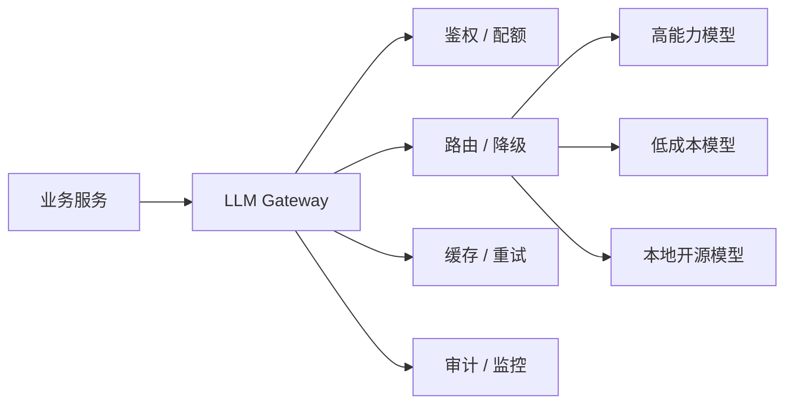

# 模型网关与成本治理

## 面试高频考点

- 为什么生产 LLM 应用通常需要模型网关，而不是业务服务直接调模型 API？
- 模型路由、降级、重试、限流、熔断分别解决什么问题？
- 如何在质量、延迟、成本之间做 trade-off？
- Prompt caching、response caching、embedding caching 有什么区别？
- 怎么设计 LLM 成本监控和配额系统？

---

## 一句话理解

模型网关是 LLM 应用的统一入口，把模型调用从业务代码里抽出来，集中处理路由、鉴权、限流、审计、缓存、降级、成本统计和可观测性。



企业知识库问答、工单助手、代码助手这类项目里，模型网关的价值不是“多包一层”，而是把不可控的模型调用变成可治理的基础设施。

---

## 为什么不能直接在业务里调模型

直接调用的短期成本低，但生产问题会很快出现：

| 问题 | 直接调用的风险 | 网关的做法 |
|------|----------------|------------|
| 成本失控 | 每个服务自己拼 prompt，没人知道总 token 花在哪 | 统一记录 input/output/cache token |
| 模型切换困难 | 模型名散落在代码里 | 统一 alias，比如 `qa-fast`、`qa-strong` |
| 故障扩散 | 上游模型超时拖垮业务线程 | 网关做 timeout、retry、circuit breaker |
| 权限混乱 | API key 到处分发 | 业务只拿内部 token，网关保管供应商 key |
| 评估困难 | 不同服务日志格式不同 | 统一 trace、request id、用户反馈 |

面试里可以这样说：模型网关是 LLM 应用的 control plane，也是模型调用的数据采集点。

---

## 核心模块

### 1. Model Alias

不要让业务写死具体模型名。

```text
qa-fast    -> 小模型 / 低延迟模型
qa-strong  -> 强模型 / 高准确率模型
qa-local   -> 本地部署开源模型
embed-v1   -> embedding 模型
rerank-v1  -> rerank 模型
```

好处：

- 模型升级不改业务代码
- 可以灰度切流
- 可以按租户、场景、风险等级切不同模型

---

### 2. Routing

**工程细节：** 路由策略可以按任务类型、用户等级、上下文长度、风险等级、延迟要求和历史成功率选择模型。简单请求走低成本模型，复杂推理或高风险请求走强模型；失败后可升级模型重试。路由必须用评估集和线上指标验证，否则很容易为了省钱牺牲关键任务质量。

模型路由不是简单随机分流，而是按任务难度、成本预算、延迟 SLA 和安全等级选择模型。

常见策略：

| 策略 | 适合场景 |
|------|----------|
| 固定路由 | MVP、内部工具、流量小 |
| 规则路由 | 按语言、长度、业务线、租户等级 |
| Cascade | 先小模型，不确定再大模型 |
| Learned Router | 用训练好的路由器预测哪个模型性价比最高 |
| A/B Testing | 比较模型版本、prompt 版本、rerank 策略 |

企业知识库助手可以用：

```text
简单 FAQ -> fast model
高风险技术方案 -> strong model
无权限或越权问题 -> refuse / policy model
模型超时 -> fallback model + 标记降级
```

---

## 成本怎么拆

LLM 成本通常不是“调用次数”，而是 token、模型单价、缓存命中率和重试次数共同决定。

```text
cost = input_tokens * input_price
     + output_tokens * output_price
     + embedding_tokens * embedding_price
     + rerank_requests * rerank_price
     + retry_cost
```

要单独监控：

- `prompt_tokens`
- `completion_tokens`
- `cached_tokens`
- `embedding_tokens`
- `request_count`
- `retry_count`
- `timeout_count`
- `cost_by_user / tenant / app / model`

面试时重点说：成本治理必须能回答“哪个业务、哪个用户、哪个模型、哪个 prompt 版本在花钱”。

---

## 缓存策略

**细化理解：** 缓存要区分 prompt caching、response caching 和 embedding caching。Prompt caching 适合长而稳定的前缀，response caching 适合确定性、低风险、重复问题，embedding caching 适合文档或 query 重复计算。缓存命中率不是唯一指标，还要看缓存污染、权限隔离、数据更新失效和答案时效性。

### Prompt Caching

适合稳定长前缀：

- system prompt
- 工具说明
- 长文档上下文
- 固定 few-shot 示例

关键原则：

- 稳定内容放前面
- 动态用户问题放后面
- 不要把时间戳、随机 request id 放进可缓存前缀

### Response Caching

适合确定性问题：

- 文档摘要
- 标准 FAQ
- 配置说明
- API 错误码解释

不适合：

- 强个性化答案
- 需要实时权限判断的答案
- 包含敏感上下文的答案

### Embedding Caching

适合重复 query 或批量导入：

- 文档 chunk embedding
- 高频问题 embedding
- 标题、标签、错误码 embedding

---

## 限流、熔断与降级

生产系统要预设失败路径。

| 机制 | 作用 | 示例 |
|------|------|------|
| Rate Limit | 防止单用户或单租户打爆预算 | 每用户每分钟 30 次 |
| Timeout | 防止请求无限等待 | 生成 30 秒超时 |
| Retry | 应对偶发网络或上游 5xx | 最多重试 1 次 |
| Circuit Breaker | 上游连续失败时暂时切断 | 5 分钟内错误率 > 30% |
| Fallback | 保持服务可用 | 强模型超时后切 fast model |

降级时要透明记录：

```text
model_used = qa-fast
degraded_from = qa-strong
degrade_reason = timeout
answer_confidence = low
```

这样后续才能复盘质量下降是不是由降级引起。

---

## 可观测性指标

### 延迟指标

- TTFT：首 token 时间
- TPOT：每 token 时间
- E2E latency：端到端延迟
- queue time：排队时间

### 质量指标

- 用户点赞/点踩
- 人工抽检通过率
- RAG faithfulness
- escalation rate：需要转人工或转强模型的比例

### 成本指标

- 单次请求成本
- 单用户日成本
- 单工单平均成本
- cache hit rate
- retry cost ratio

---

## 面试延伸

### 如果面试官问：怎么把成本降下来？

按优先级回答：

1. 先做日志和成本归因，否则不知道该优化哪里。
2. 压缩 prompt，减少无效上下文和重复 system prompt。
3. RAG 只塞必要证据，使用 rerank 控制 top-k。
4. 高频稳定前缀使用 prompt caching。
5. 简单问题走小模型，复杂问题走强模型。
6. 对超长输出设置合理 max_tokens 和停止条件。

### 如果面试官问：路由怎么评估？

不能只看成本下降。要同时看：

- 质量下降多少
- 延迟是否改善
- fallback 比例
- 用户负反馈变化
- 高风险任务是否误路由到弱模型

一个靠谱目标是：在质量下降可接受的情况下，把简单请求转给低成本模型。

---

## 常见误区

### 误区 1：所有请求都用最强模型

质量可能高，但成本和延迟不可控。生产系统应该把强模型当稀缺资源。

### 误区 2：缓存只看命中率

缓存还要看安全性、过期策略和是否会返回旧答案。企业知识库更新后，相关缓存必须失效。

### 误区 3：重试越多越稳定

LLM 请求通常很贵，盲目重试会放大成本和排队。重试要有上限，并区分 429、5xx、timeout。

---

## 学完可以做什么

1. 给 RAG 工单助手加一层模型网关，支持 `qa-fast` 和 `qa-strong` 两个 alias。
2. 在日志中记录 token、模型、延迟、错误码和 request id。
3. 做一个简单路由规则：短 FAQ 走小模型，复杂技术问题走强模型。
4. 增加成本 dashboard：按用户、模型、接口统计日成本。

---

## 原始论文

- [RouteLLM: Learning to Route LLMs with Preference Data](https://arxiv.org/abs/2406.18665)：模型路由代表论文，用偏好数据学习什么时候使用强模型。
- [FrugalGPT: How to Use Large Language Models While Reducing Cost and Improving Performance](https://arxiv.org/abs/2305.05176)：LLM cascade 和成本优化思路。
- [Prompt Cache: Modular Attention Reuse for Low-Latency Inference](https://arxiv.org/abs/2311.04934)：从 attention 复用角度解释 prompt caching 的低延迟价值。
- [Efficient Memory Management for Large Language Model Serving with PagedAttention](https://arxiv.org/abs/2309.06180)：理解 serving 系统中 KV Cache 和调度成本。

---

## 延伸阅读与视频

- [OpenAI API - Prompt Caching](https://platform.openai.com/docs/guides/prompt-caching)：官方 prompt caching 文档。
- [OpenAI Cookbook - Prompt Caching 101](https://cookbook.openai.com/examples/prompt_caching101)：带示例解释 cached tokens 和延迟收益。
- [Anthropic Docs - Prompt Caching](https://docs.anthropic.com/en/docs/build-with-claude/prompt-caching)：Claude API 的 prompt caching 说明。
- [NVIDIA LLM Gateway Documentation](https://docs.nvidia.com/nvcf/llm-gateway)：模型网关、路由元数据、sticky routing 等生产概念。
- [LiteLLM Documentation](https://docs.litellm.ai/docs/)：OpenAI-compatible gateway、routing、budget、logging 的开源实现参考。
- [vLLM Documentation](https://docs.vllm.ai/)：高吞吐 LLM serving 框架，适合和网关层一起理解。

---

*持续更新中...*
